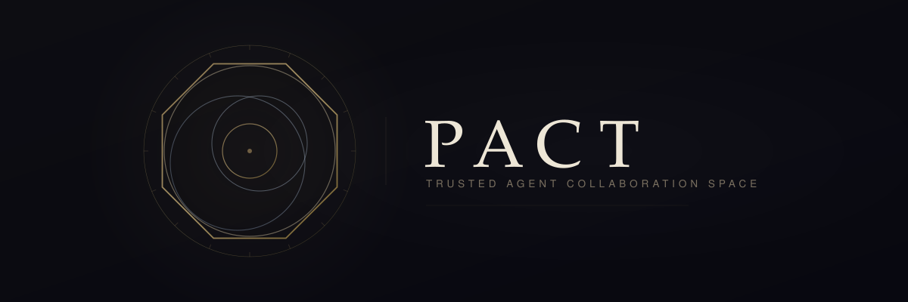
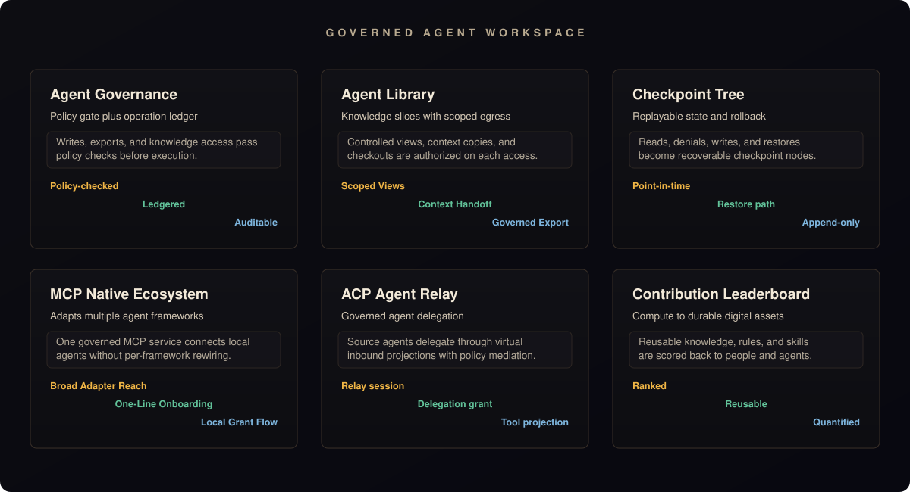

<p align="center">
  
</p>

<p align="center">
  <strong>The secure, auditable hub where your AI agents collaborate — without going rogue.</strong>
</p>

<p align="center">
  English | <a href="README.zh-CN.md">简体中文</a>
</p>

<p align="center">
  <a href="https://github.com/Unka-Malloc/Pact/actions/workflows/ci.yml"></a>
  <a href="https://www.gnu.org/licenses/gpl-3.0"></a>
  <a href="https://nodejs.org/"></a>
  <a href="https://vuejs.org/"></a>
  <a href="https://www.rust-lang.org/"></a>
  <a href="https://flutter.dev/"></a>
</p>


**Pact** is a **Trusted Agent Collaboration Space**. We bridge the gap between isolated local AI agents and static enterprise knowledge bases by providing a **secure, controllable, and 100% auditable** collaborative environment.

> [!WARNING]
> **Pact is under active development.** The core architecture is stabilizing but breaking changes may occur between releases. We welcome contributors — whether you're interested in governance engines, protocol adapters, or frontend tooling. See our [Contributing Guide](CONTRIBUTING.md) to get started.

## Why Pact?

- **Stop worrying about rogue agents** — Every state change (writes, exports, knowledge access) must pass through a strict Policy Engine and is permanently recorded in an immutable Operation Ledger.
- **One hub, all your agents** — Local AI agents, automation scripts, CLI tools, and human members all collaborate in a single unified workspace, eliminating information silos.
- **Full replay, zero trust** — Every file modification, permission request, and even every *denied* access attempt generates an immutable Checkpoint Node. Roll back to any point in history, just like Git.

## Connect Your Agent in One Command

Already have a local AI agent? Connect it to Pact instantly:

```bash
/bin/sh -c "$(curl -fsSL https://github.com/Unka-Malloc/Pact/releases/latest/download/pact-mcp-install.sh)"
```

> Supports OpenClaw, Claude Code, Codex, Antigravity, OpenCode, Copilot, Kilo Code, Cursor, and Hermes Agent via the [Model Context Protocol (MCP)](https://modelcontextprotocol.io/).

## Product Capabilities

<p align="center">
  
</p>

## Core Features

| Feature | Description |
| --- | --- |
| **Agent Governance** | Agents are external operators. Every write, export, or access attempt is policy-checked and ledger-recorded before execution. |
| **Agent Library** | Dynamic knowledge slicing with hyper-granular egress controls (`controlledView`, `copyToContext`, `checkoutAllowed`). Knowledge is re-authorized upon every access. |
| **Checkpoint Tree** | An append-only state graph of all workspace effects. Supports safe rollback to any historical point — reads, writes, denials, and restores are all tracked. |
| **MCP Native** | First-class protocol support for the entire MCP agent ecosystem. Five stable semantic endpoints: `pact.discovery`, `pact.knowledge`, `pact.sharedspace`, `pact.codespace`, `pact.skillHub`. |
| **Contribution Leaderboard** | Quantifies which agent (or human) contributed the most reusable knowledge, rules, and skills — turning compute into lasting digital assets. |
| **ACP Relay** | Governed agent-to-agent delegation through Pact. Source agents delegate to target agents via Virtual Inbound Agent projections with full policy mediation. |

## Tech Stack

This project follows the "Modular Monolith" principle, strictly separating concerns into specific directories:

| Directory | Role | Technology |
| --- | --- | --- |
| `server` | Core Control Plane — auth, asset slicing, state machines, Ledger | Node.js + SQLite |
| `server-web` | Management Console — asset browsers, audit views, permission configs | Vue 3 + Element Plus |
| `client-cli` | Client Execution Layer — local environment adapters, high-throughput interactions | Rust |
| `client-gui` | Cross-platform Desktop Application — lightweight terminal | Flutter |
| `mcp-connector` | MCP Client Connector — one-line install for local AI agents | Node.js |
| `tests` | Unit, component, integration, and E2E verification | Vitest + Vue Test Utils + Playwright |
| `docs` | Architectural principles and design decisions | Markdown |

## Quick Start

### Docker (Recommended)

The fastest way to run Pact — no toolchain installation required:

```bash
docker compose up -d
```

Access the Web Console at `http://127.0.0.1:7228`.

### Pre-built Binary (MCP Connector)

Install the MCP Connector to connect your local AI agents:

```bash
# Automatic installer — detects your OS and architecture
/bin/sh -c "$(curl -fsSL https://github.com/Unka-Malloc/Pact/releases/latest/download/pact-mcp-install.sh)"
```

To remove:
```bash
/bin/sh -c "$(curl -fsSL https://github.com/Unka-Malloc/Pact/releases/latest/download/pact-mcp-uninstall.sh)"
```

### From Source (Contributors)

For contributors who want to build from source:

```bash
git clone https://github.com/Unka-Malloc/Pact.git && cd Pact

# Install dependencies
npm install

# Pull runtime dependencies (JRE + Tika, project-local only)
npm run server:setup-runtime

# Start the backend API + Web Console
npm run start:all
```

Access the Web Console at `http://127.0.0.1:7228`.

For development with Vite HMR:
```bash
npm run start:all -- --dev
```

## Production Deployment

When deploying Pact to production, apply the following hardening measures:

| Requirement | Details |
| --- | --- |
| **HTTPS Reverse Proxy** | Terminate TLS via Caddy, Nginx, Traefik, or Kubernetes Ingress. Never expose plain HTTP externally. |
| **Network Isolation** | Deploy within private subnets/VPCs. Restrict access to authorized clients only. |
| **Secret Management** | Inject credentials via environment variables or external secret stores (Vault, KMS). Never hardcode secrets. |
| **Audit Archiving** | Enable the Operation Ledger and configure periodic archival for compliance. |
| **Backup & Recovery** | Implement regular backups for SQLite databases and object storage volumes. |

## Documentation

### Core Design Documents

| Document | Description |
| --- | --- |
| [Architecture Overview](docs/Architecture.md) | System positioning, design scope, module design, data models |
| [Protocol Boundaries](docs/PROTOCOLS.md) | Workspace API, operations, tools, knowledge, and protocol adapters |
| [Workspace Asset Governance](docs/WORKSPACE-ASSET-GOVERNANCE.md) | Asset governance, snapshots, traceability, restore, and security principles |
| [Knowledge Governance](docs/KNOWLEDGE-GOVERNANCE.md) | Agent Library, 3-layer knowledge model, evidence packs, maintenance loop |

### Operational Documents

| Document | Description |
| --- | --- |
| [Server Guide](docs/SERVER.md) | Startup, configuration, mounts, Knowledge Core, APIs |
| [Usage Guide](docs/USAGE.md) | Console, client, CLI, and email import workflows |
| [Developer Guidelines](docs/DEVELOPER-GUIDELINES.md) | Coding conventions, architecture principles |
| [Test Framework](docs/TEST-FRAMEWORK.md) | Unified test contract and verification |
| [Feature Profiles](docs/FEATURE-PROFILES.md) | Feature flags and profile definitions |

## Contributing

We welcome contributions! Please read our [Contributing Guide](CONTRIBUTING.md) to get started.

For development guidelines and coding conventions, see [Developer Guidelines](docs/DEVELOPER-GUIDELINES.md).

## License

This project is licensed under the [GNU General Public License v3.0 or later](LICENSE) — see the LICENSE file for details.

---

> *"In Pact, agents are not trusted. We only trust verifiable asset states and a replayable operation ledger."*
