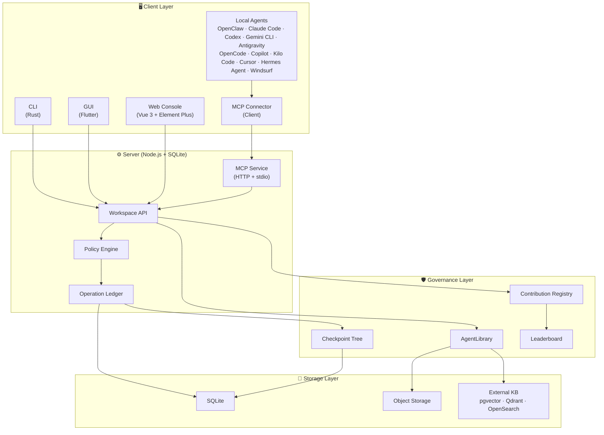

<p align="center">
  
</p>

<p align="center">
  <strong>The secure, auditable hub where your AI agents collaborate — without going rogue.</strong>
</p>

<p align="center">
  English | <a href="README.zh-CN.md">简体中文</a>
</p>

<p align="center">
  <a href="https://github.com/Unka-Malloc/Pact/actions/workflows/ci.yml"></a>
  <a href="https://www.gnu.org/licenses/gpl-3.0"></a>
  <a href="https://nodejs.org/"></a>
  <a href="https://vuejs.org/"></a>
  <a href="https://www.rust-lang.org/"></a>
  <a href="https://flutter.dev/"></a>
</p>


**Pact** is a **Trusted Agent Collaboration Space**. We bridge the gap between isolated local AI agents and static enterprise knowledge bases by providing a **secure, controllable, and 100% auditable** collaborative environment.

## 💡 Why Pact?

- **Stop worrying about rogue agents** — Every state change (writes, exports, knowledge access) must pass through a strict Policy Engine and is permanently recorded in an immutable Operation Ledger.
- **One hub, all your agents** — Local AI agents, automation scripts, CLI tools, and human members all collaborate in a single unified workspace, eliminating information silos.
- **Full replay, zero trust** — Every file modification, permission request, and even every *denied* access attempt generates an immutable Checkpoint Node. Roll back to any point in history, just like Git.

## ⚡ Connect Your Agent in One Command

Already have a local AI agent? Connect it to Pact instantly:

```bash
npm run mcp:register
```

After the connector package is published to npm or GitHub Releases, use the release channel documented in [mcp-connector/README.md](mcp-connector/README.md).

> Supports OpenClaw, Claude Code, Codex, Gemini CLI, Antigravity, OpenCode, Copilot, Kilo Code, Cursor, Hermes Agent, and Windsurf via the [Model Context Protocol (MCP)](https://modelcontextprotocol.io/).

## 🏛️ Architecture Overview



## ✨ Core Features

- 🛡️ **Agent Governance**: Agents are external operators. Every state change (writes, exports) must pass through a Policy Engine and an Operation Ledger.
- 📚 **AgentLibrary (Governed Knowledge)**: Managing the gap between knowledge source and agent. Upstream knowledge is dynamically sliced and re-authorized upon entering the system. We support hyper-granular egress controls like `controlledView`, `copyToContext`, and `checkoutAllowed`.
- 🌳 **Unified Checkpoint Tree (Auditability)**: Every file modification, permission request, and even knowledge retrieval or denied access generates a Checkpoint Node. This ensures an append-only, Git-like safe restore capability.
- 🔌 **Ecosystem Protocol Compatibility (MCP Native)**: First-class targets are OpenClaw, Claude Code, Codex, Gemini CLI, Antigravity, OpenCode, Copilot, Kilo Code, Cursor, Hermes Agent, and Windsurf. We fully embrace the Model Context Protocol (MCP) to expose workspace capabilities securely.
- 📊 **Asset Contribution Leaderboard**: Agents don't just burn compute; they accumulate digital assets. The built-in leaderboard quantifies and ranks which agent (or human) contributed the most reusable knowledge, rules, and skills to the team workspace.

## 🏗️ Tech Stack

This project follows the "Modular Monolith" principle, strictly separating concerns into specific directories:

| Directory | Role | Technology |
| --- | --- | --- |
| **`server`** | Core Control Plane — auth, asset slicing, state machines, Ledger | Node.js + SQLite |
| **`server-web`** | Management Console — asset browsers, audit views, permission configs | Vue 3 + Element Plus |
| **`client-cli`** | Client Execution Layer — local environment adapters, high-throughput interactions | Rust |
| **`client-gui`** | Cross-platform Desktop Application — lightweight terminal | Flutter |
| **`mcp-connector`** | MCP Client Connector — one-line install for local AI agents | Node.js |
| **Tests** | Unit, component, integration, and E2E verification standard | Vitest + `@vitest/coverage-v8` + Vue Test Utils + Playwright |
| **`docs`** | Source of truth for architectural principles and design decisions | Markdown |

## 🚀 Deployment & Quick Start

Pact can be launched in multiple environments depending on your use case. Below we detail the differences between local development, local Docker startup, dev integration, LAN/WAN listening, and enterprise production deployment.

### 1. Local Development (本机开发)
For local development, install dependencies and start the backend service (Minimum Node.js 22+, Recommended Node.js 24):
```bash
# Install dependencies
npm install

# Pull JRE and Tika locally (will not modify system directories)
npm run server:setup-runtime

# Start the complete backend API + Web Console
npm run start:all
```
Once started, access the Web Console at `http://127.0.0.1:7228`.

### 2. Local Docker Startup (Docker 本机启动)
To quickly run the server and Web Console in a local container environment without installing a local toolchain:
```bash
docker compose up -d
```
Access the management console at `http://127.0.0.1:7228`.

### 3. Dev Integration & HMR (开发联调)
If you need hot module replacement (HMR) for frontend development while communicating with the backend:
```bash
npm run start:all -- --dev
```
This starts the backend API on port `7228` and runs the Vite development server on port `5173` with proxy routing to the API.

### 4. LAN/WAN Listening (局域网/公网监听)
To expose the server to the local network or listen on all interfaces for testing:
```bash
npm run server:start:public
```
*Note: This starts the server on port `7228` listening on host `0.0.0.0`. Do not use this in untrusted networks without external transport security.*

### 5. Enterprise Production Deployment (企业生产部署)
Pact supports enterprise-grade integration. However, **before the production gates are closed, it is not recommended to claim production readiness (生产门禁未关闭前不建议对外宣称生产可用)**. 

When deploying in production, the default HTTP configurations MUST NOT be reused directly. You must configure the following hardening measures:
*   **HTTPS Reverse Proxy**: Run behind a secure reverse proxy (e.g., Caddy, Nginx, or Kubernetes Ingress) to terminate HTTPS and handle SSL certificates.
*   **Controlled Network Segment**: Restrict server exposure. Keep the service isolated within private subnets/VPCs, and expose it only to authorized clients.
*   **Secret Key Management**: Real API credentials, OAuth tokens, and system secrets must be injected dynamically via environment variables or external secure key managers (such as Vault/KMS), rather than being stored in configuration files.
*   **Audit Archiving**: Ensure the immutable Operation Ledger is enabled, and establish periodic archival processes for compliance logs.
*   **Backup & Recovery**: Implement robust, regular backup strategies for the SQLite database files and object storage volumes to enable point-in-time recovery.

### MCP Client Connector

Connect any compatible local AI agent to Pact with a single command:

```bash
npm run mcp:register
```

*(See [mcp-connector/README.md](mcp-connector/README.md) for source checkout, npm, and GitHub Release installation options.)*

### CLI Interactions

Pact provides a powerful CLI tool for CI/CD and quick terminal operations:

```bash
npm run cli -- health
npm run cli -- --file README.md --wait
npm run cli -- rpc-call jobs.list --params '{"limit":20}'
```

## 📖 Documentation

### Core Design Documents

These five documents are the authoritative source of truth for Pact's architecture:

| Document | Description |
| --- | --- |
| 🏛️ [Architecture Overview](docs/Architecture.md) | System positioning, design scope, requirements, module design, data models |
| 📡 [Protocol Boundaries](docs/PROTOCOLS.md) | Workspace API, operations, tools, knowledge, and protocol adapters |
| 🔒 [Workspace Asset Governance](docs/WORKSPACE-ASSET-GOVERNANCE.md) | Asset governance, snapshots, traceability, restore, and security principles |
| 🧠 [Knowledge Governance](docs/KNOWLEDGE-GOVERNANCE.md) | AgentLibrary, 3-layer knowledge model, evidence packs, maintenance loop |
| 🚧 [Production Capability Gap](docs/PRODUCTION-CAPABILITY-GAP.md) | P0 gaps, acceptance gates, and current blockers |

### Operational Documents

| Document | Description |
| --- | --- |
| 🖥️ [Server Guide](docs/SERVER.md) | Startup, configuration, mounts, KnowledgeCore, APIs |
| 📘 [Usage Guide](docs/USAGE.md) | Console, client, CLI, and email import workflows |
| 👨‍💻 [Developer Guidelines](docs/DEVELOPER-GUIDELINES.md) | Coding conventions, architecture principles |
| 🧪 [Test Framework](docs/TEST-FRAMEWORK.md) | Unified test contract and verification |
| ⚙️ [Feature Profiles](docs/FEATURE-PROFILES.md) | Feature flags and profile definitions |
| 🤝 [Git Collaboration](docs/GIT-COLLAB.md) | Local collaboration conventions |
| 📋 [Decision Register](docs/IMPLEMENTATION-DECISION-REGISTER.md) | Pre-implementation design decisions |

## 🤝 Contributing

We welcome contributions! Please read our [Contributing Guide](CONTRIBUTING.md) to get started.

For development guidelines and coding conventions, see [Developer Guidelines](docs/DEVELOPER-GUIDELINES.md).

## 📄 License

This project is licensed under the [GNU General Public License v3.0 or later](LICENSE) — see the LICENSE file for details.

---

> *"In Pact, agents are not trusted. We only trust verifiable asset states and a replayable operation ledger."*
