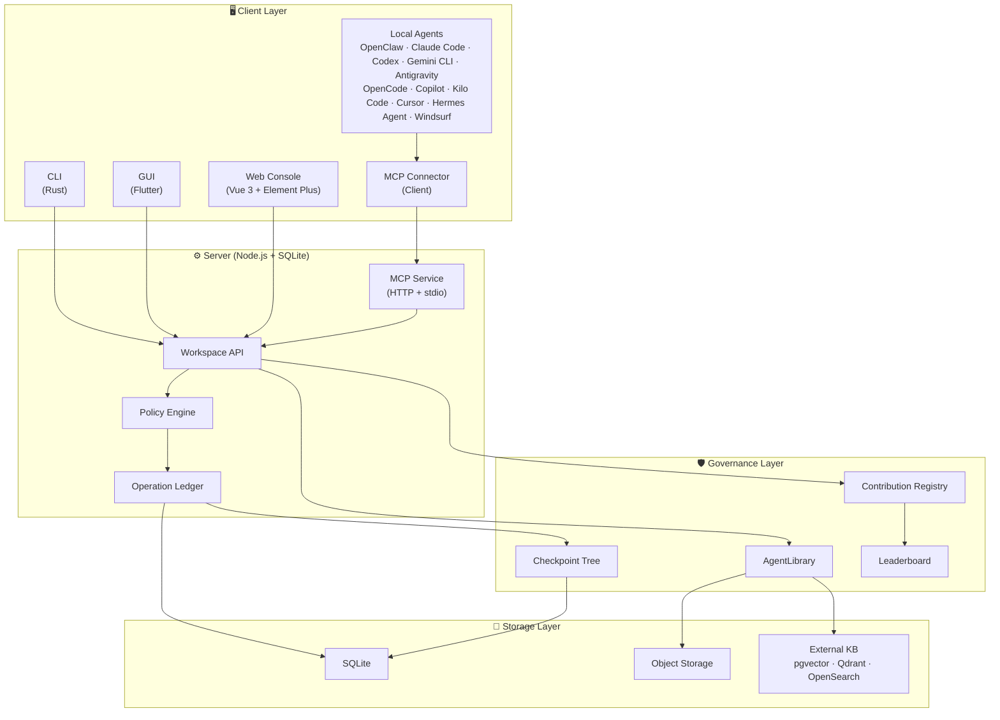

# Pact 🚀

English | [简体中文](README.zh-CN.md)

> The secure, auditable hub where your AI agents collaborate — without going rogue.

[](https://github.com/Unka-Malloc/Pact/actions/workflows/ci.yml)
[](https://www.gnu.org/licenses/gpl-3.0)
[](https://nodejs.org/)
[](https://vuejs.org/)
[](https://www.rust-lang.org/)
[](https://flutter.dev/)

**Pact** is a **Trusted Agent Collaboration Space**. We bridge the gap between isolated local AI agents and static enterprise knowledge bases by providing a **secure, controllable, and 100% auditable** collaborative environment.

## 💡 Why Pact?

- **Stop worrying about rogue agents** — Every state change (writes, exports, knowledge access) must pass through a strict Policy Engine and is permanently recorded in an immutable Operation Ledger.
- **One hub, all your agents** — Local AI agents, automation scripts, CLI tools, and human members all collaborate in a single unified workspace, eliminating information silos.
- **Full replay, zero trust** — Every file modification, permission request, and even every *denied* access attempt generates an immutable Checkpoint Node. Roll back to any point in history, just like Git.

## ⚡ Connect Your Agent in One Command

Already have a local AI agent? Connect it to Pact instantly:

```bash
npm run mcp:register
```

After the connector package is published to npm or GitHub Releases, use the release channel documented in [mcp-connector/README.md](mcp-connector/README.md).

> Supports OpenClaw, Claude Code, Codex, Gemini CLI, Antigravity, OpenCode, Copilot, Kilo Code, Cursor, Hermes Agent, and Windsurf via the [Model Context Protocol (MCP)](https://modelcontextprotocol.io/).

## 🏛️ Architecture Overview



## ✨ Core Features

- 🛡️ **Zero Trust Agent Governance**: Agents are merely external operators. Every single state change (writes, exports) must pass through a strict Policy Engine and an immutable Operation Ledger.
- 📚 **AgentLibrary (Governed Knowledge)**: Disrupting traditional "knowledge base proxies." Upstream knowledge is dynamically sliced and re-authorized upon entering the system. We support hyper-granular egress controls like `controlledView`, `copyToContext`, and `checkoutAllowed`.
- 🌳 **Unified Checkpoint Tree (100% Auditability)**: Every file modification, permission request, and even **every single knowledge retrieval or denied access** generates an immutable Checkpoint Node. This ensures an append-only, Git-like safe restore capability.
- 🔌 **Ecosystem Protocol Compatibility (MCP Native)**: First-class targets are OpenClaw, Claude Code, Codex, Gemini CLI, Antigravity, OpenCode, Copilot, Kilo Code, Cursor, Hermes Agent, and Windsurf. We fully embrace the Model Context Protocol (MCP) to expose workspace capabilities securely.
- 📊 **Asset Contribution Leaderboard**: Agents don't just burn compute; they accumulate digital assets. The built-in leaderboard quantifies and ranks which agent (or human) contributed the most reusable knowledge, rules, and skills to the team workspace.

## 🏗️ Tech Stack

This project follows the "Modular Monolith" principle, strictly separating concerns into specific directories:

| Directory | Role | Technology |
| --- | --- | --- |
| **`server`** | Core Control Plane — auth, asset slicing, state machines, Ledger | Node.js + SQLite |
| **`server-web`** | Management Console — asset browsers, audit views, permission configs | Vue 3 + Element Plus |
| **`client-cli`** | Client Execution Layer — local environment adapters, high-throughput interactions | Rust |
| **`client-gui`** | Cross-platform Desktop Application — lightweight terminal | Flutter |
| **`mcp-connector`** | MCP Client Connector — one-line install for local AI agents | Node.js |
| **Tests** | Unit, component, integration, and E2E verification standard | Vitest + `@vitest/coverage-v8` + Vue Test Utils + Playwright |
| **`docs`** | Source of truth for architectural principles and design decisions | Markdown |

## 🚀 Quick Start

### ⚡ Minimal Start — Docker (Recommended)

No local toolchain required. Spin up the full server + Web Console in seconds:

```bash
docker compose up -d
# Access the management console at http://127.0.0.1:7228
```

### 🛠️ Full Development Setup

For contributors or those who need the complete stack including CLI (Rust) and GUI (Flutter) clients:

```bash
# 1. Install server dependencies
npm install

# 2. Install client dependencies (requires Flutter & Rust toolchains)
npm run client:get

# 3. Start the complete backend API + Web Console
npm run start:all
```

*(For development with Vite HMR, append the `-- --dev` flag)*

Once running, access the management console at `http://127.0.0.1:7228`.

### MCP Client Connector

Connect any compatible local AI agent to Pact with a single command:

```bash
npm run mcp:register
```

*(See [mcp-connector/README.md](mcp-connector/README.md) for source checkout, npm, and GitHub Release installation options.)*

### CLI Interactions

Pact provides a powerful CLI tool for CI/CD and quick terminal operations:

```bash
npm run cli -- health
npm run cli -- --file README.md --wait
npm run cli -- rpc-call jobs.list --params '{"limit":20}'
```

## 📖 Documentation

### Core Design Documents

These five documents are the authoritative source of truth for Pact's architecture:

| Document | Description |
| --- | --- |
| 🏛️ [Architecture Overview](docs/Architecture.md) | System positioning, design scope, requirements, module design, data models |
| 📡 [Protocol Boundaries](docs/PROTOCOLS.md) | Workspace API, operations, tools, knowledge, and protocol adapters |
| 🔒 [Workspace Asset Governance](docs/WORKSPACE-ASSET-GOVERNANCE.md) | Asset governance, snapshots, traceability, restore, and security principles |
| 🧠 [Knowledge Governance](docs/KNOWLEDGE-GOVERNANCE.md) | AgentLibrary, 3-layer knowledge model, evidence packs, maintenance loop |
| 🚧 [Production Capability Gap](docs/PRODUCTION-CAPABILITY-GAP.md) | P0 gaps, acceptance gates, and current blockers |

### Operational Documents

| Document | Description |
| --- | --- |
| 🖥️ [Server Guide](docs/SERVER.md) | Startup, configuration, mounts, KnowledgeCore, APIs |
| 📘 [Usage Guide](docs/USAGE.md) | Console, client, CLI, and email import workflows |
| 👨‍💻 [Developer Guidelines](docs/DEVELOPER-GUIDELINES.md) | Coding conventions, architecture principles |
| 🧪 [Test Framework](docs/TEST-FRAMEWORK.md) | Unified test contract and verification |
| ⚙️ [Feature Profiles](docs/FEATURE-PROFILES.md) | Feature flags and profile definitions |
| 🤝 [Git Collaboration](docs/GIT-COLLAB.md) | Local collaboration conventions |
| 📋 [Decision Register](docs/IMPLEMENTATION-DECISION-REGISTER.md) | Pre-implementation design decisions |

## 🤝 Contributing

We welcome contributions! Please read our [Contributing Guide](CONTRIBUTING.md) to get started.

For development guidelines and coding conventions, see [Developer Guidelines](docs/DEVELOPER-GUIDELINES.md).

## 📄 License

This project is licensed under the [GNU General Public License v3.0 or later](LICENSE) — see the LICENSE file for details.

---

> *"In Pact, agents are not trusted. We only trust verifiable asset states and a replayable operation ledger."*
