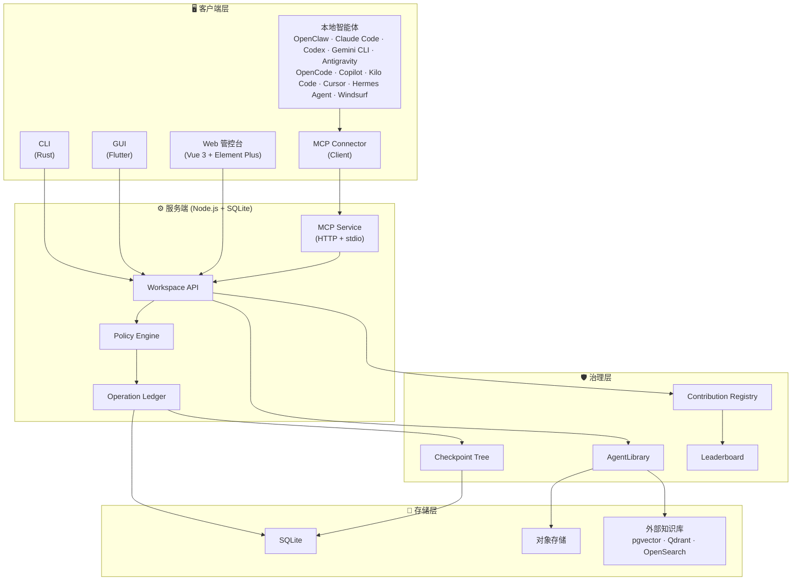

# Pact 🚀

[English](README.md) | 简体中文

> 让你的 AI 智能体安全协作的统一平台 — 每一步操作都可审计、可回溯。

[](https://github.com/Unka-Malloc/Pact/actions/workflows/ci.yml)
[](https://www.gnu.org/licenses/gpl-3.0)
[](https://nodejs.org/)
[](https://vuejs.org/)
[](https://www.rust-lang.org/)
[](https://flutter.dev/)

**Pact** 是一个**可信的智能体协作空间**。我们致力于打破本地孤立的智能体与静态企业知识库之间的壁垒，为您提供一个**安全、受控且 100% 可审计**的协同环境。

## 💡 为什么选择 Pact？

- **不再担心智能体越权** — 所有状态变更（写入、导出、知识访问）必须经过严格的策略引擎裁决，并永久记录在不可篡改的 Operation Ledger 中。
- **一个中枢，统合所有智能体** — 本地 AI 智能体、自动化脚本、CLI 工具和人类成员在同一个统一工作空间协作，彻底消除信息孤岛。
- **全程可回放，零信任架构** — 每次文件修改、权限请求，甚至每一次被*拒绝*的访问，都会生成不可篡改的 Checkpoint 节点，支持类 Git 的历史回溯与安全恢复。

## ⚡ 一行命令接入你的智能体

已有本地 AI 智能体？一行命令即可将其接入 Pact：

```bash
npx pact-mcp-connector@latest register
```

> 通过 [Model Context Protocol (MCP)](https://modelcontextprotocol.io/) 支持：OpenClaw、Claude Code、Codex、Gemini CLI、Antigravity、OpenCode、Copilot、Kilo Code、Cursor、Hermes Agent 和 Windsurf。

## 🏛️ 架构概览



## ✨ 核心特性

- 🛡️ **"零信任"智能体治理 (Zero Trust)**：智能体只是外部操作员。系统的每一次状态变更（写入、导出），必须经过严格的 Policy Engine 和 Operation Ledger 裁决。
- 📚 **AgentLibrary（受控知识库）**：颠覆传统的"知识库代理"。上游知识进入系统后会被重新切分与实时再授权。支持 `controlledView`、`copyToContext`、`checkoutAllowed` 等极细粒度的出库限制。
- 🌳 **统一 Checkpoint Tree（100% 可审计）**：每一次文件修改、权限请求，甚至是**每一次知识检索和被拒绝的访问**，都会生成不可篡改的 Checkpoint 节点，支持类 Git 的 Append-only 安全恢复。
- 🔌 **全生态协议兼容（MCP Native）**：首批一等支持目标为 OpenClaw、Claude Code、Codex、Gemini CLI、Antigravity、OpenCode、Copilot、Kilo Code、Cursor、Hermes Agent 和 Windsurf，全面拥抱 Model Context Protocol (MCP) 标准暴露工作空间能力。
- 📊 **资产贡献量化排行榜**：智能体不仅消耗算力，更在此沉淀数字资产。系统内置贡献排行榜，量化评估哪个智能体或成员贡献了最具复用价值的知识、规则和技能。

## 🏗️ 架构与技术栈

本项目遵循"模块化单体 (Modular Monolith)"原则，物理目录按职责严格收敛：

| 目录 | 职责 | 技术栈 |
| --- | --- | --- |
| **`server`** | 核心控制面 — 鉴权、资产切分、状态机与 Ledger | Node.js + SQLite |
| **`server-web`** | 管控台 — 资产浏览器、审计视图和权限配置 | Vue 3 + Element Plus |
| **`client-cli`** | 客户端执行层 — 本地环境适配、高吞吐交互 | Rust |
| **`client-gui`** | 跨端桌面应用 — 轻量化操作终端 | Flutter |
| **`mcp-connector`** | MCP 客户端连接器 — 为本地智能体提供一键安装与连接能力 | Node.js |
| **测试体系** | 单元测试、组件测试、集成测试与 E2E 验证标准 | Vitest + `@vitest/coverage-v8` + Vue Test Utils + Playwright |
| **`docs`** | 核心架构原则与设计决议记录 | Markdown |

## 🚀 快速开始

### ⚡ 极速启动 — Docker（推荐）

无需本地工具链，几秒钟内启动完整的服务端与 Web 管控台：

```bash
docker compose up -d
# 通过 http://127.0.0.1:7228 访问管控台
```

### 🛠️ 完整开发环境

适用于贡献者，或需要完整客户端（CLI Rust、GUI Flutter）的开发者：

```bash
# 1. 安装服务端依赖
npm install

# 2. 安装客户端依赖（需要 Flutter 与 Rust 工具链）
npm run client:get

# 3. 一键启动完整的服务端 API 与 Web 管控台
npm run start:all
```

*(开发模式请附加 `-- --dev` 参数启用 Vite 热更新)*

启动后，通过 `http://127.0.0.1:7228` 访问 Web 管控台。

### MCP 客户端连接器

一行命令将任意兼容的本地 AI 智能体接入 Pact：

```bash
npx pact-mcp-connector@latest register
```

*(更多配置选项请参考 [mcp-connector/README.md](mcp-connector/README.md))*

### CLI 快速交互

Pact 提供了强大的 CLI 工具以支持 CI/CD 与终端快捷操作：

```bash
npm run cli -- health
npm run cli -- --file README.md --wait
npm run cli -- rpc-call jobs.list --params '{"limit":20}'
```

## 📖 文档体系

### 核心设计文档

以下五份文档是 Pact 架构的权威真相源：

| 文档 | 说明 |
| --- | --- |
| 🏛️ [架构总览](docs/Architecture.md) | 总定位、设计范围、需求、模块设计、数据模型 |
| 📡 [协议边界](docs/PROTOCOLS.md) | Workspace API、Operation、工具管理、知识、协议适配 |
| 🔒 [工作空间资产治理](docs/WORKSPACE-ASSET-GOVERNANCE.md) | 资产治理、快照、溯源、恢复和安全原则 |
| 🧠 [知识治理与 AgentLibrary](docs/KNOWLEDGE-GOVERNANCE.md) | AgentLibrary、三层知识模型、证据包、维护闭环 |
| 🚧 [生产能力差距](docs/PRODUCTION-CAPABILITY-GAP.md) | P0 差距、验收门禁和当前阻塞项 |

### 运行支持文档

| 文档 | 说明 |
| --- | --- |
| 🖥️ [服务端指南](docs/SERVER.md) | 启动、配置、挂载、KnowledgeCore、接口 |
| 📘 [使用说明](docs/USAGE.md) | 控制台、客户端、CLI 和邮件导入工作流 |
| 👨‍💻 [开发者核心守则](docs/DEVELOPER-GUIDELINES.md) | 编码规范、架构原则 |
| 🧪 [测试框架](docs/TEST-FRAMEWORK.md) | 统一测试契约和验证 |
| ⚙️ [Feature Profiles](docs/FEATURE-PROFILES.md) | 功能开关和 Profile 规划 |
| 🤝 [Git 协作约定](docs/GIT-COLLAB.md) | 本地协作约定 |
| 📋 [设计决策登记表](docs/IMPLEMENTATION-DECISION-REGISTER.md) | 实现前设计决策记录 |

## 🤝 参与贡献

欢迎贡献！请阅读我们的[贡献指南](CONTRIBUTING.md)开始参与。

开发规范请参阅[开发者核心守则](docs/DEVELOPER-GUIDELINES.md)。

## 📄 许可证

本项目基于 [GNU General Public License v3.0 or later](LICENSE) 发布 — 详见 LICENSE 文件。

---

> *"在 Pact 中，智能体不被信任。我们只信任可验证的资产状态与可回放的操作账本。"*
