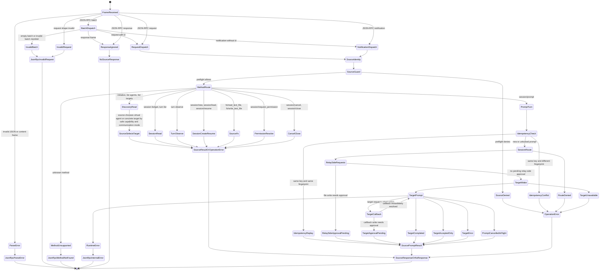

# ACP Agent Relay State Machine

**Status:** Design contract for ACP agent-to-agent relay  
**Updated:** 2026-06-06  
**Scope:** Source agent to Pact to target agent ACP interaction through the governed relay.

## Scope And Completeness

This document defines the state machine for an agent calling another agent through Pact by ACP. It covers every Pact-controlled branch: inbound JSON-RPC handling, source identity binding, operation guard, routing, session lifecycle, prompt turns, outbound target wake, target callbacks, permission suspension and resume, source filesystem methods, target observation refresh, cancellation, closure, observability, and terminal/error outcomes.

Target agents have private internal states that Pact cannot and must not model. Those states are represented at the Pact boundary by bounded result classes: `completed`, `accepted`, `target_error`, `approval_pending`, `cancelled`, observation unsupported, observation unchanged, observation refreshed, unsupported callback, JSON-RPC callback error, or runtime transport error.

## Communication Mode Taxonomy

Source-facing discovery treats target communication as a first-class route attribute. `agent/list`, `_pact/agent/list`, `target/list`, `_pact/target/list`, `initialize`, `session/new`, `session/load`, `session/resume`, and `session/prompt.targetEvidence` expose the same safe fields: `protocolStyle`, `targetCommunicationMode`, `nativeAcpTargetSupported`, `nativeAcpTargetVerified`, `nativeAcpSourceSupported`, `nativeAcpSourceVerified`, and a compact `communication` object. These fields never include target command argv, binary paths, URLs, CSRF tokens, environment variables, or credentials.

| Mode | Source-facing discovery | Proof-specific mode | Init / prompt behavior | Observe / failure behavior |
| --- | --- | --- | --- | --- |
| Native ACP stdio | `targetCommunicationMode = native_acp_stdio`, `nativeAcpTargetSupported = true` when stdio declares `protocolStyle = agent-client-protocol-v1` | `codex_acp_stdio` when the real Codex ACP adapter proof verifies the concrete target | Outbound stdio JSON-RPC `initialize`, `session/new` or `session/resume`, then `session/prompt`; target updates are normalized to source-safe progress/completion events. | `turn.observe` is supported only when an adapter supplies observation; non-observable stdio returns `target_observation_unsupported`. Runtime transport or target JSON-RPC errors become operation errors or `target_error` depending the current turn boundary. |
| Codex CLI exec proxy | `codex_cli_exec_proxy`, `nativeAcpTargetSupported = false`, `nativeAcpTargetVerified = false` | Same | Pact spawns real `codex exec` through the compatibility adapter and projects final-message output as a source ACP final response. Source-facing discovery, session/turn list/get/observe, and restart `session/load` still operate over the durable relay session. | No raw child response or output paths are exposed to source agents; external response is projected as safe keys. Native ACP claims remain false. Restart `session/load` replays stored source-safe updates without reasoning traces unless explicitly requested. |
| Antigravity Agent API proxy | `agent_api_proxy`, `nativeAcpTargetSupported = false`, `nativeAcpTargetVerified = false` | Same | Pact sends `send-message` through the local Agent API. Without Connect final evidence the turn completes as accepted-only acknowledgement. | Local observation or Connect may later refresh progress/final/error evidence. Agent API and Antigravity IDE CLI probes must not reclassify this path as native ACP. |
| Contract mock | `contract_mock`, native ACP flags false | Same | In-process mock target produces deterministic contract results for tests and local development. | Observation is contract-bound or unsupported; never proof of a real target agent. |

`supported` and `verified` are deliberately separate. `nativeAcpTargetSupported` is static advertised capability from safe descriptor metadata or transport style. Source-facing discovery must not accept registry or target-descriptor self-assertions for `nativeAcpTargetVerified`; it remains false unless a proof-specific summary reports a verified native ACP target. Pact must not infer `verified = true` from a binary name, framework label, adapter id, the presence of a command, or a target descriptor carrying `nativeAcpTargetVerified: true`.

For the Codex ACP target proof, the adapter provenance is part of the state evidence. `codex_acp_stdio` is considered verified only when the verifier records the actual adapter invocation (`project-local-codex-acp`, `local-codex-acp`, or `npx-codex-acp`), package name/version when available, a real `codex` CLI path/version, successful source-facing ACP JSON-RPC calls, and a source-safe final-response projection. The preferred Pact workspace path is the pinned project-local `node_modules/.bin/codex-acp`; `npx` remains an explicit fallback, not the default proof path.

For Antigravity, local CLI/plugin/MCP availability is not enough to enter a native ACP state. `antigravity-ide --help`, `agy --help`, and `agy plugin --help` may prove editor launch, MCP configuration, prompt mode, or plugin-management capability, but the state remains `agent_api_proxy` unless an official Antigravity ACP stdio/stream command or adapter is discovered and a verifier exchanges ACP JSON-RPC frames with it.

## Composite State Tuple

A relay interaction is not a single linear state. It is a composite state tuple:

```text
RelayState =
  FrameState
  x SourceIdentityState
  x AuthorizationState
  x RouteState
  x SessionState
  x TurnState
  x TargetState
  x ApprovalState
  x ObservationState
  x VisibilityState
```

Each transition may update one or more dimensions. For example, `session/prompt` can move `TurnState` from `running` to `approval_pending` while leaving `TargetState` at `disconnected` because Pact must not wake the target before a relay-side write approval.

## Top-Level Machine



## State Domains

### Frame State

| State | Entry | Exit |
| --- | --- | --- |
| `received` | Raw ACP stdio or transport frame arrives. | Parse as JSON-RPC message or batch. |
| `parse_error` | JSON parse or ACP frame parse fails. | Return JSON-RPC `-32700`. |
| `invalid_request` | Parsed frame is not a valid JSON-RPC request or batch member. | Return JSON-RPC `-32600`. |
| `invalid_batch` | Batch is empty or all members are invalid notifications/responses. | Return `-32600` for invalid members or no response for notifications only. |
| `response_ignored` | Source sends a JSON-RPC response frame to Pact. | No response. |
| `notification` | Source sends request without `id`. | Dispatch operation, suppress source response. |
| `request` | Source sends request with `id`. | Dispatch operation, return result or error. |
| `handler_error` | Dispatch throws after parse. | Return JSON-RPC `-32603`. |

### Source Identity State

| State | Entry | Exit |
| --- | --- | --- |
| `auth_bound` | Trusted platform authentication context supplies source identity, subject, workspace, scopes, grant, credential references, or profile. | Public source identity and internal `sourceAuthContext` are emitted to operation guard. |
| `connection_bound` | ACP connection context supplies trusted source identity. Shared source services keep this state per transport connection. | Request body cannot override it, and another concurrent transport cannot inherit it. |
| `remembered_connection` | Previous initialized context for the same bridge or connection is reused. | Request body cannot override locked values. |
| `body_fallback` | No trusted context exists. Compatibility fields in request body are used. | Must still pass ownership and operation guard. |
| `default_bound` | Missing fields fall back to configured defaults. | Only allowed for local compatibility paths. |
| `ownership_matched` | Direct `relaySessionId` belongs to `sourceId`, `workspaceId`, `sourceSessionId`, and `virtualAgentId`. | Session operations may proceed. |
| `ownership_failed` | Direct `relaySessionId` exists but does not match source context. | Report `relay_session_not_found`, never fall back to another session. |

### Authorization State

| State | Entry | Exit |
| --- | --- | --- |
| `preflight_pending` | Operation id and normalized source context are available. | Run source operation guard before target wake or file side effect. |
| `authorized` | Source guard allows operation. | Continue to route/session transition. |
| `denied` | Source guard denies operation, missing scope, grant, subject, workspace, or profile. | Return operation error with source authorization decision. |
| `approval_required` | Policy requires confirmation for a side effect. | Create `permissionRequest` and suspend turn, or wait for platform approval path. |
| `hard_denied` | Tenant, workspace, data, target, terminal, disabled capability, or revoked grant disallows action. | Deny even if a human approval is supplied. |

### Route State

| State | Entry | Exit |
| --- | --- | --- |
| `unresolved` | Method requires virtual agent or session route. | Resolve virtual agent, target, workspace, mode, data source, and risk. |
| `resolved` | Route decision is valid. | Continue to session, filesystem, prompt, or permission operation. |
| `virtual_agent_unavailable` | Virtual agent missing, disabled, or invisible. | Return route error. |
| `target_unavailable` | Concrete target missing, disabled, or external service missing. | Return route error. |
| `mode_denied` | Requested prompt mode is not advertised or not allowed. | Return route error. |
| `workspace_denied` | Source workspace does not match policy or grant. | Return route error. |
| `data_source_denied` | Requested data source or modality exceeds policy. | Return route error. |
| `capability_denied` | Requested tool, filesystem, terminal, or reasoning capability is not advertised or allowed. | Return route error or child denial receipt. |
| `route_blocked` | A previously valid session is now blocked by policy or target availability. | Set session `blocked` for session-bound route failures. |

### Session State

| State | Entry | Exit |
| --- | --- | --- |
| `absent` | No relay session exists for source key or direct id. | `session/new` may create; other direct methods return `relay_session_not_found`. |
| `dormant` | Durable Pact relay session exists, but target process is not active or not needed. | Wake, prompt, resume, cancel, close, or read summaries. |
| `waking` | Pact is starting, reconnecting, resuming, or rehydrating target session. | `active` on wake success; operation error on wake failure. |
| `active` | Target session is connected or immediately reusable. | Prompt, callback, cancel, close, idle policy to `dormant`, or approval suspension. |
| `approval_pending` | A relay turn is waiting for source or platform approval. | Approval resumes to `active`, denial completes turn, cancel moves to `dormant`, close moves to `closed`. |
| `blocked` | Session route is currently denied by policy, target, workspace, or data source. | A future resume/wake may retry and recalculate route, or close may terminate. |
| `closed` | Source closed the relay session. | Terminal for prompt, resume, wake, cancel, and permission resolve. |

### Turn State

| State | Entry | Exit |
| --- | --- | --- |
| `absent` | No prompt turn has been created. | `session/prompt` creates `running`, `cancelled`, or returns route/idempotency error. |
| `queued` | Prompt waits on per-session prompt lock. | Execute when previous prompt finishes or become `cancelled` if source cancel generation changed. |
| `running` | Turn accepted, audit created, prompt payload held in sensitive memory, target may be woken. | `approval_pending`, `completed`, `cancelled`, `blocked`, or operation error. |
| `approval_pending` | One or more permission requests are pending. | Approval all pending requests, denial, cancel, close, or payload unavailable. |
| `completed` | Prompt reached a terminal target result or accepted-only result. | Read/replay only. |
| `cancelled` | Source cancellation happened before target prompt, during target prompt, or while approval pending. | Read/replay only. |
| `approval_denied` | Source/platform denied a pending permission request. | Read/replay only. |
| `blocked` | Resume route was denied while resolving permission or session route. | Read/replay until new prompt/session route creates new state. |
| `idempotency_replay` | Same `idempotencyKey` and same request fingerprint are seen again. | Restore stored result without side effects. |
| `idempotency_conflict` | Same `idempotencyKey` but different prompt or side effect fingerprint. | Return `idempotency_key_conflict`. |

### Target State

| State | Entry | Exit |
| --- | --- | --- |
| `disconnected` | No reusable outbound ACP connection. | Wake starts `connecting`. |
| `connecting` | Stdio, HTTP, WebSocket, Agent API, or Connect adapter is being opened. | `initialized`, `unavailable`, or `runtime_error`. |
| `initialized` | Target ACP initialize completed or adapter accepted source. | Create, resume, load, or rehydrate target session. |
| `session_created` | Target session created. | Prompt. |
| `session_resumed` | Target session resumed or loaded from persisted reference. | Prompt. |
| `session_rehydrated` | Target cannot resume natively, but Pact sent allowed context envelope. | Prompt. |
| `prompting` | Pact awaits target `session/prompt` result. | Updates, callbacks, completion, accepted-only, target error, approval pending, cancel, runtime error. |
| `callback_waiting` | Target sends ACP callback request while prompt is in flight. | Callback response, denial, or target callback approval pending. |
| `accepted_only` | Target acknowledges send but cannot prove final response yet. | Source turn completes with `accepted` unless later observation path upgrades evidence in another operation. |
| `completed` | Target returns final response or normalized completion. | Source turn `completed`. |
| `target_error` | Target reports current-turn error, failed Connect trajectory, or adapter target error. | Source turn `completed` with stop reason `target_error`. |
| `unavailable` | Target process, command, endpoint, service, or dependency is unavailable. | Return operation error or blocked wake, depending transition. |
| `runtime_error` | Transport or adapter throws during wake, prompt, callback, cancel, or close. | JSON-RPC internal error or operation error after fail-closed audit path. |
| `closed` | Target `session/close` was sent or local cleanup completed. | No reuse after source closed relay session. |

### Approval State

| State | Entry | Exit |
| --- | --- | --- |
| `none` | No current approval is needed. | Side effect can complete immediately or create pending approval. |
| `pending` | Relay-side write or target callback write requires approval. | Source/platform approves, denies, cancels, closes, or expires. |
| `completed` | Approval is accepted and side effect executes once. | Resume pending turn if no pending approvals remain. |
| `denied` | Approval is rejected or hard-denied. | Turn becomes `approval_denied` or `blocked`. |
| `cancelled` | Permission request belongs to a cancelled or closed turn/session. | Request is marked cancelled. |
| `payload_mismatch` | Approval payload hash does not match stored request. | Return `approval_payload_mismatch`. |
| `payload_unavailable` | Sensitive write body or prompt body is no longer in memory/artifact retention. | Return `permission_payload_unavailable`, do not write. |
| `replayed_completed` | Target repeats an already approved callback with same tool-call id and payload hash. | Return completed receipt without repeating write. |
| `replayed_pending` | Target repeats a still-pending callback with same tool-call id and payload hash. | Return approval-pending sentinel without creating duplicate request. |

### Observation State

| State | Entry | Exit |
| --- | --- | --- |
| `not_requested` | No `turn.observe` operation is active. | Source or operator requests a bounded observation refresh. |
| `guard_pending` | `turn.observe` has session and turn ids. | Run source ownership, route, and operation guard before target observation. |
| `unsupported` | Target adapter does not expose safe observation or local observation is disabled. | Return `observed: false` with reason; do not mutate target evidence. |
| `conversation_missing` | Target conversation or resume reference is unavailable. | Return operation error; do not guess a target conversation. |
| `observing` | Adapter reads configured safe local observation. | `unchanged`, `progress_refreshed`, `final_refreshed`, `target_error_refreshed`, or observation runtime error. |
| `unchanged` | Observation fingerprint matches the previous refresh or no new evidence exists. | Return `refreshed: false`; keep existing turn evidence. |
| `progress_refreshed` | Observation detects target progress but no final response or current-turn error. | Record a source-safe progress event under the existing relay audit ids. |
| `final_refreshed` | Observation detects a final response. | Record completion evidence, set target completion to `completed`, and refresh `communicationSummary`. |
| `target_error_refreshed` | Observation detects current-turn target error evidence. | Record target-error completion evidence and refresh `communicationSummary`. |
| `runtime_error` | Observation adapter throws or cannot read configured evidence. | Return operation error unless the adapter can represent the failure as target-error evidence. |

### Visibility State

| State | Entry | Exit |
| --- | --- | --- |
| `progress_only` | Default source-facing stream. | Emit sanitized progress and receipts. |
| `reasoning_requested` | Source asks for reasoning. | Evaluate route policy. |
| `reasoning_allowed` | Route allows reasoning visibility. | Emit normalized reasoning events. |
| `reasoning_suppressed` | Route disallows reasoning or target policy is `never`. | Suppress child-agent reasoning from source context. |
| `source_summary` | Source lists sessions or turns. | Return sanitized summaries, not raw transcripts. |

## Transition Tables

### Source JSON-RPC Frame Transitions

| From | Trigger | Guard | Action | To |
| --- | --- | --- | --- | --- |
| `received` | Raw frame invalid | None | Return `-32700`. | `parse_error` |
| `received` | Parsed non-request invalid | None | Return `-32600`. | `invalid_request` |
| `received` | JSON-RPC response | None | Ignore. | `response_ignored` |
| `received` | Batch empty | None | Return `-32600`. | `invalid_batch` |
| `received` | Batch with requests | Per member | Dispatch each request; suppress notifications and responses. | `request` or `notification` |
| `request` | Unsupported method | None | Return `-32601`. | `handler_error` terminal |
| `request` | Handler throws | None | Return `-32603`. | `handler_error` |
| `notification` | Any supported method | None | Dispatch; do not send source response. | Method-specific terminal |

### Identity, Ownership, And Operation Guard

| From | Trigger | Guard | Action | To |
| --- | --- | --- | --- | --- |
| `body_fallback` | Trusted auth context appears | Context has auth session, grant, subject, source identity, or profile. | Normalize to `sourceAuthContext`; ignore conflicting body identity. | `auth_bound` |
| `connection_bound` | `initialize` or session method supplies body identity | Trusted connection exists. | Remember context but do not let body override trusted fields. | `connection_bound` |
| any identity | Direct session id supplied | Session ownership matches source tuple. | Allow session-bound operation. | `ownership_matched` |
| any identity | Direct session id supplied | Session ownership mismatch. | Return `relay_session_not_found`. | `ownership_failed` |
| identity resolved | Operation starts | Source guard preflight denies. | Return operation error with authorization decision. | `denied` |
| identity resolved | Operation starts | Source guard preflight allows or compatibility path has no guard. | Continue. | `authorized` |

### Discovery And Route Resolution

| Method | Route Input | Success | Failure Branches |
| --- | --- | --- | --- |
| `initialize` | `virtualAgentId`, source context, mode. | Return selected virtual agent, capabilities, catalog, route summary. | `virtual_agent_unavailable`, `target_unavailable`, `mode_denied`, `workspace_denied`, `data_source_denied`, `capability_denied`, operation guard denial. |
| `agent/list` | Source context. | Return policy-filtered virtual agents; unavailable agents may include safe error descriptors. | Operation guard denial. |
| `target/list` | Operator/source context. | Return concrete target descriptors without private launch secrets. | Operation guard denial. |
| `target/upsert`, `virtual-agent/upsert` | Platform operator or authorized tool grant plus descriptor body. | Persist target descriptors and virtual-agent capability bindings through the shared registries. Return only source-safe descriptors; virtual-agent registration requires an existing target. | Missing `agent_relay:operate`, operation guard denial, invalid descriptor, or missing target binding. |
| `downstream-client/refresh` | Platform operator or authorized tool grant plus optional protocol/framework filter. | Reassemble downstream MCP/ACP adapter layers, re-register ACP descriptors through shared registries, disable stale `downstream-client-aspect`-owned ACP target and virtual-agent descriptors with `downstream_client_aspect_not_assembled`, preserve manually registered descriptors, and return source-safe assembly and reconcile summaries. | Missing `agent_relay:operate`, operation guard denial, unavailable downstream-client aspect, adapter runtime error, or explicit `reconcile=false`/`disableMissing=false` leaving stale descriptors unchanged. |
| `session/list`, `session/get`, `turn/list` | Source/operator filters plus optional `includePendingPermissionRequests`. | Return safe session/turn summaries. Default includes pending-permission counts only; explicit include returns sanitized pending request ids, actions, paths, target tool-call ids, statuses, and payload hashes. | Operation guard denial, ownership mismatch, or missing session gives `relay_session_not_found`. |
| `turn/observe` | Direct relay session id plus relay turn id. | Refresh source-safe target observation and `communicationSummary` when the target adapter supports it. | Operation guard denial, ownership mismatch, route failure, missing turn, unsupported target observation, disabled local observation, missing conversation id, or observation runtime error. |
| `session/new` | Source session key and selected virtual agent. | Create durable session in `dormant`; persist capability snapshot. | Same route failures as initialize. |
| `session/load` | Direct relay session id or source key. | Return sanitized session, including `closed` sessions for observability. | Ownership mismatch or missing session gives `relay_session_not_found`. |
| `session/resume` | Direct id or source key. | Recalculate current route policy, refresh `policyRevision` and capability snapshot, return sanitized pending permission requests, then set session `approval_pending` when approvals remain or `dormant` when none remain. | Not found, ownership failed, `relay_session_closed`, or current route/policy failure marks session `blocked` and returns the route error. |
| `session/wake` | Session route. | Set `waking`, wake target, set `active`. | Not found, closed, route failure to `blocked`, target unavailable or runtime error restores the previous non-`waking` lifecycle state and records a failed `lastWakeResult`. |

### Prompt Turn Transitions

| From | Trigger | Guard | Action | To |
| --- | --- | --- | --- | --- |
| `absent` | `session/prompt` for missing direct session id | Direct id supplied and no owned session. | Return `relay_session_not_found`. | terminal error |
| `absent` | `session/prompt` for closed session | Session `closed`. | Return `relay_session_closed`. | terminal error |
| `absent` | `session/prompt` with route failure | Route not ok. | If session-bound, session becomes `blocked`. | terminal error |
| `absent` | Prompt accepted | Route ok. | Create turn `running`, create audit evidence, record `accepted`, remember sensitive prompt payload. | `running` |
| `queued` | Cancel generation changed before prompt executes | Source cancel happened while prompt waited. | Create cancelled turn, record cancellation receipt and completion. | `cancelled` |
| `running` | Relay-side terminal or command request | Terminal denied in Phase 1. | Record denial receipt; continue prompt path. | `running` |
| `running` | Relay-side file write path denied | Path ACL denies. | Record denial receipt; continue prompt path. | `running` |
| `running` | Relay-side file write immediate allow | Policy allows without pending approval. | Record completed receipt; continue prompt path. | `running` |
| `running` | Relay-side file write requires approval | Approval bridge returns `pending_approval`. | Create permission request, set session and turn `approval_pending`, do not wake target. | `approval_pending` |
| `running` | No pending relay-side approval | Route ok. | Wake target and call target `session/prompt`. | `target.prompting` |
| `target.prompting` | Target sends progress update | None | Record normalized progress; emit source update. | `target.prompting` |
| `target.prompting` | Target returns reasoning | Route policy allows reasoning and source explicitly requested `requestReasoning=true`. | Record and emit reasoning event. | `target.prompting` |
| `target.prompting` | Target returns reasoning | Route policy disallows reasoning or source did not explicitly request reasoning. | Suppress reasoning from source. | `target.prompting` |
| `target.prompting` | Target completes | Stop reason absent or completed. | Record completion, update turn `completed`, session `active`. | `completed` |
| `target.prompting` | Target accepted-only | Adapter cannot prove final response. | Record completion with stop reason `accepted`; session `active`. | `completed` |
| `target.prompting` | Target current-turn error | Target or Connect evidence reports error. | Record completion with stop reason `target_error`; session `active`. | `completed` |
| `target.prompting` | Target callback has explicit parent request id | Parent id matches a callback-capable pending target request. | Route callback only to that parent request. | `target.prompting` |
| `target.prompting` | Target callback has no explicit parent id | Exactly one callback-capable parent request is pending. | Route callback to the unique callback-capable parent. | `target.prompting` |
| `target.prompting` | Target callback has no unique callback-capable parent | More than one callback-capable parent is pending, or none exists. | Return JSON-RPC `-32601` with `target_callback_parent_ambiguous`; no handler or side effect runs. | Target decides whether to continue. |
| `target.prompting` | Target callback parent id is stale, forged, or non-callback-capable | Explicit parent id does not match a callback-capable pending request. | Return JSON-RPC `-32601` with `target_callback_parent_not_found`; no handler or side effect runs. | Target decides whether to continue. |
| `target.prompting` | Target callback write needs approval | Callback returns approval pending sentinel. | Set session and turn `approval_pending`; close in-flight callback response until approval resume. | `approval_pending` |
| `target.prompting` | Source cancel occurs during prompt | Latest turn is cancelled before finalization. | Restore cancelled result. | `cancelled` |
| `target.prompting` | Wake, transport, or adapter throws after turn acceptance. | Runtime exception. | Record a `target_error` completion, keep or recover session out of `waking`, and return source-visible target error evidence. | `completed` |

The `target_callback_parent_binding` proof requires both fail-closed branches to remain machine-verifiable: orphan callbacks without a unique parent must return `target_callback_parent_ambiguous`, stale or forged explicit parents must return `target_callback_parent_not_found`, and the result must be `No relay side effect`. No relay side effect means no callback handler invocation, no workspace write, no new permission request, and no routing to an unrelated pending request.

### Target Session And Callback Transitions

| From | Trigger | Guard | Action | To |
| --- | --- | --- | --- | --- |
| `target.connecting` | Target initialize succeeds | Target advertises session creation, resume, or compatible prompt capability. | Persist safe target capability evidence and decide create/resume/rehydrate path. | `target.initialized` |
| `target.initialized` | No target session reference exists | Target advertises `session/new` or adapter supports new conversation/session. | Create target session and persist `targetSessionId` plus `targetResumeRef` when returned. | `target.session_created` |
| `target.initialized` | Target session reference exists and target supports resume/load. | Stored target reference belongs to the relay session. | Resume or load target session; refresh persisted target reference only from target response. | `target.session_resumed` |
| `target.initialized` | Target cannot resume natively but route allows rehydration. | Stored relay context is source-safe and target policy permits rehydration. | Send only the allowed context envelope; do not expose raw source credentials, prompts, transcripts, or local MCP config. | `target.session_rehydrated` |
| `target.session_created` | Target session is ready. | None. | Send `session/prompt` with current relay turn, source-safe prompt, and relay-scoped MCP projection when available. | `target.prompting` |
| `target.session_resumed` | Target session is ready. | None. | Send `session/prompt` with current relay turn and refreshed route policy. | `target.prompting` |
| `target.session_rehydrated` | Target session is ready. | None. | Send `session/prompt`; mark target evidence with rehydration policy. | `target.prompting` |
| `target.prompting` | Target callback request received. | Callback parent is explicit and valid, or exactly one callback-capable parent request is pending. | Enter callback dispatch and bind the callback to the relay turn, target, and parent request id. | `target.callback_waiting` |
| `target.callback_waiting` | Callback resolves immediately. | Operation guard and child policy allow the action. | Return callback response to target and continue waiting for target prompt completion. | `target.prompting` |
| `target.callback_waiting` | Callback write requires approval. | Approval bridge returns pending. | Create or reuse pending permission request; suspend the target prompt and expose approval-pending summary to source. | `approval_pending` |
| `target.callback_waiting` | Callback is unsupported, ambiguous, forged, or denied. | Registry or parent binding fails, or policy denies. | Return callback error or denial receipt to the target; no side effect is performed. | Target decides whether to continue, error, or complete. |

### Target Final-Response Evidence Transitions

| Evidence Source | Trigger | Action | Result |
| --- | --- | --- | --- |
| Inline target ACP response | Target returns final `output`, content, or normalized completion. | Set `externalCompletionState: completed`, `finalResponseAvailable: true`, and propagate `outputSummary` through source ACP and `communicationSummary`. | Prompt result `completed`. |
| Codex CLI exec target | `codex exec` writes the last-message file or emits usable completion output. | Project the final message as source-visible output while hiding child process paths and raw response objects. | Prompt result `completed`, policy `codex_cli_exec_final_message`. |
| Codex ACP stdio target | `codex-acp` accepts standard ACP v1 `initialize`, `session/new`, `session/prompt`, and returns text through ACP `session/update` chunks. | Aggregate `agent_message_chunk` text, normalize ACP `end_turn` to relay `completed`, and project the result as source-visible final response. | Prompt result `completed`, policy `target_acp_completion`, native ACP target evidence. |
| Source operation recovery | Source requests target/session/turn discovery or restarts and calls `session/load` for the same durable relay session. | Return redacted target descriptors, session and turn summaries, safe unsupported-observation summaries for non-observable targets, and replay stored source-safe updates from the relay store. This applies to native ACP targets and proxy targets such as Codex CLI exec. | Source can continue operating the same relay session after process restart without target reasoning or launch-secret leakage. |
| Source multi-turn continuity | Source restarts, calls `session/load` and `session/resume`, then sends a second delegated turn on the same relay session. | Preserve the relay session, virtual agent, target, target resume reference, and source-safe response classification while assigning a distinct relay turn id. | Proof matrix requirement `source_facing_multi_turn_continuity` proves the second delegated turn is not an idempotency replay and does not expose child-agent reasoning. |
| Target process restart | The downstream ACP stdio target process exits after a completed turn, while Pact keeps a durable relay session and previous `targetResumeRef`. | Discard the closed target connection, launch a new target process, call target `initialize`, then target `session/resume` with the previous `targetResumeRef` before delivering the next source prompt. | Proof matrix requirement `target_reconnect_resume_after_process_restart` proves target process restart, `session/resume`, stable source relay session, distinct relay turns, refreshed target resume ref, and no default reasoning replay. |
| Load-only target process restart | The downstream ACP stdio target process exits after a completed turn, while the restarted target advertises `session/new` and `session/load` but not `session/resume`. | Discard the closed target connection, launch a new target process, call target `initialize`, then target `session/load` with the previous `targetResumeRef` before delivering the next source prompt; Pact must not call `session/resume` on this target. | Proof matrix requirement `target_reconnect_load_only_after_process_restart` proves target process restart, `session/load`, zero target `session/resume` calls, stable source relay session, distinct relay turns, refreshed target resume ref, and no default reasoning replay. |
| Antigravity Agent API acknowledgement | Agent API `send-message` accepts the prompt but exposes no final response channel. | Return acknowledgement/progress summary only, set `externalCompletionState: accepted_only`, keep `finalResponseAvailable: false`, set `communicationSummary.summaryKind: acknowledgement`, expose top-level `responseKind: acknowledgement`, and populate `acknowledgementSummary` instead of `finalResponseSummary`. | Prompt result `accepted`. |
| Antigravity Connect trajectory | Connect observation exposes final planner response for the current delegated turn. | Project final response preview, set `externalCompletionState: completed`, `finalResponseAvailable: true`, and policy `connect_trajectory`. | Prompt result `completed`. |
| Antigravity Connect or local observation error | Current-turn trajectory/transcript evidence reports target error. | Project target-error summary, set `externalCompletionState: target_error`, and keep raw trajectory/transcript hidden. | Prompt result `target_error`. |
| Later local observation | `turn.observe` finds final response or current-turn error after accepted-only completion. | Refresh target evidence and `communicationSummary` under the existing relay turn audit ids. | Observation `final_refreshed` or `target_error_refreshed`. |

### Turn Observation Refresh Transitions

| From | Trigger | Guard | Action | To |
| --- | --- | --- | --- | --- |
| `not_requested` | `turn/observe` request | Source owns relay session and turn belongs to session. | Load session, turn, stored target evidence, and current route. | `guard_pending` |
| `not_requested` | `turn/observe` request for a running, queued, cancelled, approval-denied, or blocked turn. | Turn is not terminal `completed`/accepted-only, or the adapter cannot provide a safe refresh for that state. | Return operation error or `observed: false`; do not mutate target evidence. | terminal error or `unsupported` |
| `guard_pending` | Source ownership mismatch or missing session | None. | Return `relay_session_not_found`; do not search other source sessions. | terminal error |
| `guard_pending` | Missing relay turn | None. | Return `relay_turn_not_found`. | terminal error |
| `guard_pending` | Source operation guard or route denies | Current policy disallows access. | Return operation error; do not observe target files or local API state. | terminal error |
| `guard_pending` | Target observation unsupported | Target is not an adapter with safe local observation. | Return `observed: false`, `reasonCode: target_observation_unsupported`, plus the safe turn summary for the requested relay turn. | `unsupported` |
| `guard_pending` | Local observation disabled | Target transport has not opted into local observation. | Return `observed: false`, `reasonCode: target_local_observation_disabled`, plus the safe turn summary for the requested relay turn. | `unsupported` |
| `guard_pending` | Conversation id unavailable | No target session id, resume ref, or configured conversation id exists. | Return `target_conversation_id_required`; do not infer or enumerate conversations. | `conversation_missing` |
| `guard_pending` | Observation allowed | Target observation config is present. | Read or wait for bounded observation using caller timeout and adapter limits. | `observing` |
| `observing` | Adapter returns no new evidence | Observation fingerprint is empty or equals previous fingerprint. | Return `observed: true`, `refreshed: false`; keep existing turn result. | `unchanged` |
| `observing` | Progress evidence appears | New target progress exists but no final response or current-turn error. | Record a sanitized progress event with `operationId: acp_agent_relay.turn.observe`; refresh target observation metadata and summary. | `progress_refreshed` |
| `observing` | Final response appears | Safe local observation exposes a final response preview. | Record a completion event, set target evidence `externalCompletionState: completed`, set `finalResponseAvailable: true`, set policy `local_conversation_observation`, and refresh `communicationSummary`. | `final_refreshed` |
| `observing` | Current-turn target error appears | Observation exposes current-turn error evidence. | Record target-error completion evidence, set target evidence `externalCompletionState: target_error`, and refresh `communicationSummary`. | `target_error_refreshed` |
| `observing` | Adapter throws or read fails | Error cannot be represented as current-turn target evidence. | Return operation error; do not write raw observation payloads. | `runtime_error` |

`turn.observe` is a bounded read-side refresh for turns that already crossed the prompt boundary. A refresh may update target evidence, `communicationSummary`, and completion/error events for the existing relay turn, but it must not create a new turn, reclassify ownership, replay the prompt, or convert cancelled/approval-denied/blocked turns into successful turns. Unsupported observation is still a successful read result when ownership and route checks pass; it returns `observed: false`, a reason code, `responseKind` derived from the stored turn, and sanitized pending permission details only when `includePendingPermissionRequests=true`.

### Idempotency Transitions

| From | Trigger | Guard | Action | To |
| --- | --- | --- | --- | --- |
| any prompt | `idempotencyKey` missing | None | Use per-session prompt lock only. | Normal prompt flow |
| any prompt | `idempotencyKey` exists and matching stored turn exists | Request fingerprint matches stored fingerprint. | Restore stored result; no target wake, no repeated write. | `idempotency_replay` |
| any prompt | `idempotencyKey` exists and stored fingerprint differs | Prompt text, mode, file write, or side effect fingerprint differs. | Return `idempotency_key_conflict`. | `idempotency_conflict` |
| target callback | Same callback id and payload hash repeats after approved write | Completed permission request exists. | Return completed receipt; do not repeat write. | `replayed_completed` |
| target callback | Same callback id and payload hash repeats while pending | Pending permission request exists. | Return approval-pending sentinel; do not duplicate request. | `replayed_pending` |

### Relay MCP Proxy Transitions

| From | Trigger | Guard | Action | To |
| --- | --- | --- | --- | --- |
| `not_prepared` | Target wake or prompt starts | Tool/Skill provider and verified source Tool Management grant are present. | Request `createRelayMcpGrant()` from the common Tool/Skill provider using source grant, source auth context, relay session, virtual agent, target, trace, and requested relay scopes/toolsets. | `issuing_child_grant` |
| `issuing_child_grant` | Child grant issued | Provider returns grant, explicit expiry, and bearer token. | Persist only `relayMcpGrantId` and non-secret relay grant metadata, including expiry metadata, on the relay session; keep child bearer token only in the current in-memory target wake/prompt parameters. | `grant_ready` |
| `issuing_child_grant` | Provider rejects or throws | Source grant is missing, invalid, expired, or requested relay scope/toolset cannot be issued under the relay TTL policy. | Return relay MCP grant issue error before target wake/prompt when provider was available and source authorization was verified. | `grant_issue_failed` |
| `issuing_child_grant` | Child grant id collision detected | Requested durable grant id already belongs to another owner, or an existing grant is not a Pact ACP relay child grant for the same relay session and source grant. | Reject with `relay_mcp_grant_id_collision`; do not upsert the existing grant, do not mint a child bearer, and do not wake the target. | `grant_issue_failed` |
| `not_prepared` | Target wake or prompt starts | No Tool/Skill provider or no verified source grant is available. | Compatibility mode: keep existing `relayMcpGrantId` projection but do not mint or project a bearer token. | `grant_reference_only` |
| `grant_ready` | Target wake starts | Relay session has `relayMcpGrantId` and current child token. | Add target-visible `relayMcp` and `mcpServers.pact` to target ACP `initialize`; include only relay child `Authorization: Bearer ...` and `X-Pact-Relay-Mcp-Grant-Id`; do not include source MCP config, source tokens, local MCP commands, or target launch secrets. | `projected` |
| `grant_reference_only` | Target wake starts | Relay session has `relayMcpGrantId` but no child token. | Add target-visible relay MCP grant reference without bearer header; target receives no source MCP config fallback. | `projected_reference_only` |
| `projected` | Target prompt starts | Relay session has `relayMcpGrantId` and current child token. | Add the same relay-scoped MCP projection to target ACP `session/prompt` so prompt-time target MCP clients can refresh from Pact. Include a turn-scoped `childOperation` envelope and MCP headers for relay session, relay turn, virtual agent, target, relay grant, trace, and parent operation. | `projected` |
| `projected` | Target calls Pact MCP `tools/call`. | Request is authorized by a relay MCP child grant and request header/envelope binding matches the canonical child grant metadata. | Tool Management executes the normal tool path and writes `resultSummary.relayChildOperation` into the `tool_executions` audit row. Canonical relay session/turn/target/grant values come from child grant metadata. | `child_operation_recorded` |
| `projected` | Target calls Pact MCP `tools/call`. | Request is authorized by a relay MCP child grant, but target-supplied `childOperation` or MCP headers disagree with canonical grant metadata. | Reject before tool execution with `relay_child_operation_binding_mismatch`; return mismatch evidence to the target-side caller and do not create a successful tool execution. | `child_operation_rejected` |
| `projected` | Cached target connection is lost and session persists. | Relay session still has durable `relayMcpGrantId`. | Reissue a fresh non-persisted child bearer under the current relay TTL policy, invalidate the old bearer through Tool Management token rotation semantics, and project only the fresh bearer to the rebuilt target connection. | `projected` |
| `projected` | Relay child grant expires before the next target MCP call. | Tool Management authorization sees `grant_expired`. | Deny the target MCP call through the normal authorization kernel. The next relay wake/prompt must rebuild or fail under current source and relay policy instead of accepting the stale token. | `grant_expired` |
| `projected_reference_only` | Target prompt starts | Relay session has `relayMcpGrantId` but no child token. | Add relay MCP grant reference only; target receives no source MCP config fallback. | `projected_reference_only` |
| `projected` | Relay session has no relay MCP grant id. | None | Omit MCP projection; target receives no source MCP config fallback. | `not_projected` |
| `projected` | Relay session close starts | Relay child grant metadata shows `issued=true`. | Close/cancel target work through session driver, then call `revokeRelayMcpGrant()` through the common Tool/Skill provider; record revoke result in close response. | `revoked_on_close` |
| `projected_reference_only` | Relay session close starts | No issued relay child grant exists. | Close/cancel target work; no grant revoke is attempted. | `closed_without_revoke` |
| `projected` | Tool Management grant created. | Grant-specific target may not be connected yet. | Emit MCP `notifications/tools/list_changed` for the grant when an active SSE connection matches; otherwise no-op. | `catalog_refresh_sent` or `no_active_client` |
| `projected` | Tool Management grant updated. | Grant id matches an active target MCP SSE connection or relay MCP grant id. | Emit grant-scoped `notifications/tools/list_changed`; publish `tool_management.mcp_catalog_changed`; HTTP server composition dispatches the Tool Management change handler to invalidate cached relay target connections for that grant. | `catalog_refresh_sent` and `connection_invalidated` |
| `projected` | Tool Management grant revoked, deleted, or token rotated. | Grant id matches relay MCP grant id. | Emit grant-scoped `notifications/tools/list_changed`; publish `tool_management.mcp_catalog_changed`; discard cached target ACP connection so next wake reconnects with fresh policy. | `revoked_or_reconnect_required` |
| `projected` | External service catalog refresh or new catalog snapshot. | Any active MCP SSE client exists. | Broadcast MCP `notifications/tools/list_changed` to public and private active MCP clients; publish event-bus catalog change. | `catalog_refresh_sent` |
| `projected` | Target ignores `list_changed` or transport cannot refresh. | Later target request uses stale or closed connection. | `AcpSessionDriver` detects non-reusable connection or explicit relay grant invalidation and creates a new target connection on next wake. | `reconnected` |
| any MCP state | Notification delivery fails. | SSE write throws or no active matching connection. | Treat notification as best-effort; keep Tool Management grant/catalog mutation successful; rely on reconnect fallback. | `no_active_client` or `reconnect_required` |

### Target ACP Callback Transitions

| Callback | Branch | Action | Result To Target | Relay State |
| --- | --- | --- | --- | --- |
| `session/request_permission` | `command`, `terminal`, `run_command`, or command text present. | Hard-deny terminal. | `{ approved: false, allowed: false }` with receipt. | Turn continues unless target stops. |
| `session/request_permission` | Read file permission and path allowed. | Record completed permission receipt. | `{ approved: true, allowed: true }`. | Turn continues. |
| `session/request_permission` | Read file permission and path denied. | Record denial receipt. | `{ approved: false, allowed: false }`. | Turn continues unless target stops. |
| `session/request_permission` | Unsupported action. | Record denial receipt. | `{ approved: false, allowed: false }`. | Turn continues unless target stops. |
| `fs/read_text_file` | Read allowed. | Return content to target; store digest/length receipt only. | JSON-RPC result with content, path, digest, receipt. | Turn continues. |
| `fs/read_text_file` | Read denied or failed. | Record denial receipt. | JSON-RPC error `-32003`. | Turn continues or target stops. |
| `fs/write_text_file` | Write allowed immediately. | Execute governed write, record receipt. | JSON-RPC result with path and receipt. | Turn continues. |
| `fs/write_text_file` | Write denied. | Record denial receipt. | JSON-RPC error `-32003`. | Turn continues or target stops. |
| `fs/write_text_file` | Write requires approval and no matching request exists. | Create pending permission request and sensitive payload refs. | Approval-pending sentinel to client connection. | Session and turn become `approval_pending`. |
| `fs/write_text_file` | Matching request already pending. | Reuse pending request. | Approval-pending sentinel. | Remains `approval_pending`. |
| `fs/write_text_file` | Matching request already completed. | Return stored completed receipt. | JSON-RPC result. | Turn continues after replay. |
| Any callback method | No unique or explicit callback-capable parent request. | The connection layer rejects routing before registry dispatch. | JSON-RPC error `-32601` with `target_callback_parent_ambiguous` or `target_callback_parent_not_found`. | No relay side effect. |
| Custom registered callback | Method is registered in the target callback registry. | Invoke handler under the parent route/session/turn/audit context; handler must record receipts through the policy bridge when it performs a governed decision. | Handler-defined JSON-RPC result or error. | Turn continues, suspends, or fails according to handler result. |
| Unsupported callback | Registry miss. | Record a fail-closed denial receipt and permission event; perform no target-requested side effect. | JSON-RPC error `-32601` with receipt. | Target decides whether to continue. |

### Permission Resolve Transitions

| From | Trigger | Guard | Action | To |
| --- | --- | --- | --- | --- |
| `pending` | Missing `requestId` | None | Return `permission_request_required`. | terminal error |
| `pending` | Request not found | None | Return `permission_request_not_found`. | terminal error |
| `pending` | Valid request enters resolve path | Request belongs to a relay turn. | Acquire turn-scoped resolve lock before mutating request or resuming prompt. | Serialized pending resolve. |
| `pending` | Session mismatch or ownership mismatch | None | Return `relay_session_not_found`. | terminal error |
| `pending` | Session closed | Pending request belongs to closed session. | Mark request cancelled. | `cancelled` |
| `completed` | Same resolve request repeats | Request already completed. | Return stored completed result. | `completed` |
| non-pending | Resolve tries denied/cancelled request | Status not pending. | Return `permission_request_not_pending`. | terminal error |
| `pending` | Approval flag not true | None | Mark request denied, turn `approval_denied`, stop reason `approval_denied`. | `denied` |
| `pending` | Payload hash mismatch | Approved hash differs from stored hash. | Return `approval_payload_mismatch`; do not write. | `payload_mismatch` |
| `pending` | Missing session or turn | None | Return `permission_context_missing`. | terminal error |
| `pending` | Turn cancelled | Turn is cancelled before approval. | Mark request cancelled. | `cancelled` |
| `pending` | Sensitive payload available | In-memory cache, configured file-backed sensitive payload store, or source-stdio sidecar sensitive payload store can return the referenced prompt/write body. | Validate hash and continue guarded write. | Pending resolve continues. |
| `pending` | Sensitive payload unavailable | Prompt or write body no longer available. | Return `permission_payload_unavailable`; do not write. | `payload_unavailable` |
| `pending` | Route re-evaluation denied | Current policy no longer allows resume. | Mark request denied; turn `blocked`. | `denied` |
| `pending` | Approval write denied by permission bridge | Path, policy, or write guard denies even after approval. | Record denial; mark request denied. | `denied` |
| `pending` | Approval write succeeds and other requests remain | Remaining pending count > 0. | Mark request completed, keep turn/session `approval_pending`. | `pending` |
| `pending` | Approval write succeeds and no requests remain | All pending requests resolved. | Set turn `running`, session `active`, resume original prompt via target. For stdio ACP targets with a persisted target resume ref, this wake path must use target `session/resume` rather than creating an unrelated target session. | `completed`, `approval_pending`, `target_error`, `accepted`, `cancelled`, or runtime error |

### Source Filesystem Method Transitions

| Method | Branch | Action | Result |
| --- | --- | --- | --- |
| `fs/read_text_file` | Direct session id missing or foreign. | Ownership check fails. | `relay_session_not_found`. |
| `fs/read_text_file` | Session closed. | Reject. | `relay_session_closed`. |
| `fs/read_text_file` | Route denied. | Reject. | Route error. |
| `fs/read_text_file` | Tool not advertised. | Reject. | `source_fs_read_not_advertised`. |
| `fs/read_text_file` | Permission bridge denies or read fails. | Reject with receipt. | `source_fs_read_denied` or receipt reason. |
| `fs/read_text_file` | Read succeeds. | Return content, digest, sanitized receipt. | Success. |
| `fs/write_text_file` | Direct session id missing or foreign. | Ownership check fails. | `relay_session_not_found`. |
| `fs/write_text_file` | Session closed. | Reject. | `relay_session_closed`. |
| `fs/write_text_file` | Route denied. | Reject. | Route error. |
| `fs/write_text_file` | Tool not advertised. | Reject. | `source_fs_write_not_advertised`. |
| `fs/write_text_file` | Permission bridge denies or approval missing. | Reject with receipt. | `source_fs_write_denied` or receipt reason. |
| `fs/write_text_file` | Write succeeds. | Return path and receipt. | Success. |

### Cancel And Close Transitions

| Method | Branch | Action | Result |
| --- | --- | --- | --- |
| `session/cancel` | Session not found or foreign. | No side effect. | `relay_session_not_found`. |
| `session/cancel` | Session closed. | No side effect. | `relay_session_closed`. |
| `session/cancel` | Prompt queued. | Advance cancel generation; queued prompt becomes `cancelled` before target wake. | Session `dormant`. |
| `session/cancel` | Prompt running. | Call target `session/cancel` when possible; cancel incomplete turns and pending permission requests. | Session `dormant`. |
| `session/cancel` | Approval pending. | Mark pending permission requests `cancelled`, mark incomplete approval-pending turns `cancelled`, release sensitive pending payload refs when allowed by retention, and do not resume target work. | Session `dormant`. |
| `session/close` | Session not found or foreign. | No side effect. | `relay_session_not_found`. |
| `session/close` | Target advertises close. | Send target `session/close`, mark pending permission requests `cancelled`, cancel incomplete turns, close target connection, and revoke relay MCP child grant when issued. | Session `closed`. |
| `session/close` | Target does not advertise close. | Local cleanup, mark pending permission requests `cancelled`, cancel incomplete turns, close target connection if present, and revoke relay MCP child grant when issued. | Session `closed`. |
| `session/close` | Session already closed. | Re-close is idempotent at local cleanup boundary. | Session `closed`. |

The `source_facing_session_cancel_running_prompt` proof covers a source ACP `session/cancel` sent while a running delegated prompt is still in flight. The target must receive `session/cancel` when the outbound ACP connection is active, the source prompt response must remain `cancelled`, and late target completion must be suppressed rather than reclassifying the cancelled turn as completed. The proof also requires no new permission request and no child-agent reasoning replay.

`session/resume` never resolves a pending approval by itself. If unresolved permission requests remain, it restores the session and relevant turn summaries as `approval_pending` and returns sanitized request ids and payload hashes. Only permission resolution can approve or deny the suspended side effect.

## Terminal Outcomes

| Outcome | Source Response | Durable State |
| --- | --- | --- |
| JSON-RPC parse error | `-32700` | No relay state. |
| JSON-RPC invalid request | `-32600` | No relay state unless valid batch members ran. |
| JSON-RPC method not found | `-32601` | No relay side effect. |
| JSON-RPC internal handler error | `-32603` | Only already-written audit/events remain; fail closed before further side effects. |
| Relay operation error | `-32002` with `error.data.code` holding the relay error code. | Session/turn updated only if transition explicitly says so. |
| Prompt completed | ACP prompt result with stop reason `completed` or normalized stop reason. | Turn `completed`, session `active`. |
| Prompt accepted-only | ACP prompt result with stop reason `accepted`. | Turn `completed`, session `active`, target evidence marks accepted-only. |
| Target error | ACP prompt result with stop reason `target_error`. | Turn `completed`, session `active`, target evidence carries current-turn error. |
| Observation unsupported | `turn.observe` result with `observed: false` and a reason code. | No target evidence mutation. |
| Observation unchanged | `turn.observe` result with `observed: true`, `refreshed: false`. | Existing turn result remains authoritative. |
| Observation refreshed | `turn.observe` result with refreshed target observation and `communicationSummary`. | Existing turn audit ids remain; target evidence and summary may move from accepted-only to progress, completed, or target-error evidence. |
| Approval pending | ACP prompt result with stop reason `approval_pending`. | Turn `approval_pending`, session `approval_pending`, permission request `pending`. |
| Approval denied | Operation result with denial. | Turn `approval_denied`, permission request `denied`. |
| Cancelled | ACP prompt result or operation result with stop reason `cancelled`. | Turn `cancelled`, session usually `dormant`. |
| Closed | Operation result for close. | Session `closed`; target connection not reusable. |
| Notification-only method | No source response. | Same side effects as request form if dispatch succeeds. |

Source responses classify terminal and non-terminal outcomes with `responseKind` and `communicationSummary.summaryKind`. `target_error`, `approval_pending`, `approval_denied`, and `cancelled` take precedence over target `finalResponseAvailable` flags; `final_response` is used only when the current relay state is terminal and Pact has final target output evidence.

## Invariants

1. `relaySessionId` is not a bearer secret. Ownership must match source identity, workspace, source session, and virtual agent.
2. Request body source fields cannot override authenticated or connection-bound source identity.
3. Real proof gates must exercise a foreign source process attempting request-body source spoofing and must observe `relay_session_not_found`.
4. Source operation guard runs before target wake, target prompt, source filesystem side effect, or permission resume.
5. Route policy is recalculated on initialize, session creation, session resume, wake, prompt, source filesystem method, and permission resume.
5. ACP Relay never forwards a raw byte stream. It normalizes source and target messages into governed operations.
6. Target callbacks are child operations inside the parent relay turn and are dispatched through the target callback registry. Callback routing requires an explicit callback-capable parent request or exactly one callback-capable pending parent; ACP Relay must not FIFO-route callbacks to arbitrary pending requests. Registry misses fail closed and still create auditable denial receipts.
7. Terminal operations from target agents are hard-denied in Phase 1 and cannot be approved by humans.
8. Relay-side write approval pending prevents target wake. Target-callback write approval pending suspends the current target prompt.
9. Approval executes a write at most once. Replays return stored receipts.
10. Idempotency replays never wake the target or repeat filesystem writes.
11. Permission resolves for the same relay turn are serialized before mutating request state or resuming a suspended prompt.
12. Sensitive prompt and write bodies are not stored in durable relay tables. File-backed sensitive payload storage may hold pending bodies under owner-only runtime storage; missing sensitive payload fails closed.
13. Source agents receive progress and receipts by default. Child-agent reasoning is emitted only when explicitly requested and allowed by route policy.
14. `session/close` is terminal for that relay session. Later prompt, resume, wake, cancel, and permission resolve must fail closed.
15. The proof matrix must carry `source_facing_session_close_terminal`: after source-facing `session/close`, same-session prompt fails, post-restart `session/load` remains observable as `closed`, and post-restart `session/resume` / `session/prompt` fail with `relay_session_closed`.
16. Ledger/audit writes required before external side effects must succeed before Pact wakes targets or mutates files.
17. `session/load` replay follows the same reasoning visibility gate as live progress: historical `reasoning_trace` events are not replayed unless the load request explicitly sets `requestReasoning=true`.
18. Read-side list/get/turn observability exposes pending approval details only when `includePendingPermissionRequests=true`; default summaries provide counts only, and detailed summaries must never contain raw prompt text or write content.
19. `turn.observe` is read-side observation refresh only. It must not re-send the prompt, create a new target session, wake an unrelated target, or bypass source ownership and current route policy.
20. `turn.observe` must store and return redacted observation projections only. Raw target transcripts, full response bodies, local file paths, connector credentials, and child-agent reasoning remain outside the default source context.
21. Observation refresh events reuse the existing relay turn audit ids and record `operationId: acp_agent_relay.turn.observe` when new evidence changes the observable turn state.
21. Connect trajectory is an evidence source for final response or target error, not a separate source-visible protocol state. Source agents see `finalResponsePolicy`, `externalCompletionState`, top-level `responseKind`, `communicationSummary.summaryKind`, and final/acknowledgement summary fields instead of raw trajectory internals.
22. `output`, `outputSummary`, and ACP text `content` are compatibility text fields. Source agents must not treat them as proof of a final response; semantic branching must use `responseKind` or `communicationSummary.summaryKind`.
23. Accepted-only acknowledgements must not be represented as final answers. When `finalResponseAvailable` is false, source-facing output is an acknowledgement or progress summary.
24. Non-terminal and failure classifications take precedence over final-response availability when building `responseKind`: `target_error`, `approval_pending`, `approval_denied`, and `cancelled` cannot be reported as `final_response`.
25. The real target-callback verifier must prove both target-originated write outcomes: approval resumes the same relay turn and writes once; denial returns `approval_denied`, persists the permission request as `denied`, writes no file, and leaks no guarded write content.
26. The real idempotency verifier must prove duplicate source-facing prompts with the same request fingerprint replay the existing turn without target wake, while same-key different prompts fail with `idempotency_key_conflict` and create no new turn.

## Event Obligations

State transitions that cross an external boundary or create a durable turn must record an auditable event before or with the side effect:

```text
source_initialize_received
source_session_created|source_session_resumed
accepted
policy_evaluated
session_wake_requested*
target_handshake_started
target_handshake_completed
target_session_created|target_session_resumed|target_session_rehydrated
prompt_turn_started
session_update_received*
target_observation_refreshed*
target_permission_requested*
child_operation_started*
child_operation_completed*
prompt_turn_completed|prompt_turn_failed|prompt_turn_cancelled
source_completion_emitted
receipt_recorded
```

If the ledger or receipt cannot be written before an external side effect, the transition must fail closed.
