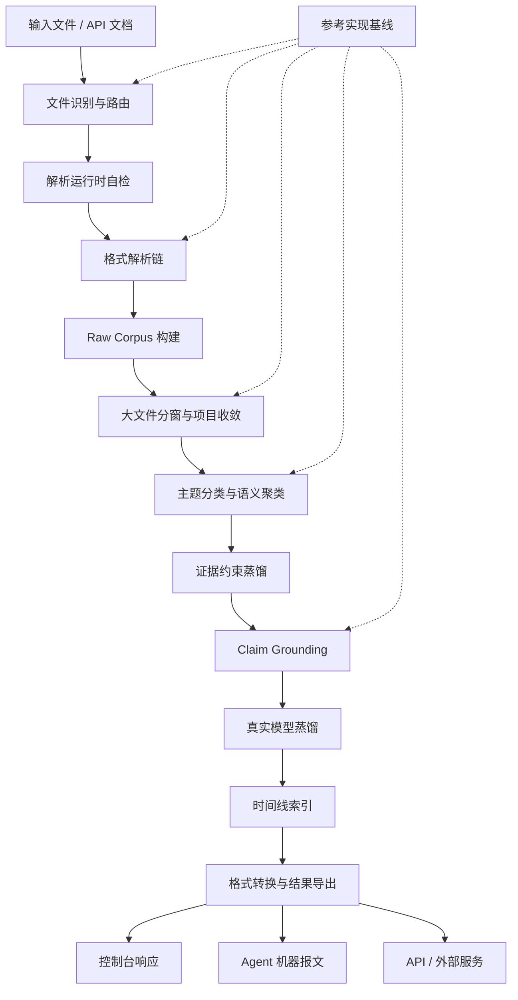

# Pact 知识蒸馏系统：全链路算法升级计划

状态：章节化落地版调整计划
日期：2026-06-02
版本：v2.3
适用范围：独立知识蒸馏服务、控制台、智能体 API、导出链路；平台内部知识蒸馏实现仅作为迁移期废弃入口

---

## 0. 文档定位

本文件是 Pact 知识蒸馏能力的整改计划，不是单点修补清单。目标是把当前偏“文件解析 + LLM 总结”的链路，收敛为单机可部署、证据可追溯、算法可验证、智能体可直接调用的独立知识蒸馏服务。

本文作为后续知识蒸馏改造的主执行文档：新增算法、解析器、导出链路、外部服务能力和 verifier，都必须回填到对应章节，避免计划继续分散到临时说明里。

章节粒度就是后续工程推进粒度。每一章都对应一个可实现、可验证、可回滚的系统层级：先把文件可靠变成证据，再把证据变成可检索、可校验、可导出的知识。

章节写法固定为五段：目标、现状问题、改进动作、落地位置、验收门禁。已经落地的能力写入“当前可用基线”，尚未完成的能力写入“后续调整落点”，避免把可用 baseline、设计目标和临时补丁混在一起。

本计划覆盖以下边界：

- 独立服务主线：`external-services/knowledge-distillation-service/`
- 外部服务适配：`server/platform/specialized/knowledge/invocation/external-distillation-service/`
- 废弃迁移壳：`knowledge.distillation.*` 与 `knowledge.distillation.workbench.*` 只返回迁移报文，不再承载算法演进
- Tika 与文件归一化：`server/platform/modules/knowledge/file-processor/`
- 控制台工作台：`server-web/components/KnowledgeDistillationWorkbench.vue`
- 验证脚本：`server/scripts/verify-*knowledge*distillation*.mjs`

---

## 1. 总体目标

知识蒸馏必须成为 Pact 平台的基础能力，而不是依赖人工补救的附属工具。

核心目标：

- 文件进入系统后先路由，再解析，最后蒸馏。
- 大文件、扫描件、字体异常 PDF、Office、邮件、图片和结构化文件都有明确处理路径。
- raw corpus 为空时硬拦截，禁止假成功。
- 蒸馏结果必须携带来源、时间线、证据、置信度和失败边界。
- 控制台输出面向用户，智能体输出机器可读。
- 成功蒸馏任务必须经过真实模型网关调用；没有可用模型网关或 `modelAlias` 时失败，不生成规则假成功。
- 外部能力统一使用 `external.*`；知识蒸馏唯一维护服务名为 `external.knowledge.distillation`。
- 平台内部知识蒸馏运行时停止装载，旧接口只保留 `410` 迁移报文和机器可读替代操作。
- 单机部署可运行，OrbStack 容器可验证，离线包可自检。

---

## 2. 总体架构



### 2.1 章节执行索引

每一层都按“契约先行、运行时落地、回归验证”推进。后续实现和评审以章节为单位推进，每个章节固定回答四件事：问题是什么、怎么调整、落到哪些文件、用什么 verifier 退出。

| 章节 | 层级 | 交付件 | 核心验证 |
| --- | --- | --- | --- |
| 4 | 输入路由 | `FileRoutingPlan`、格式矩阵、Tika 前置分流 | 文本/配置直读、PDF 子类型识别、压缩包不误送单文件解析 |
| 5 | 运行时 | runtime doctor、单机依赖矩阵、容器健康检查 | 本机、OrbStack、离线包输出一致能力状态 |
| 6 | 解析链 | `ParseResult`、parser trace、PDF/OCR 降级链 | 正常 PDF、扫描 PDF、字体异常 PDF 状态可区分 |
| 7 | Raw Corpus | 证据字段标准、空输入门禁、质量标记 | `EMPTY_RAW_CORPUS` 不进入蒸馏 |
| 8 | 大文件 | 分块上传、流式解析、结构窗口、overlap 合并 | 超窗口样本可完成窗口级和文档级收敛 |
| 9 | 分类 | 主题分组、弱证据池、垃圾隔离 | 混合资料不生成单一混乱总结 |
| 10 | 蒸馏 | embedding 聚类、项目级收敛、增量复用 | 未变窗口可复用，变更窗口可重蒸馏 |
| 11 | Grounding | claim 拆解、evidence top-k、蕴含判定 | 无证据 claim 被标记或拦截 |
| 12 | 时间线 | `eventTime`/`documentTime`/`ingestedAt`/`distilledAt` 四类时间 | 智能体可按时间段、置信度和证据强度过滤 |
| 13 | 响应 | `console`、`agent`、`api` 三类 response profile | 用户不看机器 trace，智能体能读重试动作 |
| 14 | 导出 | Markdown、DOCX、JSON、ZIP、Agent JSON | Word/Xcode/解压工具可打开产物 |
| 15 | 服务边界 | `external.knowledge.distillation` 成为唯一维护面，内部入口废弃 | Pact 可注册并调用独立知识蒸馏服务，内部入口不再暴露给智能体 |
| 16 | 验证 | 样本集、verifier、CI 轻重分层 | 历史故障全部进入回归 |

### 2.2 实施依赖顺序


硬约束：

- 路由、运行时、解析、raw corpus 是 P0 基础层，未完成前不能继续扩大模型蒸馏逻辑。
- 分类、项目收敛、时间线和 grounding 是算法层，必须以 evidence refs 和 verifier 驱动。
- 导出、响应 profile、外部服务注册是产品化层，必须同时覆盖控制台、智能体和普通 API。

### 2.3 当前实现状态与调整落点

这份计划按“已经落地的外部服务基线 + 仍需继续增强的独立服务能力 + 内部模块删除路径”组织，避免把可用 baseline、最终目标和迁移壳混在一起。

| 层级 | 当前可用基线 | 后续调整落点 |
| --- | --- | --- |
| 内部模块边界 | 外部服务已拆出 `DocumentParsing`、`DistillationAlgorithm`、`ModelDistillation`、`FormatConversion` 四个内部模块边界：解析只输出 `pact.normalized-distillation-documents.v1`，算法只接收 `external-kd.algorithm-input.normalized-documents.v1`，模型蒸馏通过 `required-agent-gateway-real-model-call.v1` 发起真实模型调用，格式转换统一负责 Markdown/DOCX/JSON/ZIP 自检 | 后续文件解析、格式转换和模型蒸馏分别优化，但仍留在 `external.knowledge.distillation` 服务内，不拆成通用 Parsing 服务 |
| 文件路由 | 外部服务已按 extension/media/source kind 生成 `routePlan`，PDF 额外输出 `pdf-subtype-routing.v1` 和 `pdfProfile`，可区分文本 PDF、扫描 PDF、字体映射风险 PDF、图片密集 PDF、加密 PDF 和空/未知 PDF | 继续只在外部服务增强 route-first 和 PDF 子类型字段，内部入口不再回填算法能力 |
| 解析链 | 外部服务已覆盖文本、配置、Markdown frontmatter/block/code fence/blockquote、标记语言、图表、Notebook、源码、diff/patch、日历事件、PDF、OOXML、OpenDocument、EPUB、EML/MSG/MBOX 邮件、压缩包、OCR/Tika fallback，并把 Markdown frontmatter key/value refs/code-fence language-line refs/blockquote refs、markup、OOXML、OpenDocument、EPUB、基础 PDF 文本、PDF text-operator geometry、PDF URI annotation links、PDF outline/bookmark refs、PDF AcroForm/widget fields、Word paragraph styles/numbering refs/header/footer/content controls/bookmarks/hyperlinks/images/charts/comments/footnotes/endnotes/revisions、Word/PowerPoint/OpenDocument table cells、OpenDocument hyperlinks、PowerPoint slide layout/master 继承 refs、shape id/name/placeholders/geometry/hyperlinks/images/charts/speaker notes/comments、Excel workbook sheet name/id/state/path、defined names/named ranges/print areas、cell coordinates、merged-cell ranges、cell comments、SpreadsheetML date styles/date serials/formulas/hyperlinks/charts 纳入 `document-element-model.v1` | 继续在外部服务补齐专业解析；内部解析器只作为非蒸馏知识入库能力，不承接知识蒸馏算法升级 |
| Raw Corpus | 外部服务已用 `EMPTY_RAW_CORPUS` 拦截空语料 | 内部 workbench 不再维护；旧入口返回迁移报文 |
| 大文件 | 外部服务已支持 mounted file refs、streaming JSONL document manifests、archive refs、chunked windowing、大 JSON/JSONC file-ref streaming，并对 mounted Office/OpenDocument/EPUB 结构包执行结构 entry 选择、bounded native parse 和 large-entry streaming fallback | 上传、manifest、解析、蒸馏三层统一流式窗口协议 |
| 分类蒸馏 | 外部服务 baseline 为 `hashing_embedding_window_community_classification_v3`，已输出语义概念主题层级、分组理由、低耦合高内聚指标和垃圾排除原因 | 后续分类算法只在外部服务升级 embedding cosine、低耦合高内聚分组和垃圾池 |
| 真实模型蒸馏 | 外部服务在成功语料上调用 `agent-gateway`，写入 `result.modelDistillation` 与 `agentMessage.modelDistillation`；缺少模型网关返回 `MODEL_GATEWAY_REQUIRED`，缺少模型别名返回 `MODEL_ALIAS_REQUIRED` | 后续把模型输出纳入 claim 改写、摘要候选排序和风险解释，但不允许替代 evidence/grounding 门禁 |
| Grounding | 外部服务已做 claim-evidence top-k、冲突证据和 promotion gate | 后续 claim 级门禁和无证据结论拦截只进入外部服务 |
| 时间线 | 表格日期已进入 `timeRange`、`timeConfidence`、`timeSignals` | 扩展到邮件、元数据、正文日期，并提供 agent 查询过滤 |
| 项目收敛 | 外部服务已有 `hierarchical-domain-topic-project-convergence.v3`、project-domain/domainReports、cross-domain links、agent query index、project snapshot、incremental reuse plan 和 project evidence query | 后续窗口 hash、增量重算、domain/topic/community/source/time 读模型和项目级 convergence 只进入外部服务 |
| 图证据 | 外部服务已有 graph-lite evidence pack、run evidence query 和跨 run project evidence query | 接入更多智能体检索策略和项目级图谱查询 |
| 导出 | 外部服务产出 Markdown、DOCX、JSON、Agent JSON、snapshot、evidence pack、workspace ZIP，并为 PDF/Word/PowerPoint/Excel/Markdown/OpenDocument 输出专业格式适配矩阵、转换 adapter、质量门禁和风险边界 | 旧内部导出入口废弃，下载/openability/manifest 规则只按外部服务产物验收 |
| 服务边界 | `external.knowledge.distillation` 可作为独立服务注册 | 外部能力继续采用 `external.*` 命名，内部知识蒸馏运行时停止装载并进入删除路径 |
| 验证 | 已有外部服务、容器和平台注册 verifier | 增补 routing、grounding、timeline、export-openability 全量回归 |

### 2.4 分层边界

| 层级 | 范围 | 不接受的结果 |
| --- | --- | --- |
| 平台边界层 | `external.knowledge.distillation`、普通 API、Agent 工具注册、内部迁移壳 | 内部算法入口继续暴露给智能体，或旧接口绕过外部服务继续运行 |
| 输入路由层 | 文件类型、媒体类型、内容形态、调用函数和 fallback 决策 | 未判断格式就直接交给 Tika 或模型 |
| 解析运行时层 | Java/Tika、PDF 视觉解析、OCR、Office/Archive/Email parser 的能力自检 | 缺依赖时只返回“执行失败” |
| Raw Corpus 层 | 文本、表格、页面、slide、sheet、邮件线程、图表节点和源码 symbol 的证据化 | 空语料继续进入蒸馏并生成假成功 |
| 分窗层 | 页、章节、元素、表格、代码、公式和 overlap 窗口 | 大文件依赖单次内存、单次 Tika 或单次模型上下文 |
| 语义算法层 | 主题分类、聚类、垃圾池、窗口级/文档级/项目级收敛 | 多主题资料被压成一个不可追溯总结 |
| 证据校验层 | claim 拆解、evidence top-k、冲突证据、grounding score | 无证据结论进入核心提炼文档 |
| 时间线层 | `eventTime`、`documentTime`、`ingestedAt`、`distilledAt` 和时间段过滤 | 智能体只能拿全量结果自行扫 JSON |
| 响应导出层 | `console`、`agent`、`api` response profile，Markdown/DOCX/JSON/ZIP/Agent JSON，以及 PDF/Word/PowerPoint/Excel/Markdown 的 format conversion profile | 用户看到机器 trace，智能体拿不到可重试错误码 |
| 部署验证层 | 单机包、OrbStack 容器、离线依赖、轻重 verifier | 只在开发机偶然可用，不能复现 |

---

### 2.5 办公文档专业适配基线

办公文档不能按“抽文本再总结”处理，必须按格式族生成结构元素、转换 profile 和质量门禁。

| 格式 | 专业适配要求 | 当前基线 |
| --- | --- | --- |
| PDF | 先做 subtype routing，再保留页序、URI link、outline/bookmark、AcroForm/widget field、可用 geometry 和 OCR/Tika 降级状态 | `pdf.subtype-route`、`pdf.hyperlinks`、`pdf.outlines`、`pdf.form-fields`、`pdf.text.pdftotext` |
| Word | 保留标题、段落样式、编号、表格单元格、header/footer、content controls、bookmarks、超链接、图片、图表、批注、脚注、尾注和修订 | `office.word.styles`、`office.word.numbering`、`office.word.tables`、`office.word.headers-footers`、`office.word.content-controls`、`office.word.bookmarks`、`office.word.hyperlinks`、`office.word.images`、`office.word.charts`、`office.word.annotations`、`office.word.revisions` |
| PowerPoint | 保留 slide 顺序、slide layout/master 继承链、shape id/name、placeholder、bbox、表格、超链接、图片、图表、speaker notes 和评论 | `office.presentation.slides`、`office.presentation.layouts`、`office.presentation.placeholders`、`office.presentation.tables`、`office.presentation.hyperlinks`、`office.presentation.images`、`office.presentation.charts`、`office.presentation.speaker-notes`、`office.presentation.comments` |
| Excel | 保留 workbook sheet refs、defined names、named ranges、print areas、行列坐标、merged cells、cell comments、date serial、formula、hyperlink、chart drawing relationship 和时间索引 | `table.workbook.sheets`、`table.workbook.defined-names`、`table.sheet.cells`、`table.sheet.merged-cells`、`table.sheet.comments`、`table.sheet.date-styles`、`table.sheet.formulas`、`table.sheet.hyperlinks`、`table.sheet.charts`、`table.time-index` |
| Markdown | 保留 frontmatter、heading tree、table、code fence language/line refs、blockquote refs、link、image，而不是当成普通纯文本 | `markdown.frontmatter`、`markdown.structure` |

验收标准：每个格式都必须在 `format-conversion-plan-json` 和 `professional-format-manifest-json` 中给出 parser profile、structure units、preserves、quality gate results、known losses，并在 agent payload 中保留 element refs。

---

### 2.6 文件格式优化优先级

当前外部知识蒸馏服务支持 24 类格式路由、141 个扩展名。以下顺序用于排定解析器优化、样例集、质量门禁和回归覆盖优先级；实际路由仍必须按扩展名、MIME、文件签名和容器结构精确判断，不能用概率排序替代路由算法。

| 优先级 | 格式族 | 扩展名 | 独立解析策略 | 优化口径 |
| ---: | --- | --- | --- | --- |
| 1 | PDF | `.pdf` | `pdf.text.tika-safe` | 最高频知识库输入，优先覆盖文本型、扫描型、字体损坏、图片重型和加密/空 PDF 的 subtype routing |
| 2 | Word | `.docx`, `.doc`, `.docm`, `.dotx`, `.dotm`, `.dot`, `.rtf` | `office.word.structured` | 优先保证标题、段落样式、编号、表格、页眉页脚、批注、修订、超链接和图片/图表可追溯 |
| 3 | 表格 | `.xlsx`, `.xls`, `.xlsm`, `.xlsb`, `.csv`, `.tsv`, `.xltx`, `.xltm` | `table.sheet.structured` | 优先保证 sheet、行列坐标、merged cells、comment、formula、date serial、defined name 和 chart refs |
| 4 | PowerPoint | `.pptx`, `.ppt`, `.pptm`, `.ppsx`, `.ppsm`, `.pps`, `.potx`, `.potm`, `.pot` | `office.presentation.slides` | 优先保证 slide 顺序、layout/master、shape、placeholder、图片、图表、speaker notes 和评论 |
| 5 | Markdown | `.md`, `.markdown`, `.mdown` | `text.direct.markdown` | 优先保证 frontmatter、heading tree、table、code fence、blockquote、link 和 image refs |
| 6 | 纯文本/日志 | `.txt`, `.text`, `.log` | `text.direct` | 保证大文件流式分窗、编码检测和日志时间线抽取 |
| 7 | 图片/扫描件 | `.png`, `.jpg`, `.jpeg`, `.gif`, `.tif`, `.tiff`, `.webp`, `.bmp`, `.heic`, `.pbm`, `.pgm`, `.pnm` | `ocr.image` | 优先覆盖 OCR、版面坐标、表格/表单截图和 multimodal fallback |
| 8 | 邮件 | `.eml`, `.msg`, `.mbox` | `email.headers-body-attachments` | 优先保证 headers、正文、线程、附件路由和时间线字段 |
| 9 | 压缩包 | `.zip`, `.tar`, `.gz`, `.tgz`, `.tar.gz`, `.7z` | `archive.expand-route` | 优先保证安全展开、entry 级路由、递归深度、大小上限和 manifest |
| 10 | HTML/XML/标记文档 | `.html`, `.htm`, `.xhtml`, `.xml`, `.rst`, `.adoc`, `.asciidoc`, `.org`, `.tex`, `.latex`, `.wiki`, `.mediawiki` | `markup.structure` | 保证结构树、链接、表格和正文噪声清洗 |
| 11 | JSON/JSONL | `.json`, `.jsonc`, `.jsonl`, `.ndjson` | `structured.json` | 保证 record/window 流式处理、schema-like key path 和超大 JSONL manifest |
| 12 | 源代码 | `.js`, `.mjs`, `.ts`, `.tsx`, `.py`, `.java`, `.go`, `.rs`, `.swift`, `.kt`, `.c`, `.cc`, `.cpp`, `.h`, `.hpp` | `code.structure` | 保证 symbol、注释、依赖和变更证据能进入项目级收敛 |
| 13 | 配置文件 | `.yaml`, `.yml`, `.toml`, `.ini`, `.cfg`, `.conf`, `.properties`, `.env` | `config.key-value` | 保证 key/value、section、环境变量风险和部署配置证据 |
| 14 | OpenDocument | `.odt`, `.ott`, `.ods`, `.ots`, `.odp`, `.otp` | `open-document.structured` | 作为 Office 兼容格式跟进，优先保留正文、表格和超链接 |
| 15 | 图表/流程图 | `.svg`, `.drawio`, `.dio`, `.mmd`, `.mermaid`, `.puml`, `.plantuml` | `diagram.structure` | 保证节点、边、label 和图形文本可索引 |
| 16 | 项目目录/包 | `.directory`, `.folder`, `.xcodeproj`, `.xcworkspace` | `directory.file-ref.expand` | 优先保证目录递归、忽略规则、child routing 和项目级 manifest |
| 17 | Jupyter Notebook | `.ipynb` | `notebook.cells` | 保证 cell 顺序、markdown/code/output 分离和执行上下文 |
| 18 | 字幕/转写 | `.vtt`, `.webvtt`, `.srt`, `.sbv` | `transcript.cues` | 保证 cue 时间轴、speaker turns 和片段级 evidence |
| 19 | Visio | `.vsdx`, `.vsdm`, `.vssx`, `.vssm`, `.vstx`, `.vstm`, `.vsd`, `.vss`, `.vst`, `.vdx` | `office.visio.pages` | 低频但结构价值高，保留 page、shape、connector 和文本 |
| 20 | 音频 | `.wav`, `.mp3`, `.m4a`, `.aac`, `.flac`, `.ogg`, `.opus` | `audio.transcript-sidecar` | 先支持 sidecar transcript，再接 ASR 外部能力 |
| 21 | Diff/Patch | `.diff`, `.patch` | `diff.unified` | 保证 hunk、文件路径和变更语义进入工程证据 |
| 22 | 日历 | `.ics`, `.vcs` | `calendar.ics` | 保证 event、时间、参与者和 recurrence 基础字段 |
| 23 | EPUB | `.epub` | `ebook.epub` | 低频长文档，按 chapter/window 处理 |
| 24 | XBRL/Inline XBRL 财报 | `.xbrl`, `.ixbrl` | `xbrl.facts` | 专业场景格式，按 fact/context/unit 优化 |

TODO：Apple iWork 包格式 `.pages`, `.numbers`, `.key`, `.keynote` 暂不纳入主线优化；当前仅作为目录/包容器进入 `directory.file-ref.expand`，后续如需专业适配必须单独设立 iWork 解析策略和样例门禁。

---

## 3. 业界参考基线

参考仓库已浅克隆到：

`build/reference-frameworks/knowledge-distillation/`

外部服务通过以下文件暴露同一份基线：

`external-services/knowledge-distillation-service/reference-frameworks.json`

本地同步与审计命令：

- `npm run server:external-kd:references`：只审计 manifest 中的 pinned checkout。
- `npm run server:external-kd:sync-references -- --only graphrag`：按 manifest fetch/checkout 单个参考仓库。
- `npm run server:verify:external-knowledge-distillation-references`：验证本机参考仓库全部存在且 commit 匹配。

外部服务还通过 `reference-framework-local-checkout-audit.v1` 对上述本地 checkout 做运行时审计：检查路径是否存在、是否为 Git worktree、实际 commit 是否匹配 manifest，并在 `/v1/reference-frameworks`、`/v1/capabilities` 和 `/v1/reference-gap-report` 中暴露 `localAudit`。单机 Docker 镜像默认不打包 1.6G 参考源码时，也必须明确报告 missing，不允许把静态 JSON 当作已完成比对。

工业 benchmark 通过 `pact.external-knowledge-distillation.industrial-benchmark.v1` 固化三层证据：

- `referenceAudit.strategy = manifest-pinned-local-source-evidence.v1`：逐个检查 RAGFlow、MinerU、Docling、LlamaIndex、Marker、GraphRAG、Haystack、Unstructured 的本地 checkout、Git commit、脏状态和源码目录证据。
- `absorptionMatrix`：把 DocumentParsing、ProfessionalOfficeCompatibility、AllSizeProcessing、ClassificationDistillation、ProjectConvergenceGraphEvidence、HumanAgentApiSeparation、RealModelDistillation 逐项绑定到参考框架和外部服务能力字符串。
- `checks.referenceAbsorptionMatrix`：只有参考源码证据和服务能力同时存在，才允许判定为 `absorbed`；否则不能把参考框架写成已吸收。

| 参考实现 | 对标重点 |
| --- | --- |
| RAGFlow | Deep document understanding、RAG 引擎、Agent 知识库流 |
| MinerU | PDF、Office、扫描件、公式、表格、长文档优化 |
| Docling | 统一文档模型、版面、阅读顺序、表格、公式、OCR |
| LlamaIndex | 文档 Agent、摄取管线、评估与可观测性 |
| Marker | PDF 到 Markdown/JSON 的结构化转换 |
| GraphRAG | 大工程项目的图谱式收敛摘要 |
| Haystack | 生产级管线编排、显式路由、组件化评估 |
| Unstructured | partition、解析 strategy、chunk 与 enrichment |

使用规则：

- 解析策略优先对标 Docling、MinerU、Marker、Unstructured。
- 结构化窗口策略优先吸收 Unstructured `chunk_by_title`、表格隔离 pre-chunk、Docling DocItem label 和 LlamaIndex node metadata。
- 大项目收敛优先对标 GraphRAG、RAGFlow。
- Agent/API 兼容优先对标 LlamaIndex、Haystack。
- GPL 项目只吸收行为模式和测试思路，不复制代码。
- 每个新增 parser、batcher、clusterer、grounding gate、exporter 都要补 verifier。
- 独立服务必须输出 `reference-gap-report-json`，把已吸收模式、baseline 状态和未完成 gap 机器可读化，不能只停留在人工 README 对照。

---

## 4. 输入层：文件识别与全套路由

目标：任何文件在进入 Tika、OCR 或模型之前，都必须生成 `FileRoutingPlan`。

现状问题：

- 过去过度依赖 Tika 自动判断，文本文件可能被包装成 XHTML。
- PDF 没有区分可复制文本、扫描件、图片型 PDF、字体映射异常 PDF。
- 文件类型、调用函数和降级路径没有先验计划。

改进计划：

- 路由策略统一由 `external-services/knowledge-distillation-service/format-routes.json` 管理，协议为 `pact.external-knowledge-distillation.format-routes.v1`，策略为 `singleton-format-route-registry.v1`；服务启动时必须校验 route id、extension、media type、preferred parser 和 parser chain，配置错误直接启动失败。
- 解析策略统一由 `external-services/knowledge-distillation-service/parser-strategies.json` 管理，协议为 `pact.external-knowledge-distillation.parser-strategies.v1`，策略为 `singleton-parser-strategy-registry.v1`；服务启动时必须校验每个 route 引用的 preferred/fallback/chain parser strategy 均存在，配置错误直接启动失败。
- 建立统一路由对象：

```json
{
  "declaredType": "application/pdf",
  "sniffedType": "application/pdf",
  "extension": ".pdf",
  "contentShape": "pdf",
  "preferredParser": "pdf.text",
  "fallbackParsers": ["pdf.visual", "ocr.page"],
  "riskFlags": ["font-mapping-risk", "large-file-risk"]
}
```

- 文本与配置类文件默认直读或结构化轻解析：`.md`、`.txt`、`.json`、`.csv`、`.yaml`、`.toml`、`.ini`、`.cfg`、`.conf`、`.properties`、`.env`、代码文件。
- 标记语言文件按元素结构解析：`.html`、`.xhtml`、`.xml`、`.rst`、`.adoc`、`.asciidoc`、`.org`、`.tex`、`.latex`、`.wiki`、`.mediawiki` 提取 heading、list、link、table row、code、citation 和 formula。
- 工程图表类文件结构化解析：`.svg`、`.drawio`、`.mmd`、`.mermaid`、`.puml`、`.plantuml`，提取节点、边、标题和标签。
- Notebook 文件按 cell 结构解析：`.ipynb` 提取 markdown、code 和 output cell。
- 源码文件按静态结构解析：JavaScript、TypeScript、Python、Java、Go、Rust、Swift、Kotlin、C/C++ 提取 import、symbol、entry point 和 TODO，不执行源码。
- 变更集文件按统一 diff 结构解析：`.diff`、`.patch` 提取 changed files、hunks、additions、deletions 和上下文。
- 日历事件文件按 iCalendar/vCalendar 结构解析：`.ics`、`.vcs` 提取事件、待办、开始/结束时间、地点、组织者和描述。
- Office 文件走结构化解析：`.docx/.docm/.dotx/.dotm`、`.pptx/.pptm/.ppsx/.ppsm/.potx/.potm`、`.xlsx/.xlsm/.xltx/.xltm`；旧式 `.doc/.dot/.ppt/.pps/.pot/.xls/.xlsb/.rtf` 走 Tika fallback。
- 在扩展名/media type 路由前增加 `content-signature-routing.v1`：对 PDF、OOXML Word/PowerPoint/Excel、OpenDocument、EPUB、图片、压缩包、RTF、HTML 做 bounded head-byte 嗅探，纠正 `.asset`、缺扩展名或 `application/octet-stream` 这类错误声明。
- PDF 拆分为 `pdf-text`、`pdf-scanned`、`pdf-font-broken`、`pdf-image-heavy`。
- PDF 子类型必须写入 `route.pdfSubtype`、`corpusPlan.documents[].pdfProfile` 和 Agent 报文，不允许只把判断埋在 parser trace 里。
- 邮件走邮件解析器：`.eml`、`.msg`、`.mbox`。
- 图片走 OCR/多模态解析器：`.png`、`.jpg`、`.jpeg`、`.tif`、`.tiff`、`.webp`。
- 压缩包作为 workspace package 处理，不直接送入单文件解析器。

落地位置：

- `server/platform/specialized/knowledge/preprocessing/file-processor/index.mjs`
- `server/platform/modules/knowledge/file-processor/FileNormalizer/Tika/tika.mjs`
- `external-services/knowledge-distillation-service/server.mjs`

验收：

- 同一文件多次路由结果稳定。
- Markdown/TXT/JSON/YAML/TOML/ENV 不再经过 Tika XHTML 路径。
- SVG/draw.io/Mermaid/PlantUML 不再被降级成普通文本或 OCR 图片。
- `.ipynb` 不再作为普通 JSON 摘要，必须保留 cell 类型与执行输出边界。
- 源码不再作为普通文本摘要，必须保留语言、行号、import 和 symbol 边界。
- `.diff/.patch` 不再作为普通文本摘要，必须保留文件级、hunk 级和增删行统计。
- `.ics/.vcs` 必须直接产出 `eventTime` 证据，支持智能体按时间段检索会议、里程碑和变更窗口。
- PDF 路由结果能说明后续是否需要视觉解析或 OCR。
- 文本 PDF、扫描 PDF、字体映射风险 PDF、图片密集 PDF、加密 PDF、空/未知 PDF 的 subtype 和风险标记可被智能体直接过滤。

---

## 5. 运行时层：单机依赖与健康检查

目标：解析能力是平台能力，不是用户手工补依赖后的偶然能力。

现状问题：

- macOS 上 bundled JRE 原生库可能被系统策略拒绝加载。
- PyMuPDF/fitz 缺失时视觉解析直接失效。
- OCR 运行时、语言包和模型路径缺少统一 health report。

改进计划：

- 增加 runtime doctor：
  - Java/Tika 可执行性。
  - JRE 原生库签名与加载状态。
  - PyMuPDF/pdfplumber 是否可用。
  - OCR runtime、语言包、模型路径是否可用。
  - Tika timeout 与解析策略配置。
- 单机包默认携带或自动检查：
  - Node server。
  - JRE/Tika。
  - PDF 视觉 Python runtime。
  - OCR runtime 与语言包。
  - 样本解析 smoke test。
- Tika 默认启用硬超时，避免长时间无响应。

落地位置：

- `server/platform/common/platform-core/settings.mjs`
- `server/platform/modules/knowledge/file-processor/FileNormalizer/Tika/tika.mjs`
- `server/scripts/production-readiness-gate.mjs`
- `server/scripts/pack-offline-server.mjs`

验收：

- 本机、OrbStack 容器、离线包都能输出同一能力矩阵。
- 缺依赖时返回结构化错误，不进入模糊失败。

---

## 6. 解析层：多解析器链与降级策略

目标：把“解析失败”拆成可解释、可恢复、可验证的阶段。

统一结果模型：

```json
{
  "parseStatus": "completed",
  "text": "...",
  "blocks": [],
  "tables": [],
  "images": [],
  "warnings": [],
  "errors": [],
  "parserTrace": [],
  "contentQuality": {
    "textCharacters": 12000,
    "ocrCharacters": 3000,
    "confidence": 0.86
  }
}
```

改进计划：

- Tika 负责稳定文本抽取，不承担所有视觉解析。
- PDF 字体映射异常时标记 `PDF_FONT_MAPPING_BROKEN`。
- 图片密集 PDF 默认禁用高风险内嵌图片抽取。
- PyMuPDF 负责页级布局、文本块、图像和表格候选。
- OCR 按页执行，保留页码、语言和置信度。
- OCR 低置信文本只能作为弱证据。
- 解析器日志进入 `parserTrace`，不直接暴露给普通用户。

落地位置：

- `server/platform/modules/knowledge/file-processor/FileNormalizer/Tika/tika.mjs`
- `server/platform/specialized/knowledge/preprocessing/file-processor/index.mjs`
- `server/scripts/verify-document-parser-dry-run.mjs`

验收：

- 字体损坏 PDF 返回字体失败原因和降级尝试结果。
- 扫描 PDF 至少返回页级 OCR trace。
- 空正文不再被当作正常解析结果。

---

## 7. Raw Corpus 层：证据保真与空输入门禁

目标：蒸馏前必须拥有可复核证据。

raw corpus item 标准字段：

```json
{
  "sourceId": "doc-001",
  "documentId": "manual.pdf",
  "page": 12,
  "section": "3.2",
  "text": "...",
  "quality": "strong",
  "parserTraceRef": "trace-001",
  "capturedAt": "2026-05-31T00:00:00.000Z",
  "contentHash": "sha256:..."
}
```

改进计划：

- `rawCorpus.totalCharacters === 0` 时禁止创建蒸馏 run。
- 控制台显示“解析无可用正文”。
- 智能体获得 `EMPTY_RAW_CORPUS` 和 parser trace refs。
- 低质量 OCR 证据必须带置信度。
- 证据水合失败必须进入 metrics 和 warning。

落地位置：

- `external-services/knowledge-distillation-service/server.mjs`

验收：

- 空 PDF、扫描 PDF、字体损坏 PDF、正常 PDF 的状态可区分。
- 空语料不能进入“看似成功”的蒸馏阶段。

---

## 8. 大文件层：不限体量的分窗与流式处理

目标：文件上限不再由一次性内存、一次性 Tika 调用或一次性 LLM 上下文决定。

上传与排队流程：

1. TODO：前端上传必须使用成熟开源组件或标准协议，例如 Uppy/FilePond、tus 或 S3 multipart 兼容实现；知识蒸馏服务不自研 multipart、断点续传、分片合并和浏览器上传状态机。
2. TODO：上传网关把原始文件存放到单独配置的本地临时目录，目录必须和最终知识库、导出目录、运行结果目录隔离，并受 TTL、quota、扩展名、MIME、hash 和路径白名单约束。
3. TODO：上传完成后，后端立即生成上传收据，至少包含 `uploadId`、`sourceId`、原始文件名、临时路径或对象 key、`byteSize`、`sha256`、`mediaType`、`extension`、上传状态和过期时间。
4. TODO：后端同时创建待解析任务并放入任务队列，任务初始状态为 `queued`，任务载荷只引用上传收据或 manifest，不再携带大文件字节。
5. TODO：解析 worker 从队列领取任务后，将临时文件转换为 `filePath`、`contentRef` 或 JSONL manifest 条目，再调用 `external.knowledge.distillation` 的 `POST /v1/distillation/runs`。
6. 已实现边界：外部知识蒸馏服务只消费 JSON 描述、文件引用、目录引用或 manifest；它负责签名探测、路由、解析、分窗和蒸馏，不负责上传传输层。
7. TODO：任务结束后，后端根据结果把上传状态推进为 `parsed`、`failed`、`expired` 或 `rejected`，并清理过期临时文件；失败必须保留错误码、parser trace refs 和 upload receipt refs。

改进计划：

- TODO：上传层支持 chunk/resume，不把大文件完整塞进单次内存处理。
- TODO：上传层使用成熟组件和标准协议，Pact 只管理上传收据、临时目录、任务状态和队列调度。
- 已实现：外部知识蒸馏服务支持 `single-node-background-run-queue.v1`，`POST /v1/distillation/runs` 可通过 `Prefer: respond-async`、`executionMode=queued`、`mode=queued`、`executionMode: "queued"` 或 `async: true` 立即返回 `202 queued`，后续通过 run polling 查询 `queued/running/completed/failed/canceled`。
- API 层支持 `rawDocumentsManifestPath`/`rawDocumentsManifestRef` 指向 JSONL 文档清单，服务端逐行读取 manifest，再把每个条目交给 filePath/contentRef 路由，避免大工程把所有文档塞进一次请求体。
- 解析层按页、sheet、slide、section 或 block 流式产出。
- `.json/.jsonc` 的 mounted filePath 必须走 `structured-json-file-ref-streaming-window.v1`，超出 direct-read 阈值时仍保留 `json` 路由、streaming hash、窗口和 parser trace，不允许退化成 unknown binary。
- 结构化 ZIP 文件引用按结构 entry 读取：DOCX/PPTX/XLSX/OpenDocument/EPUB 只选择文档 XML/XHTML，不把图片、媒体和无关包内容交给解析器；单个结构 entry 超过边界时进入 `structured-zip.large-entry-stream`，保留文本窗口、错误边界和 parser trace。
- 对没有专用文本解析器的超大或未知 filePath 使用 `bounded-binary-file-profile.v1`，流式计算 hash 和有限头尾采样，禁止整文件读入内存，也不把二进制字节伪造成文本。
- corpus 层按结构边界建立窗口：
  - 默认窗口按字符、页、元素或 block 混合控制。
  - Markdown frontmatter key/value refs、code-fence language/line refs、blockquote refs、标记语言、OOXML、OpenDocument、EPUB、PDF 基础文本块、PDF 文本定位几何、PDF URI annotation links、PDF outline/bookmark refs、PDF AcroForm/widget fields、Word paragraph styles/numbering refs/header/footer refs/content controls/bookmarks/链接/图片/图表/批注/脚注/尾注/修订、Word/PowerPoint/OpenDocument 表格单元格、OpenDocument 链接、PowerPoint slide layout/master 继承 refs、shape id/name/placeholders/链接/图片/图表/批注/shape 几何/speaker notes、Excel workbook sheet name/id/state/path、defined names/named ranges/print areas、单元格坐标、merged-cell ranges、cell comments、SpreadsheetML 日期样式/日期序列号/公式/hyperlink/chart 和后续 PDF/Office layout block 使用 `document-element-model.v1` 统一表达元素。
  - 标题层级使用 `element-aware-by-title-windowing.v1` 建立窗口，表格、代码、公式保留隔离边界。
  - 普通文本窗口之间保留 overlap；元素窗口保留 `headingPath`、`elementRefs` 和 `boundaryReason`。
  - 每个窗口保留 `contentHash`。
- 蒸馏层按窗口先局部提炼，再做文档级、项目级收敛。
- 超大文件只限制运行资源和策略，不设小尺寸硬上限。

落地位置：

- `external-services/knowledge-distillation-service/server.mjs`

验收：

- TODO：上传链路不出现自研 multipart 文件接收逻辑；文件先进入受控临时目录，再通过队列任务触发解析。
- TODO：上传完成后能看到 upload receipt、queued parse job、解析中状态和最终 parsed/failed 状态。
- 大 PDF 不因单次解析 timeout 直接失败。
- 单文档可拆成多个窗口，并能合并为文档级结论。
- verifier 覆盖至少一个超窗口文本样本。

---

## 9. 分类层：多主题分流与垃圾信息隔离

目标：不同主题不能被压成一个混乱总结。

改进计划：

- 对输入文档先做主题分类，再进入蒸馏。
- unrelated 文档进入不同分类组。
- 低相关、低质量、模板化、重复噪声进入 `garbage` 或 `weak-evidence` 池。
- 每个分类组输出：
  - `groupId`
  - `label`
  - `keywords`
  - `sourceIds`
  - `cohesionScore`
  - `evidenceCount`

算法路径：

- 当前独立服务先用确定性 token/Jaccard 做 baseline。
- 后续只在独立服务中升级 embedding cosine 或更强语义聚类。
- 大项目再叠加 GraphRAG 风格 community report。

落地位置：

- `external-services/knowledge-distillation-service/server.mjs`
- `server/platform/specialized/knowledge/invocation/external-distillation-service/index.mjs`

验收：

- 架构文档、财务票据、运维日志混合输入时至少产生 3 个主题组。
- 垃圾信息不进入核心提炼文档。

---

## 10. 蒸馏层：语义聚类、项目收敛与增量复用

目标：从“LLM 总结器”升级为“证据约束的知识提炼系统”。

改进计划：

- 分批：
  - 以文档、页、章节、slide、sheet 为优先边界。
  - 单文档超大时按结构窗口拆分。
  - 同目录、同来源、同主题优先同批。
- 聚类：
  - 用 embedding cosine 替代字面 Jaccard。
  - 使用 Leader-Clustering。
  - 超出最大 cluster 时进入最相似组或 `unassigned_garbage_pool`。
- 项目收敛：
  - 窗口级摘要。
  - 文档级摘要。
  - 主题组摘要。
  - 项目级决策、风险、实体、时间线收敛。
  - 以 `projectId` 合并多次 run 的 graph evidence，保留 `sourceRunId` 供智能体区分历史证据和当前证据。
- 增量复用：
  - 以 `contentHash` 判断未变窗口。
  - 未变 cluster 复用上一轮结果。

落地位置：

- `external-services/knowledge-distillation-service/server.mjs`
- `external-services/knowledge-distillation-service/reference-frameworks.json`

验收：

- 多主题工程样本不再产出单一巨型 cluster。
- 未变内容重复蒸馏时能复用缓存。

---

## 11. Grounding 层：Claim-Evidence 事实校验

目标：每条关键结论都能回到原始证据。

改进计划：

- 将蒸馏输出拆成原子 claims。
- 为每条 claim 检索 top-k evidence。
- 判定 claim 与 evidence 的关系：
  - `entailed`
  - `contradicted`
  - `neutral`
- 计算 `groundingScore`。
- 低分输出进入不确定项，不写入核心知识。
- OCR 低置信内容不能单独支撑高置信结论。

落地位置：

- `external-services/knowledge-distillation-service/server.mjs`
- `server/scripts/verify-external-knowledge-distillation.mjs`

验收：

- 故意注入无证据 claim 时必须被拦截。
- 每个最终 finding 至少包含一个 evidence ref。

---

## 12. 时间线层：时间段检索与噪声排除

目标：智能体按时间段查询时，能精确筛选有效信息并排除无关噪声。

改进计划：

- 每个 evidence item 维护四类时间：
  - `eventTime`: 文档内容描述的事件时间。
  - `documentTime`: 文档自身创建、修改、邮件发送或报告日期。
  - `ingestedAt`: 进入 Pact 的时间。
  - `distilledAt`: 蒸馏产物生成时间。
- 时间解析保留来源：
  - 文件元数据。
  - 邮件头。
  - 文档正文日期。
  - 用户上传上下文。
- 时间线索引字段：
  - `timeRange`
  - `timeConfidence`
  - `timeEvidenceRef`
  - `timezone`
  - `ambiguityFlags`
- 智能体查询支持：
  - `from`
  - `to`
  - `timeField`
  - `confidenceMin`
  - `excludeWeakEvidence`
- Agent evidence query 不返回完整大 JSON 后再让智能体自扫；服务侧必须先按时间、实体、claim 状态和 evidence 强度过滤。

落地位置：

- `external-services/knowledge-distillation-service/server.mjs`

验收：

- 查询某一时间段时，结果按 `eventTime` 或 `documentTime` 可切换。
- 无日期、低置信日期、模板日期不污染强时间线。
- 智能体请求同一时间段时，返回结果数量、过滤条件和被排除原因可机器读取。

---

## 13. 响应层：控制台、智能体与 API 分离

目标：同一任务对不同调用方输出不同形态。

响应 profile：

| Profile | 使用者 | 输出重点 |
| --- | --- | --- |
| `console` | 管控台用户 | 简短状态、失败摘要、下一步建议 |
| `agent` | 智能体 | 错误码、trace refs、routePlan、evidence refs |
| `api` | 普通接口调用 | 稳定 JSON contract |

统一错误码：

- `TIKA_RUNTIME_DENIED`
- `PDF_FONT_MAPPING_BROKEN`
- `PDF_VISUAL_RUNTIME_MISSING`
- `OCR_NO_TEXT`
- `EMPTY_RAW_CORPUS`
- `DISTILLATION_INPUT_UNSUPPORTED`
- `GROUNDING_FAILED`

落地位置：

- `server-web/components/KnowledgeDistillationWorkbench.vue`
- `server/platform/specialized/knowledge/invocation/external-distillation-service/index.mjs`
- `external-services/knowledge-distillation-service/server.mjs`

验收：

- 控制台不展示长 Java stack trace。
- 智能体能直接读取机器可重试动作和 trace refs。
- 普通 API 不依赖控制台桥接逻辑。
- 智能体可通过专用 evidence query 读取裁剪后的 text units、entities、relationships、claims 和 community reports。
- 智能体可通过 project evidence query 按 `projectId`、domain、route、时间段、实体、claim 状态和来源过滤跨 run 项目证据。

---

## 14. 导出层：可打开、可复核、可下载

目标：产物不是“看起来生成了”，而是能被常见工具打开。

导出格式：

- Markdown：核心提炼文档。
- DOCX：Word 可打开文档。
- JSON：机器可读结构化结果。
- Console Summary JSON：管控台摘要，只保留状态、文件大小、路由、openability、转换风险和质量门禁计数，不暴露 parser trace 噪声。
- Format Conversion Plan JSON：每个输入文档的专业解析与格式转换计划。
- Professional Format Manifest JSON：智能体/集成测试用专业格式清单，逐文档列出 parser profile、structure units、conversion adapters、preserves、quality gates、risk controls、known losses 和 openability。
- ZIP：完整工作区包。
- Agent JSON：智能体专用报文。

改进计划：

- DOCX 必须使用合法 OpenXML，不写伪文档；Markdown 标题、列表、代码块、路由表格和超链接必须转换成 Word heading/list/code style、`<w:tbl>` 与 hyperlink relationship，不能只是逐行塞入普通段落。
- ZIP manifest 记录文件大小、hash 和 media type。
- Markdown 不允许包含 Tika XHTML 噪声。
- PDF、Word、PowerPoint、Excel、Markdown、OpenDocument 必须进入 `office-document-professional-adaptation.v1` 格式矩阵，声明 parser stages、structure units、conversion adapters、preserves、quality gates、risk controls 和 known losses。
- PDF、Word、PowerPoint、Excel、Markdown 的专业适配必须区分解析和转换：解析阶段保留 page/bbox/PDF URI links/PDF outline refs/PDF form fields、heading/list/table/header/footer/content-control/bookmark/link/image/chart、comment/footnote/endnote/revision、slide/layout/master/shape id/name/placeholder/table/link/image/chart/speaker-note/comment、workbook sheet name/id/state/path、defined name/named range/print area、sheet/cell/merged-cell/comment/date-style/date-serial/formula/hyperlink/chart/time-index、Markdown frontmatter key/value refs、code-fence language/line refs、blockquote refs 和 block refs；转换阶段分别输出人类可读 Markdown/DOCX 和智能体可读 Agent JSON/evidence pack。
- 每个文档的 `formatConversionPlan.documents[]` 必须能说明转换到 Markdown、DOCX、Agent JSON 和 evidence pack 时保留什么、丢失什么、如何验收可打开性。
- `human-agent-response-profile-separation.v1` 必须把管控台摘要和智能体报文分开；管控台不展示 parser trace/full windows，智能体必须能下载 `professional-format-manifest-json` 精确筛选格式适配状态。
- 每个文档必须输出 `qualityGateResults`，把页面顺序、bbox、PDF link/outline/form fields、Word paragraph style/list/table/header-footer/content-control/bookmark/link/image/chart/annotation/revision、PPT slide/layout-master/shape placeholder/shape layout/table/link/image/chart/speaker-note/comment、Excel workbook sheet refs/defined-name refs/sheet-row-cell/merged-cell/comment/date-serial/formula/hyperlink/chart/time-index、Markdown frontmatter/heading/table/code-fence/blockquote/link/image、OpenDocument content/table/link 变成可机读的 pass/warning/fail/not_applicable。
- `formatConversionPlan.outputArtifactValidation` 必须对实际导出的 Markdown/DOCX 做自检，DOCX 至少验证 ZIP 可读、OpenXML 必需部件、WordprocessingML content type、`word/document.xml` body、文本节点、heading style、list/code style、表格 XML 可用性和 hyperlink relationship 完整性。
- 下载链路统一走 bridge-mediated fetch/blob。
- 下载 UI 显示文件大小。

### 14.1 办公文档专业适配合同

| 格式 | 解析合同 | 转换合同 | 质量门禁 |
| --- | --- | --- | --- |
| PDF | text/layout/OCR 分路，保留 page、bbox、URI link、outline/bookmark、AcroForm/widget field、subtype/risk flag | Markdown/DOCX 保留阅读顺序，Agent JSON 保留页级、目录和表单字段证据 | `page-order-preserved`、`pdf-link-refs-preserved`、`pdf-outline-refs-preserved`、`pdf-form-fields-preserved` |
| Word | 保留 heading/list style、table cell、header/footer part、content control、bookmark、link、image、chart、comment、footnote、endnote、tracked-change revision | DOCX 必须为合法 WordprocessingML，Agent JSON 保留段落、页眉页脚、控件、书签、图表、批注与修订证据 | `word-paragraph-style-refs-preserved`、`word-list-refs-preserved`、`word-header-footer-refs-preserved`、`word-content-control-refs-preserved`、`word-bookmark-refs-preserved`、`word-chart-refs-preserved`、`word-annotation-refs-preserved`、`word-revision-refs-preserved` |
| PowerPoint | 保留 slide、layout/master、shape id/name、placeholder、bbox、table、link、image、chart、speaker-note、comment | Markdown/DOCX 按 slide 顺序输出，Agent JSON 保留 layout/master/shape/chart/comment refs | `slide-order-preserved`、`presentation-layout-master-refs-preserved`、`presentation-placeholder-refs-preserved`、`presentation-image-refs-preserved`、`presentation-chart-refs-preserved`、`presentation-comment-refs-preserved` |
| Excel | 保留 workbook sheet、defined name、named range、print area、row/cell、merged-cell、comment、date serial、formula、hyperlink、chart、time index | Markdown 表格可读，Agent JSON/evidence pack 保留精确 defined-name/cell/chart refs | `spreadsheet-workbook-sheet-refs-preserved`、`spreadsheet-defined-name-refs-preserved`、`sheet-row-cell-refs-preserved`、`spreadsheet-merged-cell-refs-preserved`、`spreadsheet-comment-refs-preserved`、`spreadsheet-date-serials-normalized`、`spreadsheet-chart-refs-preserved` |
| Markdown | 保留 frontmatter key/value、heading tree、table、code-fence language/line refs、blockquote refs、link、image、block refs | Markdown 原生输出无 Tika XHTML，DOCX 转 frontmatter/heading/list/code/table/link/image | `heading-tree-preserved`、`markdown-frontmatter-refs-preserved`、`markdown-table-blocks-preserved`、`markdown-code-blocks-preserved`、`markdown-blockquote-refs-preserved`、`markdown-link-refs-preserved`、`markdown-image-refs-preserved` |

落地位置：

- `server-web/lib/bridge.ts`
- `server-web/components/KnowledgeDistillationWorkbench.vue`
- `external-services/knowledge-distillation-service/server.mjs`

验收：

- Markdown、DOCX、JSON、ZIP 均可打开。
- `format-conversion-plan-json` 能按 PDF/Word/PowerPoint/Excel/Markdown 精确列出专业 adapter、质量门禁评估、openability 状态和输出 artifact 自检结果。
- 浏览器下载记录不再出现失败项。
- 文件大小与 manifest 一致。

---

## 15. 服务边界层：外部服务唯一维护面

目标：知识蒸馏算法只在独立部署服务中演进；平台内部实现进入删除路径，不再作为维护对象。

命名规则：

- 外部服务统一使用 `external.*`。
- 知识蒸馏唯一维护服务名：`external.knowledge.distillation`。
- 旧 `knowledge.distillation.*` 和 `knowledge.distillation.workbench.*` 是迁移壳，不属于可维护算法面。
- Feature Profile 中新增独立能力 `external-knowledge-distillation`；旧 `knowledge-distillation` 只作为内部工作流迁移标记，不再代表外部服务最小依赖。
- 后续外部能力示例：
  - `external.icloud`
  - `external.mail`
  - `external.gmail`
  - `external.onedrive`

调用边界：

- 控制台只调用已注册外部服务或迁移壳返回的替代指引。
- 智能体可直接访问授权后的 `external.knowledge.distillation`。
- 普通 API 可绕过控制台和智能体，直接使用稳定接口。
- 内部知识蒸馏运行时不再由 server runtime provider 装载。

Feature Profile 最小依赖：

- `external-knowledge-distillation` 必须显式依赖 `core-platform`、`security-permissions`、`operation-dispatcher`、`console-shell`、`tool-management-core`、`work-queue-core`、`agent-gateway`。
- `agent-gateway` 是真实模型蒸馏的必需脱水依赖；模型不可用时任务必须失败并返回机器可读错误，不允许生成规则假成功。
- `work-queue-core` 是上传复用的必需脱水依赖；知识蒸馏上传链路复用平台 upload session、checkpoint、resume 和 raw object 能力，服务内部不自研浏览器分片上传状态机。
- `knowledge-core`、`document-parser`、`pdf-processor`、`ocr`、`multimodal-parser` 不属于外部知识蒸馏代理的最小依赖；需要这些能力时必须作为上层组合 feature 单独启用。知识蒸馏服务内的解析模块只为蒸馏服务生成保持时序、逻辑和原文结构关系的中间数据，不替代平台通用文档解析器。
- 旧内部工作流必须标记 `must-migrate`：`knowledge.agent_skill`、`knowledge.skills`、`knowledge.golden_rules`、`knowledge.rule_authoring`、`knowledge.gold_cases`、`knowledge.summarization`、`knowledge.training_sets`、`knowledge.evaluation`、`knowledge.model_roles`、`knowledge.model_decision`、`knowledge.evidence_gate.evaluate`。

删除路径：

- `server/platform/interactive/server-runtime-providers.mjs` 不再动态加载 `knowledge-distillation-runtime/index.mjs`。
- `server/platform/specialized/console/console-domain-services.mjs` 不再导入内部 workbench。
- `knowledge.distillation.*` 与 `knowledge.distillation.workbench.*` 在 Operation Registry 中标记 `deprecated: true`、`replacementService: external.knowledge.distillation`、`maintenancePolicy: compatibility-shim-only`。
- Tool Management 不暴露任何内部知识蒸馏操作，智能体只能发现 `pact.external.knowledge.distillation.*`。
- 内部 `knowledge-distillation-runtime/` 与 `knowledge-distillation-workbench/` 源文件已删除；相关 verifier 改为确认外部服务能力和内部模块缺席。

落地位置：

- `external-services/knowledge-distillation-service/`
- `server/platform/specialized/knowledge/invocation/external-distillation-service/`
- `server/platform/specialized/capabilities/tools/tool-management-core/catalog.mjs`
- `server/platform/common/operation-dispatcher/operation-registry.mjs`
- `server/platform/interactive/features/feature-manifest.mjs`
- `server/scripts/verify-knowledge-distillation-standalone-service.mjs`

验收：

- 新 OrbStack 容器能启动独立服务。
- Pact 平台能注册并调用外部服务。
- 智能体工具目录可发现并调用该能力。
- 独立 profile 必须带出 `agent-gateway`，并能通过 Pact 模型网关完成真实模型调用。
- 独立 profile 必须带出 `work-queue-core`，上传侧通过平台 upload session/checkpoint/resume 进入受控临时目录和任务队列。
- 旧内部入口返回机器可读 `INTERNAL_KNOWLEDGE_DISTILLATION_REMOVED`。
- `server:verify:external-service-api-registration` 阻止内部知识蒸馏重新进入 Tool Management 或 server runtime provider。
- `server:verify:knowledge-distillation-standalone-service` 是服务端独立服务门禁，不读取 `client-gui` 清单；它必须证明平台基础核心组件、`agent-gateway`、`work-queue-core` 和 `external.knowledge.distillation` 所需组件能被单独剥离出来，且不拉起内部知识库、平台文档解析器或旧内部工作流。

---

## 16. 验证层：样本集与回归门禁

目标：每次修复都进入可重复验证，不靠人工感觉判断。

样本集：

- 正常文本 PDF。
- 字体映射损坏 PDF。
- 扫描 PDF。
- 图片密集 PDF。
- Markdown/TXT/JSON/YAML/TOML/INI/ENV/properties。
- SVG/draw.io/Mermaid/PlantUML 工程图。
- Jupyter Notebook `.ipynb`。
- 源码结构样本：`.ts`、`.py`、`.go`、`.rs`。
- Git 变更集样本：`.diff`、`.patch`。
- 日历事件样本：`.ics`、`.vcs`。
- DOCX/XLSX/PPTX。
- EML/MSG/MBOX。
- 仓库内真实邮件原文：`tests/fixtures/email-corpus/*.eml`，用于邮件解析、时间线筛选和模型蒸馏回归。
- 大文件样本。
- 多主题混合样本。
- 噪声样本。

Verifier：

- `verify-document-parser-dry-run`
- `verify-knowledge-distillation-workbench`
- `verify-external-service-api-registration`
- `verify-knowledge-distillation-standalone-service`
- `verify-external-knowledge-distillation`
- 新增 `verify-distillation-routing`
- 新增 `verify-distillation-grounding`
- 新增 `verify-distillation-export-openability`
- 新增 `verify-distillation-timeline-filtering`

验收：

- CI 跑轻量样本。
- 本地全量 verifier 跑重样本。
- 每个历史故障都有固定回归用例。

---

## 17. 分层落地路线

| 阶段 | 覆盖章节 | 优先级 | 交付焦点 | 退出条件 |
| --- | --- | --- | --- | --- |
| P0-A | 4 | 最高 | 文件路由、Tika 前置分流、文本直读 | 所有支持格式先生成 `routePlan` |
| P0-B | 5-6 | 最高 | runtime doctor、PDF 视觉/OCR 自检、parser trace | 缺依赖可解释，正常 PDF、扫描 PDF、字体异常 PDF 状态可区分 |
| P0-C | 7 | 最高 | raw corpus 空输入硬门禁、证据字段标准 | `EMPTY_RAW_CORPUS` 稳定返回，不再假成功 |
| P0-D | 13-14 | 最高 | 控制台/智能体/API 响应分离，DOCX/ZIP/Markdown/JSON 下载可打开 | 下载成功，产物可被 Word、Xcode 和解压工具打开 |
| P1-A | 8 | 高 | 大文件分窗、流式解析、窗口合并 | 超窗口样本可完成窗口级和文档级蒸馏 |
| P1-B | 9-10 | 高 | 分类蒸馏、embedding 聚类、垃圾隔离、项目级收敛 | unrelated 输入可分组，噪声不进入核心提炼 |
| P1-C | 11 | 高 | Claim grounding、证据 top-k、冲突门禁 | 无证据 claim 被拦截，最终 finding 有 evidence refs |
| P1-D | 12 | 高 | 四类时间字段、时间段过滤、弱证据排除 | 智能体可按时间、置信度、证据强度精确检索 |
| P2-A | 10 | 中 | 增量蒸馏、窗口 hash、跨 run 项目收敛 | 未变内容复用缓存，变更窗口可重蒸馏 |
| P2-B | 15 | 中 | `external.knowledge.distillation` 独立服务、平台注册、Agent 工具目录 | OrbStack 单机容器可运行，Pact 可注册并调用 |
| P2-C | 16 | 中 | 全量样本集、轻重 verifier、CI 门禁 | 历史故障全部进入固定回归 |

### 17.1 第一轮执行顺序

第一轮不按“改一点点 UI”推进，而按系统链路闭环推进：

1. 路由与运行时：先统一 `FileRoutingPlan`、runtime doctor、parser trace 和空语料门禁。
2. 解析与证据：补齐 PDF/Office/Email/Archive/Markup/Notebook/Source/Diff/Calendar 的结构化证据模型。
3. 大文件与分窗：把页、章节、元素、表格、代码、公式统一纳入窗口模型，消除小文件上限。
4. 算法与校验：引入主题分类、聚类、垃圾池、claim grounding、冲突证据和时间线过滤。
5. 响应与导出：分离控制台、Agent、普通 API 报文，并验证 Markdown/DOCX/JSON/ZIP 可打开。
6. 服务与门禁：外部服务注册为 `external.knowledge.distillation`，OrbStack 单机容器、reference framework checkout audit 和 verifier 固化为回归门禁。

---

## 18. 文档维护规则

- 算法实现、文件格式支持、导出格式和外部服务 API 变更，必须更新对应章节。
- 新增历史故障必须补充到第 16 章样本集或 verifier 列表。
- 新增外部能力继续使用 `external.*` 命名，并同步更新第 15 章。
- 不新增平行的知识蒸馏长期计划文档；确有阶段记录时，最终结论回填本文。

---

## 19. 成功判定

该计划完成后，知识蒸馏应满足：

- 支持格式有明确路由，不再把 Tika 当万能入口。
- 大文件通过分窗和流式处理进入蒸馏，不被小尺寸上限挡住。
- 解析失败有错误码、trace 和降级说明。
- raw corpus 为空时不进入蒸馏。
- 多主题资料能分类提炼，噪声不会污染核心结果。
- 每条关键结论有证据来源和 grounding 状态。
- 智能体能按时间段检索并排除弱证据。
- 控制台、智能体、API 三类响应互不混淆。
- Markdown、DOCX、JSON、ZIP 可下载、可打开、可复核。
- `external.knowledge.distillation` 可单机部署和验证，内部知识蒸馏模块已删除。
