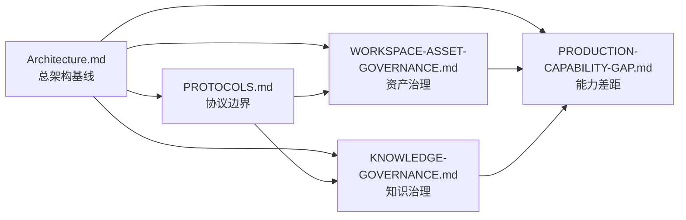

# Pact Docs

## Metadata / 元数据

- Last updated: 2026-06-14
- Status: Current maintained document
- Scope: Pact Docs.
- Staleness check: Scanned on 2026-06-12; this update indexes agent-facing documentation entry points and does not change release/readiness claims.

> Documentation index for Pact — a controllable agent collaboration space.
>
> Pact 文档索引 — 可控的智能体协作空间。

本文档目录分为核心设计文档和运行支持文档。新的长期架构决策只能进入核心设计文档，避免重新扩散成多份互相漂移的设计说明。

This directory is organized into **Core Design Documents** and **Operational Documents**. New long-term architectural decisions must be merged into one of the core documents to prevent fragmentation.

---

## 核心设计文档 / Core Design Documents

当前核心设计文档固定为五份 / Fixed to five authoritative documents:

| Document | 文档 | Description | Size |
| --- | --- | --- | --- |
| [Architecture.md](Architecture.md) | 架构总览 | System positioning, design scope, requirements, module design, data models, deployment | 54 KB |
| [PROTOCOLS.md](PROTOCOLS.md) | 协议边界 | Workspace API, Operation, Tool Management, Knowledge, and protocol adapter boundaries | 29 KB |
| [WORKSPACE-ASSET-GOVERNANCE.md](WORKSPACE-ASSET-GOVERNANCE.md) | 工作空间资产治理 | Public workspace asset governance, snapshots, traceability, restore, copy, and security principles | 37 KB |
| [KNOWLEDGE-GOVERNANCE.md](KNOWLEDGE-GOVERNANCE.md) | 知识治理 | Knowledge evidence, 3-layer knowledge model, agent-citable context, and knowledge maintenance loop | 19 KB |
| [PRODUCTION-CAPABILITY-GAP.md](PRODUCTION-CAPABILITY-GAP.md) | 生产能力差距 | Production capability gaps, acceptance gates, and current blockers | 38 KB |

### Document Dependencies / 文档依赖

---

## 运行支持文档 / Operational Documents

| Document | 文档 | Description | Size |
| --- | --- | --- | --- |
| [SERVER.md](SERVER.md) | 服务端指南 | Server startup, runtime, protocols, packaging, and operations | 57 KB |
| [USAGE.md](USAGE.md) | 使用说明 | Console, client, and CLI usage guide | 7 KB |
| [PRODUCT.md](PRODUCT.md) | 产品定义 | Product purpose, users, brand personality, design principles, and accessibility expectations | 4 KB |
| [FEATURE-PROFILES.md](FEATURE-PROFILES.md) | Feature Profile | Feature profile planning, trimming, and build commands | 2 KB |
| [IMPLEMENTATION-DECISION-REGISTER.md](IMPLEMENTATION-DECISION-REGISTER.md) | 设计决策登记表 | Pre-implementation design decisions; finalized conclusions must be merged back into core docs | 33 KB |
| [CLIENT_ARCHITECTURE.md](CLIENT_ARCHITECTURE.md) | 客户端架构 | Destructive desktop-client architecture target and six-module product boundary | 13 KB |
| [ENTITY-CONFIG-LAYOUT.md](ENTITY-CONFIG-LAYOUT.md) | 实体配置目录 | Human-maintainable entity config directory, lightweight skill packs, and validation | 2 KB |
| [DOCUMENT-EVALUATION-CORPUS.md](DOCUMENT-EVALUATION-CORPUS.md) | 文档测评集治理 | External corpus layout and rules for public document samples, local Mail samples, manifests, and parser verifiers | 4 KB |
| [EXTERNAL-SERVICE-MCP-DSL-EBNF.md](EXTERNAL-SERVICE-MCP-DSL-EBNF.md) | 外部服务 MCP DSL | EBNF grammar reference for external service MCP DSL | 15 KB |
| [MCP_INSTALL.md](MCP_INSTALL.md) | MCP 安装说明 | MCP installation and local setup notes | 7 KB |
| [MCP_INSTALL.zh-CN.md](MCP_INSTALL.zh-CN.md) | MCP 安装说明中文 | Chinese MCP installation and local setup notes | 7 KB |
| [TEST-FRAMEWORK.md](TEST-FRAMEWORK.md) | 测试框架 | Unified test framework contract | 6 KB |
| [DEVELOPER-GUIDELINES.md](DEVELOPER-GUIDELINES.md) | 开发者核心守则 | Coding conventions, architecture principles, and design philosophy | 5 KB |
| [GIT-COLLAB.md](GIT-COLLAB.md) | Git 协作约定 | Local collaboration conventions | 2 KB |
| [AGENT.md](AGENT.md) | 文档智能体入口 | Documentation task routing, metadata expectations, and context budget | < 1 KB |
| [scenarios/README.md](scenarios/README.md) | 场景链路草案 | Client-to-backend scenario drafts; finalized decisions must be merged back into core docs | < 1 KB |
| [testing/memory-and-smoke-framework.md](testing/memory-and-smoke-framework.md) | 记忆与 Smoke 测试 | Memory and smoke test framework guide | < 1 KB |

---

## 历史报告 / Historical Reports

历史进度、总结、审计、缺口、缺陷和阶段计划类文档统一放在 `docs/reports/history/`。这些文档用于记录某个时间点的状态、问题和整理路径；长期结论需要回写到核心设计文档或运行支持文档。

当前任务执行顺序和验收口径见 [reports/ORDERED-IMPLEMENTATION-TASKS-2026-06-03.md](reports/ORDERED-IMPLEMENTATION-TASKS-2026-06-03.md)。之前的综合决策队列、Checklist 和批量决策说明已归档到 [reports/history/](reports/history/)。

| Report | 报告 | Description | Size |
| --- | --- | --- | --- |
| [reports/history/PROJECT-HYGIENE-BASELINE-2026-06-03.md](reports/history/PROJECT-HYGIENE-BASELINE-2026-06-03.md) | 项目卫生基线 | Repository hygiene baseline, red gates, cleanup priorities, and confirmed maintainer decisions | 21 KB |
| [reports/history/PROJECT-PROGRESS-ASSESSMENT-2026-06-03.md](reports/history/PROJECT-PROGRESS-ASSESSMENT-2026-06-03.md) | 项目进度综合评估 | Project progress assessment across product goals, scenarios, service layers, clients, and delivery gaps | 21 KB |
| [reports/history/PROJECT-AUDIT-REPORT.md](reports/history/PROJECT-AUDIT-REPORT.md) | 历史深度巡检报告 | Historical code and document report; some findings may have drifted after later worktree changes | 22 KB |
| [reports/history/design-audit-2026-05-23.md](reports/history/design-audit-2026-05-23.md) | 设计文档审计 | Historical design-document audit against server implementation | 6 KB |
| [reports/history/platform-foundation-coupling-audit-2026-05-25.md](reports/history/platform-foundation-coupling-audit-2026-05-25.md) | 平台基础能力审计 | Historical coupling and cohesion audit for platform foundation modules | 13 KB |
| [reports/history/protocol-operation-registry-gap-2026-05-25.md](reports/history/protocol-operation-registry-gap-2026-05-25.md) | 协议操作缺口报告 | Historical protocol operation registry gap report | 7 KB |
| [reports/history/client-design-review-2026-05-26.md](reports/history/client-design-review-2026-05-26.md) | 客户端设计审查 | Historical client design review and gap report | 9 KB |
| [reports/history/COMMERCIALIZATION-IMPROVEMENT-PLAN.zh-CN.md](reports/history/COMMERCIALIZATION-IMPROVEMENT-PLAN.zh-CN.md) | 商业化改进计划 | Historical commercialization goals, constraints, and improvement path | 19 KB |
| [reports/history/V0.0.1-IMPLEMENTATION-PLAN.md](reports/history/V0.0.1-IMPLEMENTATION-PLAN.md) | v0.0.1 实施计划 | Historical single-node v0.0.1 delivery phases, checkpoints, and gates | 62 KB |
| [reports/history/CHECKPOINT-ALGORITHM-EVOLUTION-PLAN.md](reports/history/CHECKPOINT-ALGORITHM-EVOLUTION-PLAN.md) | Checkpoint 算法演进方案 | Historical LSM/Merkle/CAS/checkpoint algorithm evolution plan | 29 KB |
| [reports/history/KNOWLEDGE-DISTILLATION-EVOLUTION-PLAN.md](reports/history/KNOWLEDGE-DISTILLATION-EVOLUTION-PLAN.md) | 知识蒸馏演进方案 | Historical full-chain knowledge distillation plan | 58 KB |
| [reports/history/KNOWLEDGE-DISTILLATION-PROGRESS.md](reports/history/KNOWLEDGE-DISTILLATION-PROGRESS.md) | 知识蒸馏进展台账 | Historical completed, partially completed, and unfinished distillation work items | 20 KB |
| [reports/history/KNOWLEDGE-DISTILLATION-AUDIT.md](reports/history/KNOWLEDGE-DISTILLATION-AUDIT.md) | 知识蒸馏审计 | Historical implementation audit, gaps, and quality risks | 6 KB |
| [reports/history/KNOWLEDGE-DISTILLATION-IMPLEMENTATION-BASELINE.md](reports/history/KNOWLEDGE-DISTILLATION-IMPLEMENTATION-BASELINE.md) | 知识蒸馏实现基线 | Historical baseline notes for distillation behavior and artifacts | 4 KB |
| [reports/history/RESOURCE-OPERATION-INTERFACE-DRAFT.md](reports/history/RESOURCE-OPERATION-INTERFACE-DRAFT.md) | Resource Operation 接口草案 | Historical resource operation interface draft | 17 KB |
| [reports/history/SUBSYSTEM-REFACTOR-CHECKLIST.md](reports/history/SUBSYSTEM-REFACTOR-CHECKLIST.md) | 子系统重构检查表 | Historical subsystem refactor checklist and verifier status | 25 KB |
| [reports/history/SCENARIO-IMPLEMENTATION-GAPS.md](reports/history/SCENARIO-IMPLEMENTATION-GAPS.md) | 场景实现差距 | Historical scenario implementation gap list | 21 KB |
| [reports/history/SERVER-WEB-FRONTEND-AUDIT-2026-06-01.md](reports/history/SERVER-WEB-FRONTEND-AUDIT-2026-06-01.md) | Server Web 前端审计 | Historical server-web frontend audit | 109 KB |
| [reports/history/production-readiness/](reports/history/production-readiness/) | 生产准入运行报告 | Archived production readiness run reports, JSON summaries, and logs | directory |
| [reports/history/v001-readiness/](reports/history/v001-readiness/) | v0.0.1 准入运行报告 | Archived v0.0.1 readiness run reports, migration summaries, and logs | directory |

---

## 边界文档 / Boundary Documents

| Document | 文档 | Description | Size |
| --- | --- | --- | --- |
| [boundary/2-3-5-Security-Model.md](boundary/2-3-5-Security-Model.md) | 2-3-5 安全治理模型 | Security governance reference for two boundaries, three environments, and five governance objects; authoritative decisions are mirrored in core docs | 27 KB |
| [boundary/N-2-N-Interfaces.md](boundary/N-2-N-Interfaces.md) | N-2-N 接口边界 | External-service and downstream-client boundaries, with in-Pact adapters/gateways and out-of-Pact services/clients split explicitly | 11 KB |
| [boundary/U-1-Data.md](boundary/U-1-Data.md) | U-1 数据边界 | Unified vocabulary for data, resources, state, evidence, receipts, ledgers, checkpoints, projections, and external refs | 12 KB |

## 安全设计文档 / Security Design Documents

安全设计记录单独保存在 `docs/security/`，不和普通产品、协议或能力 ADR 混放。安全门禁使用 `server:verify:security-*` 脚本管理。

| Document | 文档 | Description |
| --- | --- | --- |
| [security/README.md](security/README.md) | 安全设计索引 | Security design records and security gate ownership |
| [security/design/0001-local-stdio-interface-lockdown.md](security/design/0001-local-stdio-interface-lockdown.md) | 本机 stdio 接口锁定 | Disable local stdio as a public Pact framework surface |

---

## 架构图 / Architecture Diagrams

长期维护的 HTML 架构图保存在 `docs/architecture/`，作为可审阅的源文件。`build/artifacts/architecture/` 只能作为本地构建或导出产物，不作为事实源。

| Diagram | 图 | Description |
| --- | --- | --- |
| [architecture/PACT-SYSTEM-ARCHITECTURE.html](architecture/PACT-SYSTEM-ARCHITECTURE.html) | Pact 系统架构图 | Pact internal system structure, application layer, runtime assembly, and foundation boundaries |
| [architecture/PACT-SERVICE-CAPABILITY-ARCHITECTURE.html](architecture/PACT-SERVICE-CAPABILITY-ARCHITECTURE.html) | Pact 平台能力架构图 | Agent Harness / Pact Client to MCP Plugin, routing, algorithm substrate, gateway, and external services |

---

## 维护规则 / Maintenance Rules

- 不再新增横向设计文档；新设计必须合并到五份核心文档之一。
  *No new lateral design documents. New designs must be merged into one of the five core documents.*
- 旧设计说明如果仍有价值，先合并为核心文档章节，再删除旧文件。
  *Legacy design documents with remaining value must be merged as a section of a core document, then deleted.*
- 操作说明、命令说明、配置说明可以保留为运行支持文档，但不得承载新的架构决策。
  *Operational docs may contain instructions and configurations, but must not carry new architectural decisions.*
- 非历史 Markdown 文档的标题后第一个二级章节必须是 `## Metadata / 元数据`，并包含提交日的 `Last updated`、状态、范围和 stale scan 说明；提交前运行 `npm run server:verify:docs-governance`。
  *Every non-history Markdown file must put `## Metadata / 元数据` immediately after the title with commit-day `Last updated`, status, scope, and stale-scan notes; run `npm run server:verify:docs-governance` before committing.*
- 生成物不进入 `docs/`。需要长期维护的图必须放在 `docs/architecture/` 作为可审阅源文件；历史进度、总结、审计、缺口、缺陷和阶段计划统一放在 `docs/reports/history/`，长期结论必须回写到核心设计文档或运行支持文档。
  *Generated artifacts do not belong in `docs/`. Long-lived diagrams must live under `docs/architecture/` as reviewable source files; historical progress, summary, audit, gap, defect, and phase-plan documents live under `docs/reports/history/`, and long-lived conclusions must be merged back into core or operational docs.*
- 历史目录不强制刷新逐篇元数据；但每次提交前必须生成当日 `docs/reports/history/Summary-YYYY-MM-DD.md`，并列出全部历史 Markdown 来源。
  *History files are exempt from per-file metadata refresh; each commit must generate `docs/reports/history/Summary-YYYY-MM-DD.md` for the day and list every historical Markdown source.*
