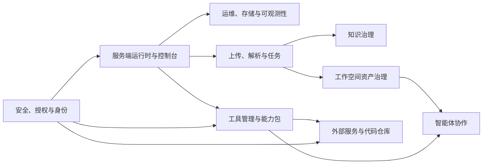

# Pact Architecture

## Metadata / 元数据

- Last updated: 2026-06-16
- Status: Current maintained document
- Scope: Pact architecture, separated into server and client.
- Staleness check: Checked against package scripts, operation registry, module manifests, state-machine definitions, server runtime paths, server-web components, client-gui modules, and client-cli commands on 2026-06-16.

## 文档边界

本文是 Pact 唯一长期维护的架构说明。架构事实只在本文维护，并按服务端与客户端拆分。功能设计在 `docs/functionality/`，命令用法在 `docs/USAGES.md`，协议在 `docs/protocols/`，状态机在 `docs/state-machine/`，开发和发布规范在 `docs/runbook/`。

功能模块文档固定为以下 10 个，`docs/functionality/` 中不再新增横向功能说明：

| 模块 | 文档 |
| --- | --- |
| 服务端运行时与控制台 | `docs/functionality/SERVER-RUNTIME.md` |
| 上传、解析与任务 | `docs/functionality/INGESTION-JOBS.md` |
| 知识治理 | `docs/functionality/KNOWLEDGE.md` |
| 工作空间资产治理 | `docs/functionality/WORKSPACE-ASSETS.md` |
| 智能体协作 | `docs/functionality/AGENT-COLLABORATION.md` |
| 工具管理与能力包 | `docs/functionality/TOOL-MANAGEMENT.md` |
| 外部服务与代码仓库 | `docs/functionality/EXTERNAL-SERVICES.md` |
| 安全、授权与身份 | `docs/functionality/SECURITY-AUTHORIZATION.md` |
| 桌面客户端 | `docs/functionality/CLIENT-DESKTOP.md` |
| 运维、存储与可观测性 | `docs/functionality/OPERATIONS-OBSERVABILITY.md` |

## 服务端

### 定位

Pact 服务端是受控工作空间、知识、工具、外部服务和智能体协作的权威运行时。服务端不把智能体当作可信主体，也不把外部服务当作可直接透传的代理；所有读写、导出、任务、工具执行、权限裁决和恢复动作都进入 Operation Registry、authorization、audit、checkpoint、storage 和相关功能模块。

### 分层

| 层 | 当前实现位置 | 职责 |
| --- | --- | --- |
| 启动与组合 | `server/scripts/start-server.mjs`, `server/platform/interactive/`, `server/services/server-runtime/` | 解析配置、创建 runtime providers、挂载 HTTP API、发布控制台和事件入口。 |
| 公共平台能力 | `server/platform/common/` | 配置、控制台 HTTP adapter、MCP、移动中继、模块管理、operation dispatcher、资源管理、状态机、存储、安全、版本治理。 |
| 专用业务能力 | `server/platform/specialized/` | agent workspace、ACP Relay、Tool Management、知识、代码仓库、外部服务、console domain executor 等业务模块。 |
| 协议实现 | `server/protocols/` | checkpoint、client-cli、knowledge、pubsub、server-web、storage 等协议代码和实现说明。 |
| 客户端任务服务 | `server/services/client/` | upload session、job manager、work queue、client-local runtime bootstrap 和 allocator。 |
| Server Console | `server-web/` | Vue 控制台，只通过 `/api/*` 与服务端交互。 |

### 运行时边界

服务端 HTTP 入口统一由 `server/services/server-runtime/http-server.mjs` 发布。注册式接口优先走 `SERVER_API_OPERATIONS`，控制台专用处理器必须通过 operation context、domain provider 或明确 facade 进入业务模块，不应绕过授权、审计和状态边界。

服务端数据目录默认由 `ServerConfig.getDataDir()` 解析，运行态数据包括 SQLite 元数据、raw objects、jobs、upload sessions、mount config、settings、Tool Management grants、知识技能/Playbook 运行态数据和审计记录。真实 secret 只能进入运行态 secret store 或系统密钥后端，不写入文档、manifest 明文、日志或审计正文。

### 核心架构原则

- Operation Registry 是服务端可治理操作目录；HTTP、RPC、Tool Management、维护智能体和控制台都必须映射到稳定 operation id。
- 状态变化由拥有该业务事实的模块负责；通用队列、存储、事件总线和控制台不能反向持有业务语义。
- MCP、ACP、移动中继、client-local runtime、ServiceHub 和外部服务都只是受控入口或出口，不拥有最终权限。
- 任何高风险写入、外部副作用、密钥绑定、恢复、发布或删除动作都必须产生审计、receipt 或 checkpoint 证据。
- 外部服务默认 fail closed；HTTP/HTTPS raw MCP、模型网关、云盘、代码评审和知识后端都必须经过 manifest、secretRef、egress policy、output governance 和 Tool Adoption Gate。

### Compatibility Layers

三个兼容层是 `agent-client-mcp-compatibility`、`external-service-compatibility` 和 `pact-internal-compatibility`。三大兼容层归口规则如下：agent/client/MCP 入口 adapter 归 `agent-client-mcp-compatibility`，Gerrit、云盘、RAG、模型网关等外部 provider 归 `external-service-compatibility`，module contract、resource operation、capability lifecycle、runtime environment 和 state boundary 等 Pact 内部扩展面归 `pact-internal-compatibility`。

### 通信服务

通信服务归入能力层，`communication-service` 只负责把 communication service（ACP Relay、MCP Server Side）登记为下游客户端通信能力。**ACP Relay** 对应 `acp-agent-relay`，**MCP Server** 对应 `mcp-server-side`；两者仍由各自模块实现权限、审计和状态边界。

### 服务端功能模块

服务端功能模块按 `docs/functionality/` 中的 8 个服务端模块维护。模块间依赖关系如下：

## 客户端

### 定位

客户端由 Flutter GUI 与 Rust `pact-client` sidecar 组成，是轻量本地环境管理器，不是自治 agent harness、权限代理、业务分析引擎或通用 MCP 聚合网关。客户端可以管理目标智能体配置、MCP 插件、Skill Hub、模型转发、移动中继、本机活动与快照，并可托管最小 `client-local` 服务端 runtime。

### 分层

| 层 | 当前实现位置 | 职责 |
| --- | --- | --- |
| Flutter shell | `client-gui/lib/src/ui`, `client-gui/lib/src/controllers`, `client-gui/lib/src/services` | 视图、控制器、配置面板、活动面板、移动中继和本机 runtime 展示。 |
| Native sidecar | `client-cli/src` | 本机目标适配、MCP 配置写入、Skill Hub、移动中继命令、模型转发、native history、process identity、local runtime 管理。 |
| 便携数据 | `client-gui/lib/src/services/portable_data_root.dart`, `client-cli/src/client_state.rs` | `future-client/` 状态、targets、skills、pins、mobile-relay、activity、snapshots 和 local-runtime。 |
| 打包 | `client-gui/packaging.modules.json`, `client-gui/scripts/package-client.mjs` | macOS/Linux/Windows 桌面包、sidecar、portable data、图标和 smoke 验证。 |

### 客户端边界

- GUI 不直接实现业务 HTTP 协议；本机能力优先通过 `pact-client` 命令执行。
- 本机目标配置文件和目标官方 CLI 是 MCP 配置事实源；客户端只写 Pact-managed 区块并保留用户配置。
- native agent history 只读导入，不创建 Pact-local conversation 数据库作为 fallback。
- mobile relay 的手机端只通过中继请求白名单命令；PC 端执行命令并返回结果，网关不直接触达本机智能体。
- client-local runtime 必须使用明确 runtime config、固定 loopback 地址和 process identity claim，不依赖隐式默认配置。
- Server Console 通用组件在 `server-web/components/common.ts` 统一登记；能用通用组件就用通用组件，能继承就继承，新增页面能力先扩展通用组件再落到局部实现。

### 客户端功能模块

客户端功能集中在 `docs/functionality/CLIENT-DESKTOP.md`。其内部功能项包括 Agents、MCP Plugins、Skill Hub、Model Forwarding、Mobile Relay、Activity And Snapshots、Settings、Local Runtime、Process Identity 和 Native History。
