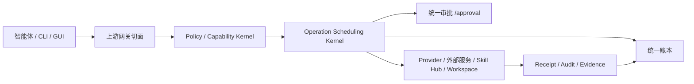

# Pact Task Implementation Software Design Description

## Metadata / 元数据

- Last updated: 2026-06-11
- Status: Current implementation design specification
- Scope: Pact Task Implementation Software Design Description.
- Staleness check: Scanned on 2026-06-11; current release/readiness claims were checked against docs/reports/history/v001-readiness/20260606T121950Z/report.md and docs/reports/history/production-readiness/20260606T122049Z/report.md.

文档编号：PACT-SDD-TASK-IMPLEMENTATION-2026-06-04  
文档版本：1.0  
文档状态：当前实现基线 / 可派发设计规格  
发布日期：2026-06-04  
适用范围：Pact 项目 T00-T23 规划任务及其 117 个单功能子任务  
维护位置：`docs/reports/DETAILED-SUBTASK-SPECS-2026-06-04.md`

## 文档控制

| 项 | 内容 |
| --- | --- |
| 文档类型 | 软件设计说明书（Software Design Description / Specification, SDD/SDS） |
| 目标用途 | 将已批准任务转化为可实现、可验证、可追踪的设计分解规格 |
| 上游计划 | `docs/reports/ORDERED-IMPLEMENTATION-TASKS-2026-06-03.md` |
| 当前评估 | `docs/reports/CURRENT-IMPLEMENTATION-ASSESSMENT-2026-06-04.md` |
| 安全输入 | `docs/reports/SECURITY-HARDENING-BACKLOG-2026-06-03.md`、`docs/SECURITY-VULNERABILITY-AUDIT.md` |
| 历史材料 | `docs/reports/history/`，仅作历史证据，不作为当前事实源覆盖本文 |
| 维护责任 | Pact 项目维护者；执行智能体只能按本文更新状态和证据，不得降低验收门禁 |

## 修订记录

| 版本 | 日期 | 变更摘要 | 状态 |
| --- | --- | --- | --- |
| 1.0 | 2026-06-04 | 将 T00-T23 子任务清单规范为正式软件设计说明书，补充范围、术语、约束、接口、数据、安全、验证和变更控制章节。 | 当前版本 |

## 1. 引言

### 1.1 目的

本文把 `docs/reports/ORDERED-IMPLEMENTATION-TASKS-2026-06-03.md` 中 T00-T23 的规划任务转化为正式软件设计规格。每个子任务必须明确功能改造点、验收目标和依赖，防止执行者只依据任务标题自行发挥。

### 1.2 范围

本文覆盖 Pact 当前已批准的 P0/P1/P2/P3/S 系列任务，包括场景状态、脚本治理、前端门禁、配置和密钥外移、安全加固、Operation Scheduling Kernel、统一审批、权限实时生效、智能体支持、代码提交工作流、Skill Hub、外部云盘、共享空间、办公文档解析、知识蒸馏、前端接口收敛、个人/企业预设、模块生态、管理报告、贡献者市场、降级保护和残余风险维护。

### 1.3 目标读者

- 负责实现单个子任务的智能体或工程师。
- 负责验收、审计、回归验证和生产准入判断的维护者。
- 负责拆分批次、安排并行实现和处理 blocker 的项目协调者。

### 1.4 非目标

- 本文不替代产品需求文档、用户手册或历史讨论记录。
- 本文不授权任何执行者绕过现有架构文档、协议文档、权限模型或安全门禁。
- 本文不把缺少真实凭据的 contract-mode 能力声明为 live 完成。

## 2. 设计输入与事实源

执行前必须按以下顺序读取事实源：

1. 核心架构和治理文档：`docs/Architecture.md`、`docs/PROTOCOLS.md`、`docs/WORKSPACE-ASSET-GOVERNANCE.md`、`docs/KNOWLEDGE-GOVERNANCE.md`、`docs/SERVER.md`、`docs/CLIENT_ARCHITECTURE.md`、`docs/FEATURE-PROFILES.md`、`docs/TEST-FRAMEWORK.md`。
2. 当前计划和评估文档：`docs/reports/ORDERED-IMPLEMENTATION-TASKS-2026-06-03.md`、`docs/reports/CURRENT-IMPLEMENTATION-ASSESSMENT-2026-06-04.md`、本文。
3. 安全输入：`docs/reports/SECURITY-HARDENING-BACKLOG-2026-06-03.md`、`docs/SECURITY-VULNERABILITY-AUDIT.md`。
4. 历史材料：`docs/reports/history/`。历史材料只作审计线索；如与当前核心文档冲突，以当前核心文档、决策登记、verifier 和本文为准。

## 3. 术语、缩略语和规范用语

| 术语 | 定义 |
| --- | --- |
| Operation Scheduling Kernel | 所有真实副作用操作的调度内核。只有经过该内核分配 `operationId`、执行 policy、写入账本并生成 receipt 的操作才允许产生真实副作用。 |
| 统一账本 | 记录 operation、approval、policy decision、provider receipt、失败原因、回滚和审计事件的唯一事实源。 |
| 统一审批 | 高风险或需人工确认的 operation 必须进入 pending 状态，由独立 `/approval` 页面和 API 完成 approve/reject/expire。 |
| 上游网关切面 | 外部服务、知识蒸馏、工具、智能体和 provider 入口的统一权限、审计、限流和能力治理层。 |
| `secretRef` | 对外部数据目录、环境变量或 secret store 中真实密钥的引用。项目目录内不得保存真实密钥值。 |
| provider mode | 标识 provider 当前能力状态的字段，包括 `contract`、`dry-run`、`local-live`、`remote-live` 等，不得混用。 |
| receipt | provider 或内核对受管 operation 的机器可读回执，必须可追踪、可审计、可区分真假成功。 |
| Skill Hub | 独立技能库。智能体上传的技能包必须进入 Skill Hub，不得混入 workspace contribution。 |
| 可脱水模块 | 可从个人或企业预设中禁用、替换或剥离的功能模块，禁用后不得破坏基础控制面。 |
| fake path/provider/receipt | 无真实路径、无真实接通或无真实回执却伪装成成功的实现或测试结果。全项目禁止。 |

规范用语：

- `MUST` / `必须`：关闭任务前的硬性要求，未满足时不得标记完成。
- `MUST NOT` / `不得`：禁止行为，出现时必须修正或登记阻塞。
- `SHOULD` / `应当`：默认要求；如不能满足，必须记录原因和替代方案。
- `MAY` / `可以`：可选实现，不得覆盖 `MUST` 要求。

## 4. 总体设计约束

- 一个子任务只允许覆盖一个功能改造面。不要把 schema、API、UI、provider、policy、文档和 verifier 混成一个大补丁。
- 所有 key、token、secret、外部服务配置、本地运行数据、测评集、邮件样本、runtime 下载缓存、模型文件和 `.pact-server-data` 必须外移到外部数据目录或 secret store，不得落入项目目录。
- 所有真实副作用必须经过 Operation Scheduling Kernel、统一审批、Tool Management、Capability Key Kernel、上游网关切面和统一账本中相应的治理路径。
- 所有外部服务和 provider 必须明确 `provider mode` 和 receipt 字段。缺真实凭据或真实环境时，只能标记 `blocked`、`contract-only` 或 `dry-run`。
- Pact 当前支持 OpenClaw、Claude Code、Codex、Gemini CLI、Antigravity、OpenCode、Copilot、Kilo Code、Cursor、Hermes Agent 和 Windsurf。涉及智能体目标的位置必须引用同一清单。
- 客户端 GUI 仍为 Flutter，CLI 后端仍为 Rust。旧遗留客户端模块只能按 keep/migrate/remove/dev-only 清理，不得改变当前技术路线。
- 手机端当前降级为未来路线，不进入默认构建、默认发布或当前交付承诺。
- 不得通过删除 verifier、扩大 allowlist、降低安全边界或改写历史报告正文来制造通过。

## 5. 总体设计

### 5.1 设计原则

- 逻辑隔离先行，物理拆分延后。第一版可以是模块化单体，但模块边界、接口、状态和队列语义必须支持后续拆分。
- Pact 是治理控制面。智能体、外部服务、云盘、Git provider、Skill、模块和客户端进入公共空间的行为必须由 Pact 的 policy、operation、ledger、checkpoint 和 audit 裁决。
- 读请求也是行为。list、search、permission check、evidence read、context injection、export 和 download 都必须能审计、能解释、能撤销影响。
- 追加式恢复优先。不得用裸 reset、裸覆盖、裸删除代替受管 restore operation、version operation 或 rollback operation。
- 外部服务是上游能力，不是绕过 Pact 的后门。知识蒸馏、云盘、GitHub、未来 connector 都必须走统一治理、`secretRef`、provider mode、receipt 和审计。
- 个人电脑轻量预设和企业私有化预设是两条路线。个人电脑不部署集群；企业能力通过 port / adapter 接入企业已有中间件。

### 5.2 系统上下文

### 5.3 可追踪设计模型

每个子任务必须维持以下追踪链：

`规划来源 -> 父任务 -> 子任务编号 -> 功能改造点 -> 代码/文档路径 -> verifier -> 证据路径 -> 当前状态`

验收时不得只填写自然语言总结。至少需要提供命令、报告、fixture、receipt、operation id、audit id、screenshot 或失败日志之一作为证据。

## 6. 详细设计分解规格

以下 T00-T23 子任务是本文的详细设计分解。派发任务时必须完整引用对应行的功能项改造点、验收目标和依赖；不得只复制子任务编号或标题。

### T00 场景状态和门禁基线

| 子任务 | 功能项改造点 | 验收目标 | 依赖 |
| --- | --- | --- | --- |
| T00-a | 定义 `docs/scenarios/scenario-implementation-status.json` schema，字段覆盖 `status`、`operationIds`、`toolIds`、`verifier`、`evidence`、`blockers`。 | schema 可被 verifier 解析；缺字段或非法状态时失败。 | 无 |
| T00-b | 将 8 个场景全部填入状态文件，绑定现有 operation、tool、verifier 和 blocker。 | `npm run server:verify:scenario-implementation-status` 通过，并报告 8 个场景。 | T00-a |
| T00-c | 新增或补强聚合 verifier，阻断缺 operation/tool/verifier 的 `verified` 状态。 | 删除任一已绑定 operation/tool 或移除 verifier 时，聚合 verifier 非零退出。 | T00-a, T00-b |
| T00-d | 让场景文档、状态 JSON 和后续控制台读取同一状态事实源。 | 不存在第二套手写完成度；文档引用状态 JSON 或聚合结果。 | T00-b |

### T01 脚本、版本和依赖治理

| 子任务 | 功能项改造点 | 验收目标 | 依赖 |
| --- | --- | --- | --- |
| T01-a | 盘点根 `package.json` 脚本，按 server/client/docs/security/runtime/scenario/composition 责任域归类。 | 有脚本责任域清单；根脚本只保留清晰聚合入口和必要快捷入口。 | 无 |
| T01-b | 建立 Node、Flutter、Rust、Java、Docker、Tika 版本元数据。 | 新人可按元数据复现环境；版本字段不为空；文档和 verifier 引用同一来源。 | T01-a |
| T01-c | 建立关键依赖 owner、影响范围和回滚口径清单。 | 关键依赖升级能定位 owner、影响 verifier 和回滚路径。 | T01-a |
| T01-d | 补脚本/依赖治理 verifier，阻断静默跳过、无 owner 脚本和关键命令缺失。 | `npm run repo:hygiene` 及相关治理 verifier 通过；负向样例能失败。 | T01-a, T01-b, T01-c |

### T02 前端门禁优先扩展

| 子任务 | 功能项改造点 | 验收目标 | 依赖 |
| --- | --- | --- | --- |
| T02-a | 扩展前端架构门禁，阻断 view/component 直接 `fetch`、硬编码 `/api`、直接全局 `bridge.*`。 | `npm run server:verify:frontend-architecture` 能发现负向样例。 | T01 |
| T02-b | 收敛 i18n、style、shared type facade 边界，记录 allowlist、负责人和删除条件。 | facade 重新膨胀或无 owner allowlist 时 verifier 失败。 | T02-a |
| T02-c | 为公共组件建立 focused test 或豁免规则，覆盖关闭、焦点、disabled、保存、刷新、tooltip。 | 新公共组件无测试且无豁免时门禁失败。 | T02-a |
| T02-d | 增加稳定 id 门禁，阻断随机 id 破坏测试和可访问性。 | 随机 id 或不稳定 selector 进入公共组件时 verifier 失败。 | T02-a |

### T03 配置、密钥、数据目录和 runtime 资产边界

| 子任务 | 功能项改造点 | 验收目标 | 依赖 |
| --- | --- | --- | --- |
| T03-a | 统一 data dir 解析优先级：`PACT_SERVER_DATA_DIR`、外部配置、`~/.pact-server-data`。 | 空配置默认外部目录；显式 env 覆盖生效；仓库内路径不是默认值。 | T01 |
| T03-b | secret/config 外移，真实值只通过 `secretRef`、环境变量或外部配置引用。 | 仓库中出现 key/token/secret 值时 `security:hygiene` 失败。 | T03-a |
| T03-c | runtime dependency manifest、checksum、来源、版本和外部安装位置。 | `npm run server:verify:runtime-dependency-downloads` 通过；python/JRE/Tika 等版本字段不为空。 | T03-a |
| T03-d | repo/secret hygiene 阻断项目内 key、运行数据、测评集、邮件样本、`.pact-server-data`。 | `npm run repo:hygiene`、`npm run security:hygiene` 通过；负向 fixture 失败。 | T03-b |
| T03-e | SQLite migration 版本化和执行记录。 | migration 记录含版本、时间、结果；隐式裸升级被 verifier 拦截或登记 blocker。 | T03-a |

### T04 安全短批次一

| 子任务 | 功能项改造点 | 验收目标 | 依赖 |
| --- | --- | --- | --- |
| T04-a | iframe sandbox 加固，移除不必要的逃逸权限组合。 | 邮件/evidence iframe 可读但不能逃逸；安全 backlog 回写 S-02。 | T03 |
| T04-b | 初始 owner 凭据 stdout 暴露收窄。 | 命令输出不直接泄露完整凭据；登录流程仍可用；回写 S-03。 | T03 |
| T04-c | HTTP/IP/subject/login 限流。 | 暴力请求触发限流；正常请求不误杀；回写 S-04。 | T03 |
| T04-d | `.dockerignore` 加固，排除运行数据、agent 历史、临时报告、敏感上下文。 | Docker build context 不包含禁止路径；回写 S-05。 | T03 |
| T04-e | Docker Compose 开发/生产 TLS 口径。 | 开发 compose 明确本地；生产/enterprise 通过 HTTPS 或反代 TLS；回写 S-06。 | T03 |
| T04-f | Vite HTTPS 代理证书验证。 | 远端 HTTPS 默认不 `secure: false`；本地例外有显式条件；回写 S-08。 | T03 |

### T05 CSP 和 HTML 渲染安全批次

| 子任务 | 功能项改造点 | 验收目标 | 依赖 |
| --- | --- | --- | --- |
| T05-a | 生产 CSP 去掉 `script-src 'unsafe-inline'`，落 nonce/hash 或等价方案。 | 控制台构建和登录可用；内联 script 被 CSP 阻断；回写 S-01。 | T02, T04 |
| T05-b | `SafeHtmlBlock` 增加强制 sanitizer 或 TypeScript branded safe type。 | 普通 string 不能直接进入 `v-html`；绕过 sanitizer 的调用失败。 | T05-a |
| T05-c | 邮件 HTML sanitizer 从 blocklist 升级到 allowlist 或等价安全策略。 | 事件属性、危险 URL、`svg`、`math`、`annotation-xml` 等样本被移除。 | T05-b |
| T05-d | 危险 HTML 回归样本和浏览器 smoke。 | Knowledge evidence、邮件 evidence、Markdown 渲染、控制台登录全部 smoke 通过。 | T05-a, T05-b, T05-c |

### T06 Operation Scheduling Kernel 和统一账本

| 子任务 | 功能项改造点 | 验收目标 | 依赖 |
| --- | --- | --- | --- |
| T06-a | operation registry 分类，补齐 safety、inputSchema、audit、requiredScopes。 | `npm run server:verify:protocol-operations` 通过；缺元数据失败。 | T00, T03 |
| T06-b | Kernel accept、`operationId` 分配、started/pending ledger 写入。 | 外部 IO 前必须已写 ledger；ledger 不可写时无副作用。 | T06-a |
| T06-c | 阻断未经过内核的 provider side effect 和状态写入。 | 至少一个旁路负向样例返回 unmanaged/not scheduled 拒绝。 | T06-b |
| T06-d | trace、receipt、policy decision、idempotency 和失败语义统一。 | 按 `traceId` 可追溯 operation、policy、receipt、失败原因。 | T06-b |
| T06-e | 先迁移一个真实纵向链路，再批量扩展其它入口。 | 选定链路从 API/RPC/MCP 到 ledger 到 provider 全链路可复现。 | T06-c, T06-d |

### T07 统一审批和独立 `/approval`

| 子任务 | 功能项改造点 | 验收目标 | 依赖 |
| --- | --- | --- | --- |
| T07-a | `pending_operation` 数据模型和过期语义。 | pending item 保存 payload、grant、trace、risk、expiresAt、idempotencyKey。 | T06 |
| T07-b | 审批 API 和 policy 接入。 | 高危 operation 审批前不执行；approve/reject/expire 有明确 API。 | T07-a |
| T07-c | 独立 `/approval` 页面。 | 路由独立可访问；显示风险、来源、payload 摘要、过期时间和操作按钮。 | T07-b |
| T07-d | approve/reject/expire 恢复和账本事件。 | approve 恢复原 operation；reject/expire 写 ledger/audit 并通知调用方。 | T07-b, T07-c |
| T07-e | MCP `operation_reply`。 | MCP client 能区分 pending、approved、rejected、expired、failed。 | T07-d |

### T08 权限变更实时生效

| 子任务 | 功能项改造点 | 验收目标 | 依赖 |
| --- | --- | --- | --- |
| T08-a | policy revision 与 active grant 重算。 | 撤销 grant 后无需重启即可失效。 | T03, T06 |
| T08-b | Tool Management catalog 和 MCP discovery 刷新。 | tools/list 立即反映权限变更。 | T08-a |
| T08-c | SSE/list_changed 通知。 | 客户端收到机器可读变更通知，不依赖轮询。 | T08-b |
| T08-d | capability/opaque key policy version 校验。 | 旧 policy version key 写操作被拒绝并写审计。 | T08-a |
| T08-e | 上游网关缓存失效。 | 同会话权限变化立即影响 gateway 入口。 | T08-a |
| T08-f | 权限/key 状态外部持久化。 | 服务重启后不要求手工重配 key；状态不写仓库。 | T03-b, T08-d |

### T09 11 个智能体安装、配对和客户端清理

| 子任务 | 功能项改造点 | 验收目标 | 依赖 |
| --- | --- | --- | --- |
| T09-a | 11 个一等智能体目标 registry。 | 服务端、MCP connector、CLI、GUI、文档共用同一清单；包含 Hermes Agent、Windsurf。 | T03, T08 |
| T09-b | 每个目标的 install plan、doctor、rollback、机器可读 report。 | 每个目标至少有 plan 和 doctor，不能执行时有 blocked reason。 | T09-a |
| T09-c | 配置写入快照、回滚和审计。 | 安装写配置可回滚；真实 key 不写项目目录。 | T09-b |
| T09-d | CLI pairing request 和控制台批准/撤销。 | 安装成功不等于授权；未 pairing 不能调用受管能力。 | T09-c |
| T09-e | 旧客户端模块 keep/migrate/remove/dev-only 清单。 | package plan 标出旧模块状态；默认包不包含 legacy/dev-only。 | T09-a |

### T10 代码提交 durable workflow

| 子任务 | 功能项改造点 | 验收目标 | 依赖 |
| --- | --- | --- | --- |
| T10-a | 代码提交 workflow schema 和 operation 注册。 | codespace/code submission operation 有 schema、policy、receipt、audit 元数据。 | T06, T08 |
| T10-b | durable queue、retry、resume、idempotency。 | worker 重启可恢复；重复 idempotency key 不重复提交。 | T10-a |
| T10-c | GitHub live adapter 和 PR receipt。 | live 成功返回 PR URL、branch、commit、provider durable id；缺凭据标 blocked/contract-only。 | T10-b |
| T10-d | 高危提交接入 T07 审批。 | 审批前不 push、不创建 PR；approve 后恢复原 operation。 | T07, T10-b |
| T10-e | worker restart、重复提交、provider failure 回归。 | `v001-codespace-e2e` 适配 pending -> approve/reject/expire，并通过。 | T10-c, T10-d |

### T11 Skill Hub 独立库和 lifecycle

| 子任务 | 功能项改造点 | 验收目标 | 依赖 |
| --- | --- | --- | --- |
| T11-a | Skill package schema、manifest、`SKILL.md`、checksum。 | 坏包、缺 manifest、checksum 不匹配均被拒绝。 | T06, T08 |
| T11-b | `pact.skillHub.upload` 独立存储和记录。 | 上传后 Skill Hub / skill library 有独立记录，workspace contribution 只存引用。 | T11-a |
| T11-c | 签名、扫描、pin、rollback。 | 缺签名或扫描失败不可激活；pin/rollback 可追溯。 | T11-a |
| T11-d | lifecycle 状态机。 | scanned/reviewed/activated/disabled/revoked/rollback 非法跃迁失败。 | T11-c |
| T11-e | Tool Management catalog / MCP discovery 原子刷新。 | 刷新失败不产生半启用状态。 | T11-d |
| T11-f | disabled/revoked 可见性和执行拒绝。 | revoke 后同 grant 不可见且不可执行，并写 audit。 | T11-e |

### T12 provider mode、receipt 和 iCloud/OneDrive local projection

| 子任务 | 功能项改造点 | 验收目标 | 依赖 |
| --- | --- | --- | --- |
| T12-a | provider mode schema 和统一词表。 | API/UI/receipt/log 使用 `contract/local-live/remote-live/dry-run/failed`。 | T03, T06, T07, T08 |
| T12-b | receipt 字段统一。 | receipt 包含 mode、verificationSource、remoteId 或 localProjectionId。 | T12-a |
| T12-c | OneDrive local projection adapter 和本地 smoke。 | 本机目录上传/下载/覆盖/只读拒绝通过；不宣称 remote-live。 | T12-b |
| T12-d | iCloud / OneDrive local-live adapter 和文案边界。 | 本机 adapter 只标 local-live / localProjectionVerified，不宣传远端同步。 | T12-a |
| T12-e | UI/API/文档 provider mode 展示。 | contract/fake 不显示为真实远端成功。 | T12-a, T12-b |
| T12-f | contract/fake provider 不能替代 local projection 或 future remote-live 的门禁。 | v0.0.1 local projection 必须有本机读写证据；future remote-live 必须要真实 remote 字段或明确 blocked。 | T12-c |

### T13 共享空间产品化

| 子任务 | 功能项改造点 | 验收目标 | 依赖 |
| --- | --- | --- | --- |
| T13-a | 大文件流式上传、下载、恢复。 | 大文件或模拟大流不一次性读入内存，支持进度和失败恢复。 | T06, T07, T08 |
| T13-b | 路径级 ACL、配额、只读/可写范围。 | 无权限路径读写被拒绝并写 audit。 | T13-a |
| T13-c | 版本恢复作为新 operation。 | restore 不裸覆盖，生成新 operation 并保留历史。 | T13-b |
| T13-d | 冲突处理。 | 同路径并发/版本冲突返回可解释 conflict，不静默覆盖。 | T13-b |
| T13-e | 共享空间、checkpoint、cloud receipt、artifact/proposal 统一视图。 | 能按 operation/trace 串起文件、checkpoint、receipt 和 proposal。 | T13-c, T13-d |

### T14 真实办公文档解析基准

| 子任务 | 功能项改造点 | 验收目标 | 依赖 |
| --- | --- | --- | --- |
| T14-a | 外部 corpus 目录和 manifest 规则。 | 仓库只保存 manifest/hash/公开 URL；样本落外部数据目录。 | T03 |
| T14-b | 公开 PDF/DOCX/XLSX/PPTX 样本 manifest。 | 四类办公文档都有 openability、结构锚点和导出预期。 | T14-a |
| T14-c | 本机 Mail / 邮件样本 manifest 和隐私边界。 | 邮件样本可引用本机外部路径，不泄露私有内容到仓库。 | T14-a |
| T14-d | parser trace 和 source metadata hash。 | 输出可追溯 raw object、page/slide/sheet、bbox、parser/model/version。 | T14-b |
| T14-e | DOCX/Markdown/export 一致性基准。 | 文档到 Markdown 或 DOCX 导出结构一致性有机器检查。 | T14-d |
| T14-f | 机器可读失败原因。 | 解析失败返回 failure reason，不生成空成功结果。 | T14-d |

### T15 知识蒸馏算法和办公文档质量升级

| 子任务 | 功能项改造点 | 验收目标 | 依赖 |
| --- | --- | --- | --- |
| T15-a | `external.knowledge.distillation.*` 网关边界。 | 所有 run/evidence/artifact/export/delete/archive 走上游网关切面。 | T03, T08, T14 |
| T15-b | 外部服务 auth、healthcheck、非 root、Tika checksum、资源限制门禁。 | `external-knowledge-distillation-service-gates` 通过。 | T15-a |
| T15-c | 质量基准：证据保真、召回/排序、成本、错误率、trace。 | `knowledge-industrial-distillation` 覆盖 8 项，不再实际 0。 | T15-b |
| T15-d | DOCX/XLSX/PPTX/PDF 到 Markdown 或包导出。 | 真实样本输出可下载 Markdown 或包，缺模型/凭据标 blocked。 | T14, T15-c |
| T15-e | 旧 workbench shim 迁移和删除。 | 旧入口只返回迁移报文，不执行真实算法。 | T15-a, T15-d |

### T16 前端剩余页面接口收敛

| 子任务 | 功能项改造点 | 验收目标 | 依赖 |
| --- | --- | --- | --- |
| T16-a | 剩余页面直接后端访问盘点。 | 列出所有 `fetch`、硬编码 `/api`、直接 `bridge.*` 剩余点。 | T02 |
| T16-b | domain client 补齐 HTTP method、路径、参数、返回类型。 | 修改后端路径只需改 domain client。 | T16-a |
| T16-c | 页面 controller 承接 loading/error/retry/stale response。 | 组件只消费 controller，不散落副作用。 | T16-b |
| T16-d | `useConsole()` 瘦身和 allowlist 删除计划。 | `useConsole` 只保留 shell、登录态、导航、公共刷新。 | T16-c |
| T16-e | Dashboard、Knowledge、External Services、Approval、Runtime browser smoke。 | 主路径和错误态 smoke 通过。 | T16-b, T16-c, T16-d |

### T17 个人/企业两套可脱水预设构建线

| 子任务 | 功能项改造点 | 验收目标 | 依赖 |
| --- | --- | --- | --- |
| T17-a | feature profile / composition preset schema。 | plan 输出模块、ports、secret refs、runtime assets、verifier。 | T01, T03, T06 |
| T17-b | personal 轻量预设 plan。 | personal 不含 Postgres/Redis/S3/KMS/集群/企业网关强依赖。 | T17-a |
| T17-c | enterprise adapter/port 预设 plan。 | enterprise 通过 ports/adapters 接企业已有中间件，不污染 personal。 | T17-a |
| T17-d | 模块 dehydrate verifier。 | 禁用附加模块后 direct mode、授权、账本、控制台、基础场景仍可运行。 | T17-b, T17-c |
| T17-e | 模块 membership、secret refs、runtime assets、audit behavior 清单。 | 缺可脱水元数据的模块不能进入 profile。 | T17-a |

### T18 模块和外部服务接入生态

| 子任务 | 功能项改造点 | 验收目标 | 依赖 |
| --- | --- | --- | --- |
| T18-a | 模块/外部服务/Skill/Tool Package/mount 治理状态词表。 | 新状态不在统一词表时 verifier 失败。 | T06, T07, T08, T17 |
| T18-b | create-module 模板。 | 新模块模板包含 manifest、contract test、schema docs 和 CI 指引。 | T18-a |
| T18-c | module contract test。 | 至少一个真实样例模块可通过 contract test；无参数 usage 不算验收。 | T18-b |
| T18-d | 外部服务 registration、health、scope、secretRef、audit。 | 注册不全失败；不得暴露裸 secret、裸 URL、未审计副作用。 | T18-a |
| T18-e | disable/revoke 后 Tool Management、MCP discovery、gateway route、grants 同步失效。 | 禁用后所有入口立即拒绝或不可见。 | T18-d |
| T18-f | asset lineage 和 source metadata 接入。 | raw object -> derived result -> export 可追溯。 | T18-d |

### T19 管理报告、架构 live map 和样例业务包

| 子任务 | 功能项改造点 | 验收目标 | 依赖 |
| --- | --- | --- | --- |
| T19-a | executive report 数据模型。 | 报告只基于 verifier、operation、usage、risk、capacity、cost、readiness 数据。 | T00, T17 |
| T19-b | architecture live map 扫描器。 | 设计文档到实现路径到 verifier 可定位；路径缺失失败。 | T19-a |
| T19-c | sample business pack materialize/import/cleanup。 | 样例包可物化、导入、验证、清理；只用公开/可脱敏数据。 | T19-a |
| T19-d | production readiness 数据接入。 | 管理报告显示 blocked/pass，不掩盖 P0 阻塞。 | T19-a |

### T20 完整贡献者生态、市场和统计面板

| 子任务 | 功能项改造点 | 验收目标 | 依赖 |
| --- | --- | --- | --- |
| T20-a | 市场条目 schema。 | 条目含来源、版本、签名、授权范围、风险、回滚能力。 | T11, T18, T19 |
| T20-b | 授权、安装、撤销和回滚。 | 未授权不可安装；revoke 后不可见不可执行。 | T20-a |
| T20-c | usage/operation/rollback/revoke/denied request 统计。 | 统计只来自真实事件，不手写计数。 | T20-b |
| T20-d | 推荐和风险提示。 | 推荐考虑 usage、失败率、风险、维护状态；风险可见。 | T20-c |
| T20-e | 贡献者主页、市场和统计面板 UI。 | UI 能显示条目、贡献者、安装/撤销、统计和风险。 | T20-a, T20-c |
| T20-f | revoke 后 discovery/grant/catalog/可见性同步。 | 撤销后所有可见面和执行面同步失效。 | T20-b, T20-e |

### T21 P3-C 大包拆分决策

| 子任务 | 功能项改造点 | 验收目标 | 依赖 |
| --- | --- | --- | --- |
| T21-a | P3-C 大包文档门禁。 | connector SDK、多租户、分布式 worker、mTLS fleet、插件市场不能作为一个大包启动。 | 无 |
| T21-b | feature profile 扫描，阻断分布式 worker / 多租户默认化。 | 分布式 worker 或多租户进入默认 profile 时失败。 | T21-a |
| T21-c | P3-C 子方向决策模板。 | 任一子方向重启前必须有依赖、风险、预设线、脱水方式、验收门禁。 | T21-a |

### T22 手机端降级保护

| 子任务 | 功能项改造点 | 验收目标 | 依赖 |
| --- | --- | --- | --- |
| T22-a | client package plan 扫描，阻断 mobile 默认构建。 | package plan 不包含 iOS/Android 默认交付。 | T09, T17 |
| T22-b | 客户端文档和 feature profile 标记 future/deferred。 | 手机端只作为未来路线，不显示当前承诺。 | T22-a |
| T22-c | release/CI 入口防止新增 mobile 默认交付。 | 新增 mobile CI/release 默认入口时门禁失败。 | T22-a |

### T23 低危残余风险维护策略

| 子任务 | 功能项改造点 | 验收目标 | 依赖 |
| --- | --- | --- | --- |
| T23-a | 安全 backlog 保持 S-10 残余风险状态。 | S-10 不被误标完全修复；维护时才处理。 | T04, T05 |
| T23-b | CI 输出收窄 regression。 | CI 失败日志不输出过宽 JSON 或敏感上下文。 | T23-a |
| T23-c | legacy/dev-only Rust unsafe 默认不可达检查。 | unsafe 不进入主线默认包；进入默认路径时升级为安全任务。 | T22 |
| T23-d | User-Agent mismatch 审计可见性。 | mismatch 有审计记录且不误杀正常用户。 | T23-a |

## 7. 接口设计要求

### 7.1 Operation 接口

- 每个真实副作用入口必须映射到 operation registry 中的稳定 `operationId`、`inputSchema`、`requiredScopes`、`safety`、`audit` 和 `idempotency` 语义。
- Operation 接口必须返回机器可读状态，至少区分 `accepted`、`pending_approval`、`approved`、`rejected`、`expired`、`failed`、`blocked` 和 `contract-only`。
- Operation 接口不得直接暴露 provider 私有错误、裸 secret、裸本机路径或不可审计的临时状态。

### 7.2 HTTP、RPC、MCP 和网关接口

- HTTP、RPC、MCP 和上游网关入口必须使用同一权限事实源和 capability 映射，不得各自维护独立授权表。
- MCP discovery、Tool Management catalog 和客户端 registry 必须在权限变更后同步刷新，并能通过 verifier 证明。
- 读接口和写接口都必须产生可追踪 audit 或 ledger 事件；只读接口不得成为绕过权限和审计的旁路。

### 7.3 客户端接口

- GUI 继续使用 Flutter，CLI 后端继续使用 Rust。涉及客户端技术栈的子任务只能清理旧遗留和收敛接口，不得改变已批准路线。
- 前端页面不得直接散落 `fetch`、硬编码 `/api`、直接全局 `bridge.*` 或随机 id；必须通过页面 controller、typed facade 和稳定 selector 接入。
- 独立 `/approval` 页面必须能显示风险、来源、payload 摘要、过期时间、approve/reject 操作和执行结果。

### 7.4 外部服务和 provider 接口

- OneDrive、iCloud、GitHub、知识蒸馏、文档解析、Skill Hub、workspace provider 和后续 connector 必须通过统一 registration、health、scope、`secretRef`、provider mode、receipt 和 audit 进入系统。
- `contract`、`dry-run`、`local-live`、`remote-live` 必须是机器可读字段，不能只写在 UI 文案或说明文档里。
- Provider disable/revoke 后，Tool Management、MCP discovery、gateway route、grant、catalog、UI 可见性和执行入口必须同步失效。

## 8. 数据设计要求

### 8.1 外部数据目录

- 默认外部数据目录为 `~/.pact-server-data`，可由 `PACT_SERVER_DATA_DIR` 或外部配置覆盖。
- 项目目录内不得保存 `.pact-server-data`、运行数据库、provider 缓存、测评集、邮件样本、runtime 下载缓存、模型文件或真实配置值。
- 数据目录解析必须有 verifier 覆盖默认值、显式覆盖、非法仓库内路径和重启持久化场景。

### 8.2 配置和密钥

- 真实配置值和密钥必须通过 `secretRef`、环境变量、外部配置文件或 secret store 引用。
- 项目内可以保存 schema、示例占位符和文档说明，但不得保存可用 key、token、cookie、OAuth refresh token、私有 URL 或个人邮箱样本。
- 门禁必须扫描整个项目目录，而不是只扫描 `docs/`、`server/` 或某个局部目录。

### 8.3 账本、receipt 和迁移

- 统一账本必须保存 operation 生命周期、policy decision、approval decision、provider receipt、失败原因、回滚关系和 evidence 位置。
- SQLite 或其它持久化结构变更必须有版本化 migration、执行记录和失败恢复语义。
- receipt 字段必须能区分 provider 真实成功、dry-run 成功、contract 校验成功、pending 审批、失败和阻塞。

### 8.4 测评集和业务样例

- PDF、Word、Excel、PPT、邮件和其它测评集必须放在外部数据目录或外部 corpus manifest 指向的位置，不得进入项目目录。
- 样例业务包只允许使用公开数据、合成数据或已脱敏数据，并必须提供 materialize/import/cleanup 过程。
- 文档解析、知识蒸馏和导出链路必须保留 raw object、derived result、export 和 source metadata 的 lineage。

## 9. 安全设计要求

### 9.1 身份、权限和审批

- 所有权限必须通过上游网关切面和 Capability Kernel 生效；不得在知识蒸馏、云盘、Skill、代码提交或模块接口中维护私有授权旁路。
- 权限和 key 状态必须外部持久化，服务重启后不得要求手工重配。
- 高风险 operation 必须先进入统一审批。审批前不得产生真实副作用，审批拒绝或过期必须写入账本。

### 9.2 内容和浏览器安全

- 生产 CSP 不得依赖 `script-src 'unsafe-inline'`；确需内联时必须使用 nonce/hash 或等价安全方案。
- HTML 渲染必须通过 sanitizer 或 branded safe type；普通 string 不得直接进入 `v-html` 或等价危险渲染入口。
- 邮件 HTML、Markdown、evidence iframe 和 preview 必须覆盖危险 URL、事件属性、`svg`、`math`、`annotation-xml`、sandbox 逃逸和浏览器 smoke。

### 9.3 供应链和包安全

- Skill Hub、Tool Package、模块和市场条目必须包含来源、版本、签名、扫描结果、pin、回滚能力和 catalog 原子刷新语义。
- 运行时依赖必须包含 manifest、来源、checksum、版本、外部安装路径和 verifier。
- Docker、CI、build context、日志和报告不得包含敏感上下文、运行数据或密钥。

## 10. 验证设计

### 10.1 必跑门禁

每个子任务关闭前至少必须运行：

- `git diff --check`
- `npm run repo:hygiene`
- 与子任务功能面对应的专项 verifier

涉及安全、权限、前端、provider、场景、composition、feature profile、文档解析、知识蒸馏、Skill Hub 或外部服务时，还必须运行对应专项命令，并在状态报告中记录证据。

### 10.2 负向用例

每个门禁必须至少覆盖一个负向用例，例如缺字段、非法状态、仓库内 secret、fake path、未授权 operation、未审批副作用、provider mode 混淆、contract 冒充 live、禁用后仍可见、随机 id 或 sanitizer 绕过。

### 10.3 外部依赖验证

- 需要真实第三方凭据时，缺凭据只能证明 `contract` 或 `dry-run`，不能宣称 `remote-live`。
- 需要本机邮件、云盘或外部 corpus 时，缺环境必须登记 `blocked`，不得把样例替换成项目内 fake 文件。
- 真实 smoke 必须保留 receipt、audit id、operation id、日志路径或截图证据。

## 11. 质量属性和运维设计

- 可维护性：脚本、依赖、模块、provider、客户端目标和 verifier 必须有 owner、责任域、影响范围和回滚口径。
- 可观测性：operation、approval、provider、policy、queue、runtime dependency、external service 和 user-facing failure 必须可追踪。
- 可恢复性：失败操作应优先支持 retry、resume、rollback、restore 或 checkpoint，不得依赖裸删除和裸覆盖。
- 可移植性：个人预设不能依赖企业集群中间件；企业预设必须通过 port / adapter 接入企业已有服务。
- 最小惊扰：P3 市场、统计、贡献者生态和未来 P3-C 子方向不得抢占 P0/P1/P2 的基础门禁。

## 12. 子任务状态更新和变更控制

执行者关闭任一子任务时，应在当前评估报告或新的 current report 中追加：

- 子任务编号。
- 改动文件范围。
- 运行的 verifier。
- 通过证据或失败日志路径。
- 是否影响父任务状态。
- 是否新增后续子任务。

允许使用的子任务状态：

| 状态 | 含义 | 关闭条件 |
| --- | --- | --- |
| `not-started` | 尚未开始。 | 不允许作为完成状态。 |
| `in-progress` | 已开始实现或验证。 | 必须记录当前改动范围和未完成项。 |
| `contract-only` | 仅完成接口契约、dry-run 或 contract-mode 验证。 | 必须说明缺少的 live 条件和 blocker。 |
| `blocked` | 被失败门禁、缺真实凭据、缺外部环境或设计冲突阻塞。 | 必须记录失败命令、日志路径和恢复建议。 |
| `complete-gated` | 子任务功能、负向用例、专项 verifier、文档回写和全局 hygiene 均已通过。 | 必须提供证据路径；不得存在未解释的残余失败。 |

变更控制要求：

- 修改本文的任务编号、依赖、验收目标或禁止项时，必须同步更新上游计划或当前评估报告。
- 如果实现发现父任务设计不成立，必须新增 blocker 或修订设计，不得在代码中临时绕过。
- 历史归档文档不得改写原始结论；需要废弃时只能增加标注或在当前报告中说明。
- 任一子任务拆分、合并或降级时，必须保留原编号的追踪记录，防止证据链断裂。
